# Frontend Architecture Diagrams & Visualizations

_Visual Documentation for Spring Boot Modulith Payment Platform Frontend_

## Table of Contents

1. [System Architecture Overview](#1-system-architecture-overview)
2. [Application Flow Diagrams](#2-application-flow-diagrams)
3. [Component Hierarchy Diagrams](#3-component-hierarchy-diagrams)
4. [Data Flow Visualizations](#4-data-flow-visualizations)
5. [API Integration Diagrams](#5-api-integration-diagrams)
6. [User Journey Flowcharts](#6-user-journey-flowcharts)
7. [State Management Diagrams](#7-state-management-diagrams)

---

## 1. System Architecture Overview

### 1.1 High-Level Architecture

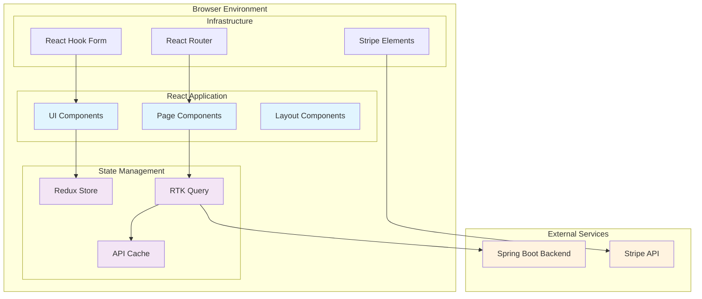

### 1.2 Layer Architecture

```
╔══════════════════════════════════════════════════════════════╗
║                      PRESENTATION LAYER                      ║
║  ┌─────────────┐  ┌─────────────┐  ┌─────────────────────┐  ║
║  │    Pages    │  │   Layouts   │  │    UI Components    │  ║
║  │  (Routes)   │  │ (Structure) │  │   (Reusable UI)     │  ║
║  │             │  │             │  │                     │  ║
║  │ • LoginPage │  │ • AuthLayout│  │ • Button            │  ║
║  │ • Dashboard │  │ • DashLayout│  │ • Input             │  ║
║  │ • Payments  │  │             │  │ • Card              │  ║
║  │ • Settings  │  │             │  │ • Modal             │  ║
║  └─────────────┘  └─────────────┘  └─────────────────────┘  ║
╚══════════════════════════════════════════════════════════════╝
╔══════════════════════════════════════════════════════════════╗
║                     APPLICATION LAYER                        ║
║  ┌─────────────┐  ┌─────────────┐  ┌─────────────────────┐  ║
║  │    Hooks    │  │  Services   │  │     Utilities       │  ║
║  │ (Business)  │  │ (Complex)   │  │    (Helpers)        │  ║
║  │             │  │             │  │                     │  ║
║  │ • useAuth   │  │ • authSvc   │  │ • validation        │  ║
║  │ • useOrg    │  │ • paymentSvc│  │ • errorHandling     │  ║
║  │ • usePay    │  │ • subSvc    │  │ • formatting        │  ║
║  └─────────────┘  └─────────────┘  └─────────────────────┘  ║
╚══════════════════════════════════════════════════════════════╝
╔══════════════════════════════════════════════════════════════╗
║                  STATE MANAGEMENT LAYER                      ║
║  ┌─────────────┐  ┌─────────────┐  ┌─────────────────────┐  ║
║  │Redux Store  │  │ RTK Query   │  │     Selectors       │  ║
║  │(Client)     │  │ (Server)    │  │   (Derived)         │  ║
║  │             │  │             │  │                     │  ║
║  │ • authSlice │  │ • authApi   │  │ • selectUser        │  ║
║  │ • uiSlice   │  │ • userApi   │  │ • selectOrgs        │  ║
║  │             │  │ • orgApi    │  │ • selectLoading     │  ║
║  │             │  │ • payApi    │  │ • selectErrors      │  ║
║  └─────────────┘  └─────────────┘  └─────────────────────┘  ║
╚══════════════════════════════════════════════════════════════╝
╔══════════════════════════════════════════════════════════════╗
║                    DATA ACCESS LAYER                         ║
║  ┌─────────────┐  ┌─────────────┐  ┌─────────────────────┐  ║
║  │ API Client  │  │    Cache    │  │    Validation       │  ║
║  │    (HTTP)   │  │ Management  │  │      (Zod)          │  ║
║  │             │  │             │  │                     │  ║
║  │ • baseQuery │  │ • tag cache │  │ • UserSchema        │  ║
║  │ • auth      │  │ • timeout   │  │ • OrgSchema         │  ║
║  │ • retry     │  │ • invalidate│  │ • PaymentSchema     │  ║
║  └─────────────┘  └─────────────┘  └─────────────────────┘  ║
╚══════════════════════════════════════════════════════════════╝
```

### 1.3 Module Dependencies

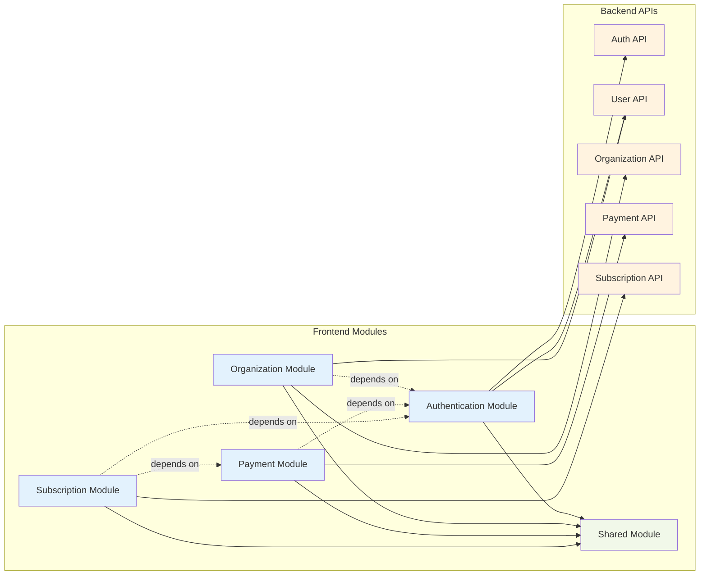

---

## 2. Application Flow Diagrams

### 2.1 Application Bootstrap Flow

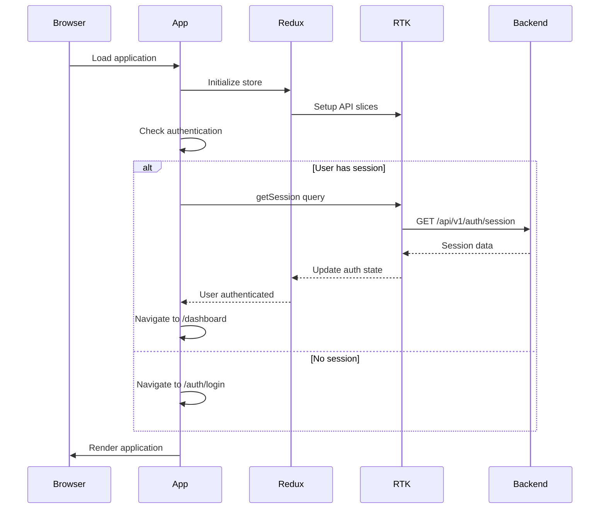

### 2.2 Page Navigation Flow

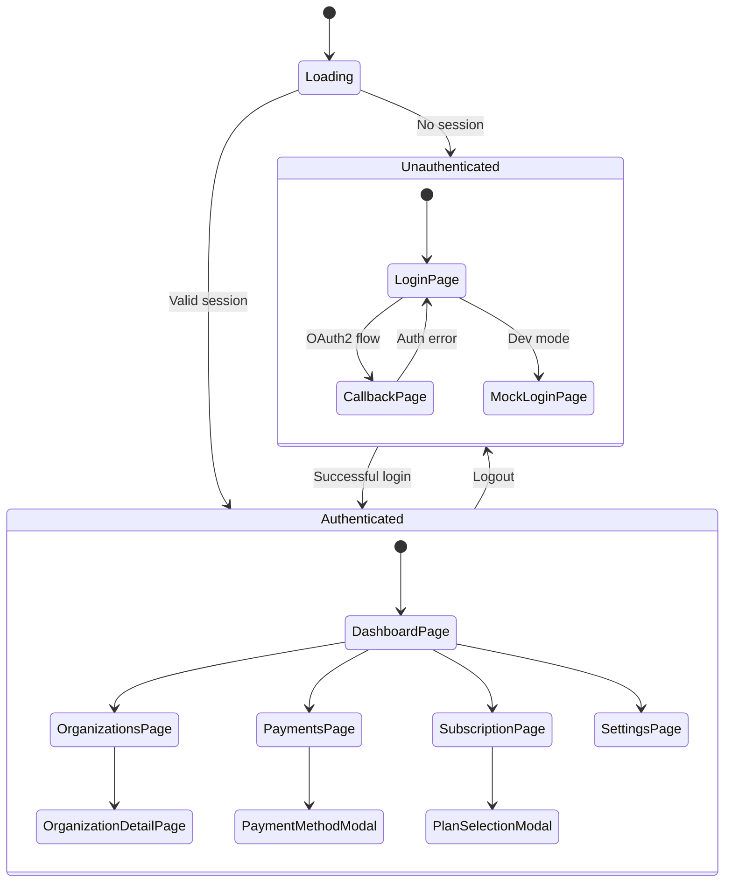

---

## 3. Component Hierarchy Diagrams

### 3.1 Complete Component Tree

```
App
├── Providers
│   ├── Provider (Redux)
│   ├── Elements (Stripe)
│   ├── BrowserRouter
│   ├── ErrorBoundary
│   └── NotificationProvider
├── AppContent
│   └── Routes
│       ├── AuthLayout
│       │   ├── Header (minimal)
│       │   ├── Outlet
│       │   │   ├── LoginPage
│       │   │   │   ├── PasswordLoginForm
│       │   │   │   │   ├── Input (email)
│       │   │   │   │   ├── Input (password)
│       │   │   │   │   ├── Checkbox (remember)
│       │   │   │   │   └── Button (submit)
│       │   │   │   ├── OAuth2LoginButtons
│       │   │   │   │   ├── Button (Google)
│       │   │   │   │   ├── Button (GitHub)
│       │   │   │   │   └── Button (Microsoft)
│       │   │   │   └── LoadingSpinner
│       │   │   └── CallbackPage
│       │   │       ├── CallbackHandler
│       │   │       └── LoadingSpinner
│       │   └── Footer (optional)
│       └── DashboardLayout
│           ├── Sidebar
│           │   ├── Logo
│           │   ├── NavigationMenu
│           │   │   ├── NavLink (Dashboard)
│           │   │   ├── NavLink (Organizations)
│           │   │   ├── NavLink (Payments)
│           │   │   ├── NavLink (Subscription)
│           │   │   └── NavLink (Settings)
│           │   ├── OrganizationSelector
│           │   └── UserMenu
│           │       ├── UserAvatar
│           │       ├── Dropdown
│           │       │   ├── ProfileLink
│           │       │   ├── SettingsLink
│           │       │   └── LogoutButton
│           ├── TopBar
│           │   ├── Breadcrumbs
│           │   ├── SearchBox
│           │   └── NotificationBell
│           ├── MainContent
│           │   ├── PageHeader
│           │   │   ├── Title
│           │   │   ├── Description
│           │   │   └── Actions
│           │   └── Outlet
│           │       ├── DashboardPage
│           │       │   ├── StatsCards
│           │       │   │   ├── StatsCard (Users)
│           │       │   │   ├── StatsCard (Revenue)
│           │       │   │   └── StatsCard (Subscriptions)
│           │       │   ├── RecentActivity
│           │       │   └── QuickActions
│           │       ├── OrganizationsPage
│           │       │   ├── OrganizationGrid
│           │       │   │   └── OrganizationCard[]
│           │       │   └── CreateOrgButton
│           │       ├── OrganizationPage
│           │       │   ├── OrganizationHeader
│           │       │   ├── TabNavigation
│           │       │   ├── MembersList
│           │       │   │   └── MemberCard[]
│           │       │   └── Settings
│           │       ├── PaymentsPage
│           │       │   ├── PaymentMethodsList
│           │       │   │   └── PaymentMethodCard[]
│           │       │   ├── TransactionHistory
│           │       │   │   └── TransactionRow[]
│           │       │   └── AddPaymentButton
│           │       ├── SubscriptionPage
│           │       │   ├── CurrentPlanCard
│           │       │   ├── PlanComparison
│           │       │   │   └── PlanCard[]
│           │       │   └── BillingHistory
│           │       │       └── InvoiceRow[]
│           │       └── SettingsPage
│           │           ├── ProfileSettings
│           │           ├── SecuritySettings
│           │           ├── NotificationSettings
│           │           └── DangerZone
│           └── GlobalModals
│               ├── CreateOrganizationModal
│               │   └── CreateOrganizationForm
│               ├── PaymentMethodModal
│               │   └── AddPaymentMethodForm
│               │       └── StripeCardElement
│               └── ConfirmationModal
├── Toaster (react-hot-toast)
└── PerformanceDashboard (dev only)
```

### 3.2 Authentication Components

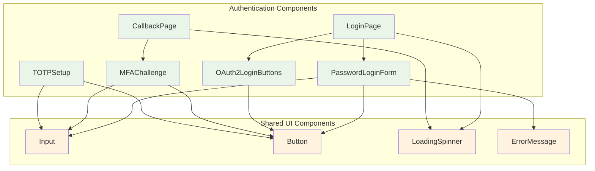

### 3.3 Payment Components

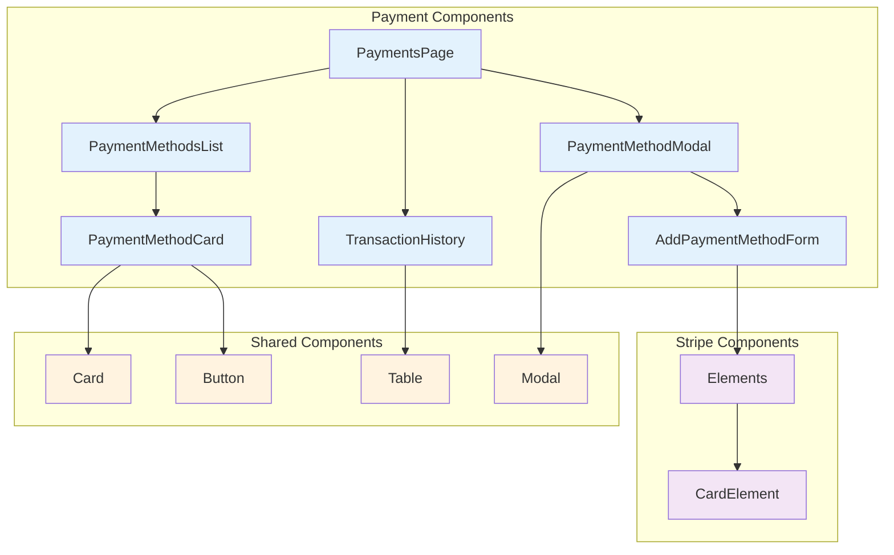

---

## 4. Data Flow Visualizations

### 4.1 Redux State Flow

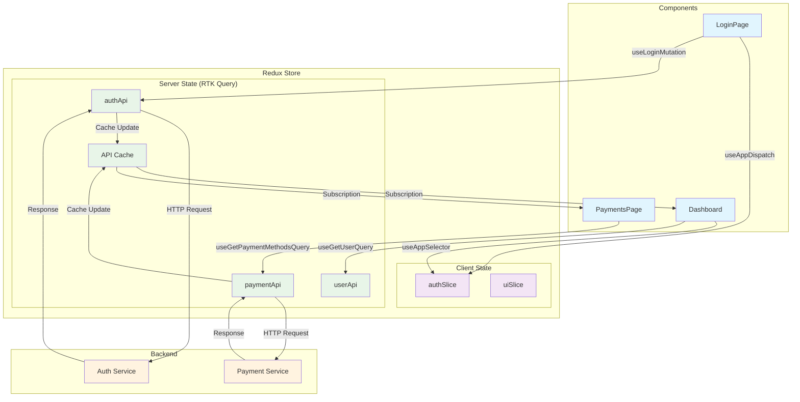

### 4.2 Authentication Flow

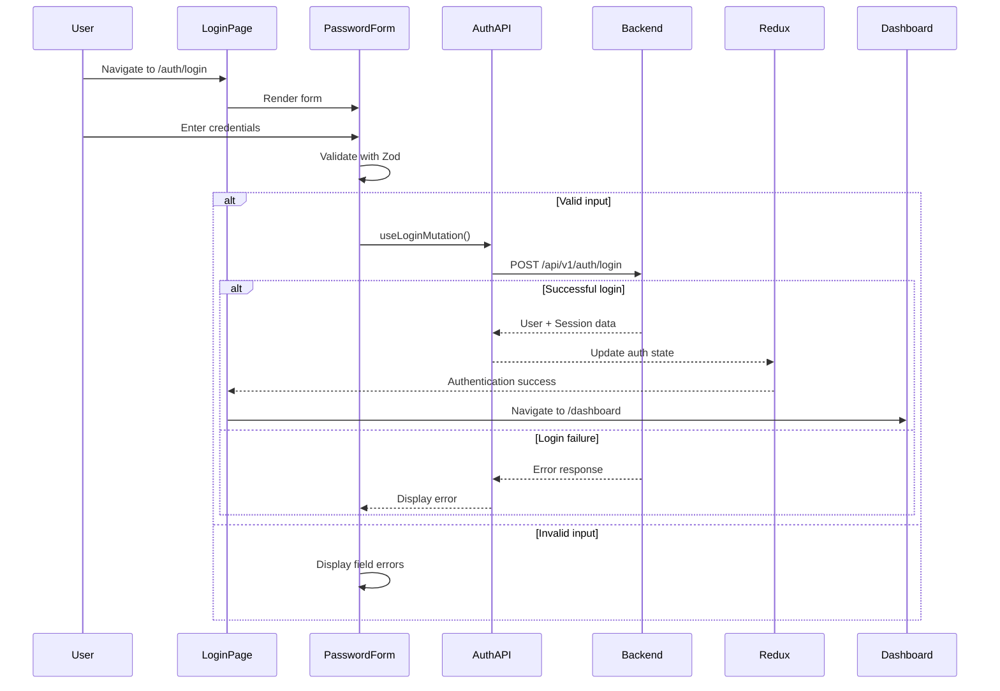

### 4.3 Payment Method Addition Flow

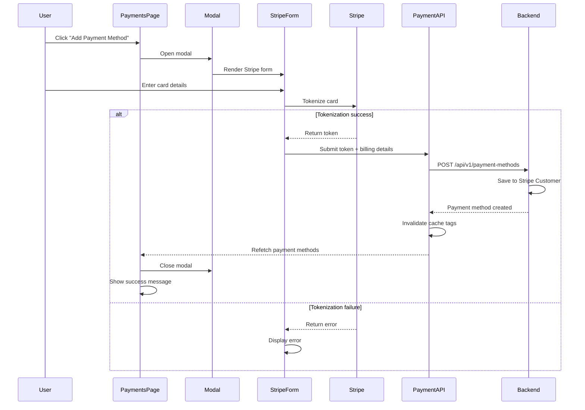

### 4.4 RTK Query Cache Flow

```
┌─────────────────────────────────────────────────────────────┐
│                    RTK Query Cache Management               │
└─────────────────────────────────────────────────────────────┘

Query Request
     ↓
┌─────────────┐    Cache Hit?    ┌──────────────┐
│  Component  │ ────────────────▶│    Cache     │
└─────────────┘                  └──────────────┘
     │                                  │
     │ No                              │ Yes
     ▼                                  ▼
┌─────────────┐                  ┌──────────────┐
│   Network   │                  │ Return Data  │
│   Request   │                  │   + Status   │
└─────────────┘                  └──────────────┘
     │
     ▼
┌─────────────┐
│  Response   │
│  Processing │
└─────────────┘
     │
     ▼
┌─────────────┐    Tag-based     ┌──────────────┐
│ Cache Store │ ◀─ Invalidation ─│   Mutation   │
└─────────────┘                  └──────────────┘
     │
     ▼
┌─────────────┐
│ Component   │
│ Re-render   │
└─────────────┘
```

---

## 5. API Integration Diagrams

### 5.1 API Architecture Overview

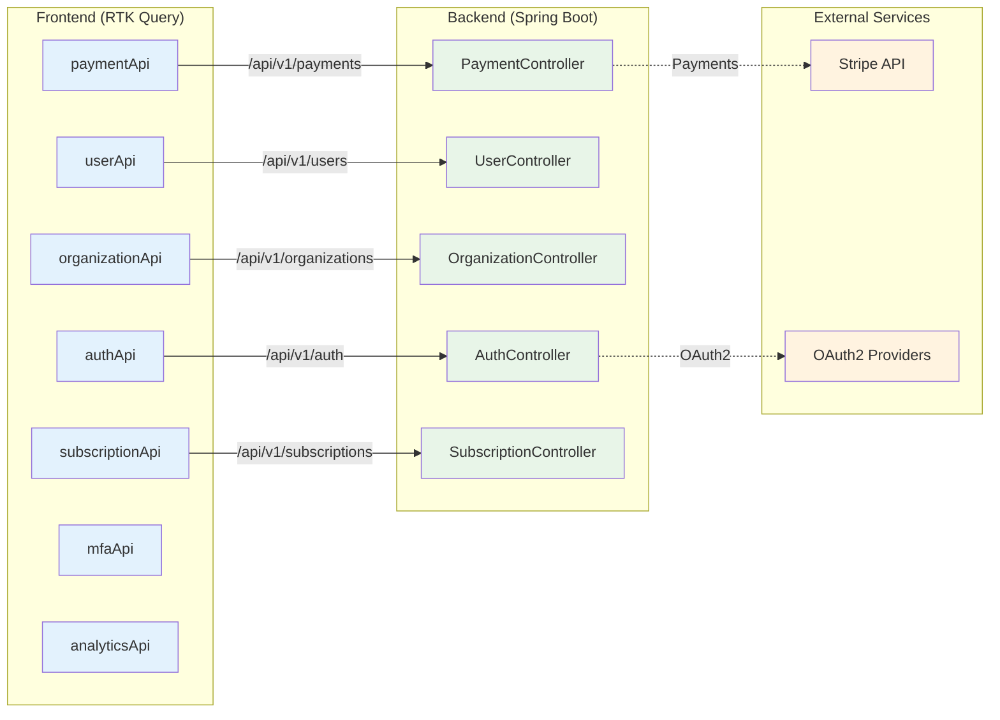

### 5.2 API Request/Response Flow

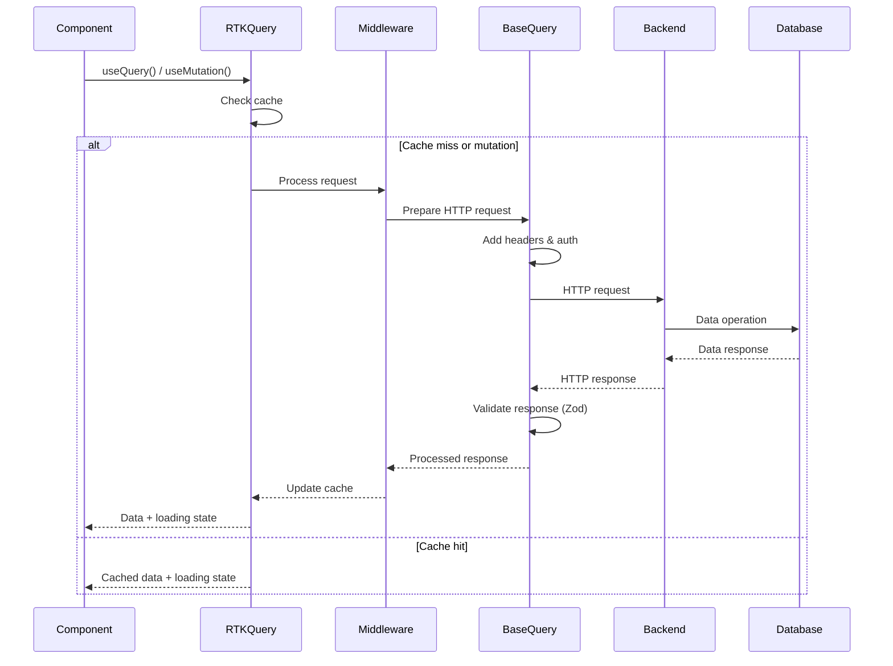

### 5.3 Error Handling Flow

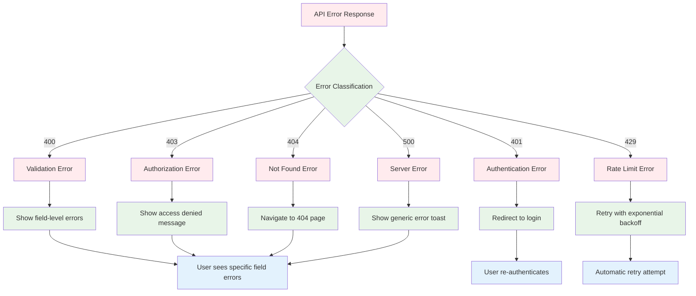

### 5.4 Type Safety & Validation

```
┌─────────────────────────────────────────────────────────────┐
│                    Type Safety Pipeline                     │
└─────────────────────────────────────────────────────────────┘

Backend Response
       ↓
┌─────────────┐
│   Network   │ ← HTTP Response (unknown type)
│   Layer     │
└─────────────┘
       ↓
┌─────────────┐
│    Zod      │ ← Runtime validation
│ Validation  │   schema.safeParse(response)
└─────────────┘
       ↓                    ↓
  ✅ Valid              ❌ Invalid
       ↓                    ↓
┌─────────────┐       ┌─────────────┐
│ TypeScript  │       │ Validation  │
│  Inference  │       │   Error     │
└─────────────┘       └─────────────┘
       ↓                    ↓
┌─────────────┐       ┌─────────────┐
│ Type-safe   │       │  Error      │
│ Component   │       │ Handling    │
│    Data     │       └─────────────┘
└─────────────┘
       ↓
┌─────────────┐
│  Rendered   │
│     UI      │
└─────────────┘
```

---

## 6. User Journey Flowcharts

### 6.1 Complete Authentication Journey

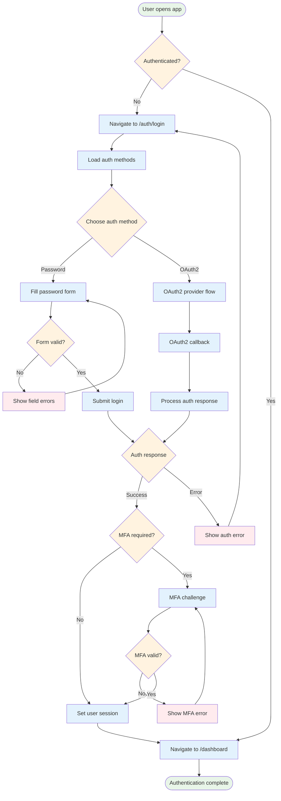

### 6.2 Payment Method Addition Journey

```mermaid
flowchart TD
    Start([User needs to add payment method]) --> PaymentsPage[Navigate to /payments]

    PaymentsPage --> LoadMethods[Load existing payment methods]
    LoadMethods --> ShowMethods[Display payment methods]
    ShowMethods --> AddButton[Click "Add Payment Method"]

    AddButton --> OpenModal[Open payment method modal]
    OpenModal --> StripeForm[Show Stripe card form]

    StripeForm --> FillCard[User fills card details]
    FillCard --> ValidateStripe{Stripe validation}

    ValidateStripe -->|Invalid| StripeError[Show card errors]
    StripeError --> FillCard

    ValidateStripe -->|Valid| FillBilling[Fill billing details]
    FillBilling --> ValidateBilling{Billing valid?}

    ValidateBilling -->|No| BillingError[Show billing errors]
    BillingError --> FillBilling

    ValidateBilling -->|Yes| SubmitForm[Submit form]
    SubmitForm --> StripeTokenize[Stripe tokenization]

    StripeTokenize --> TokenResponse{Tokenization result}
    TokenResponse -->|Error| TokenError[Show tokenization error]
    TokenError --> StripeForm

    TokenResponse -->|Success| APICall[API call with token]
    APICall --> BackendResponse{Backend response}

    BackendResponse -->|Error| APIError[Show API error]
    APIError --> StripeForm

    BackendResponse -->|Success| UpdateCache[Update payment methods cache]
    UpdateCache --> CloseModal[Close modal]
    CloseModal --> RefreshList[Refresh payment methods list]
    RefreshList --> ShowSuccess[Show success message]
    ShowSuccess --> Success([Payment method added])

    classDef start fill:#e8f5e8
    classDef decision fill:#fff3e0
    classDef process fill:#e3f2fd
    classDef error fill:#ffebee
    classDef success fill:#f1f8e9

    class Start,Success start
    class ValidateStripe,ValidateBilling,TokenResponse,BackendResponse decision
    class PaymentsPage,LoadMethods,ShowMethods,AddButton,OpenModal,StripeForm,FillCard,FillBilling,SubmitForm,StripeTokenize,APICall,UpdateCache,CloseModal,RefreshList,ShowSuccess process
    class StripeError,BillingError,TokenError,APIError error
```

### 6.3 Organization Creation Journey

```mermaid
flowchart TD
    Start([New user needs organization]) --> Dashboard[User on dashboard]

    Dashboard --> NoOrg{Has organization?}
    NoOrg -->|No| CreatePrompt[Show "Create Organization" prompt]
    NoOrg -->|Yes| ExistingOrg[Show existing organization]

    CreatePrompt --> ClickCreate[Click "Create Organization"]
    ClickCreate --> OpenModal[Open creation modal]

    OpenModal --> OrgForm[Show organization form]
    OrgForm --> FillDetails[Fill organization details]

    FillDetails --> ValidateForm{Form valid?}
    ValidateForm -->|No| FormErrors[Show validation errors]
    FormErrors --> FillDetails

    ValidateForm -->|Yes| SubmitOrg[Submit organization]
    SubmitOrg --> CreateResponse{Creation response}

    CreateResponse -->|Error| CreateError[Show creation error]
    CreateError --> OrgForm

    CreateResponse -->|Success| OrgCreated[Organization created]
    OrgCreated --> SetupWizard{Start setup wizard?}

    SetupWizard -->|Skip| CompleteBasic[Basic setup complete]
    SetupWizard -->|Yes| PaymentSetup[Payment method setup]

    PaymentSetup --> PaymentAdded[Payment method added]
    PaymentAdded --> PlanSelection[Plan selection]
    PlanSelection --> PlanSelected[Plan selected]
    PlanSelected --> TeamInvites[Team member invitations]
    TeamInvites --> InvitesSent[Invitations sent]
    InvitesSent --> CompleteAdvanced[Advanced setup complete]

    CompleteBasic --> Success([Organization ready])
    CompleteAdvanced --> Success
    ExistingOrg --> Success

    classDef start fill:#e8f5e8
    classDef decision fill:#fff3e0
    classDef process fill:#e3f2fd
    classDef error fill:#ffebee
    classDef success fill:#f1f8e9

    class Start,Success start
    class NoOrg,ValidateForm,CreateResponse,SetupWizard decision
    class Dashboard,CreatePrompt,ClickCreate,OpenModal,OrgForm,FillDetails,SubmitOrg,OrgCreated,PaymentSetup,PaymentAdded,PlanSelection,PlanSelected,TeamInvites,InvitesSent,CompleteBasic,CompleteAdvanced,ExistingOrg process
    class FormErrors,CreateError error
```

---

## 7. State Management Diagrams

### 7.1 Redux Store Structure

```
┌─────────────────────────────────────────────────────────────┐
│                      REDUX STORE                            │
├─────────────────────────────────────────────────────────────┤
│                   CLIENT STATE                              │
│  ┌─────────────────┐    ┌─────────────────────────────────┐ │
│  │   authSlice     │    │         uiSlice                 │ │
│  │                 │    │                                 │ │
│  │ • user          │    │ • theme                         │ │
│  │ • isAuth        │    │ • sidebar                       │ │
│  │ • loading       │    │ • notifications                 │ │
│  │ • error         │    │ • modals                        │ │
│  └─────────────────┘    └─────────────────────────────────┘ │
├─────────────────────────────────────────────────────────────┤
│                  SERVER STATE (RTK Query)                   │
│  ┌─────────────┐  ┌─────────────┐  ┌─────────────────────┐ │
│  │   authApi   │  │   userApi   │  │   organizationApi   │ │
│  │             │  │             │  │                     │ │
│  │ • login     │  │ • getMe     │  │ • getOrgs          │ │
│  │ • logout    │  │ • updateMe  │  │ • createOrg        │ │
│  │ • session   │  │ • changePass│  │ • getMembers       │ │
│  └─────────────┘  └─────────────┘  └─────────────────────┘ │
│                                                             │
│  ┌─────────────┐  ┌─────────────┐  ┌─────────────────────┐ │
│  │ paymentApi  │  │ subscripApi │  │      mfaApi         │ │
│  │             │  │             │  │                     │ │
│  │ • getMethods│  │ • getCurrent│  │ • setupTOTP        │ │
│  │ • addMethod │  │ • getPlans  │  │ • verifyTOTP       │ │
│  │ • deleteMth │  │ • subscribe │  │ • getBackupCodes   │ │
│  └─────────────┘  └─────────────┘  └─────────────────────┘ │
└─────────────────────────────────────────────────────────────┘
```

### 7.2 RTK Query Cache Tags

```mermaid
graph TB
    subgraph "Cache Tags"
        User[User]
        Session[Session]
        Organization[Organization]
        Member[Member]
        PaymentMethod[PaymentMethod]
        Transaction[Transaction]
        Subscription[Subscription]
        Invoice[Invoice]
        MFA[MFA]
    end

    subgraph "Queries"
        GetUser[getUser]
        GetSession[getSession]
        GetOrgs[getOrganizations]
        GetMembers[getMembers]
        GetPayments[getPaymentMethods]
        GetTransactions[getTransactions]
        GetSubscription[getSubscription]
        GetInvoices[getInvoices]
    end

    subgraph "Mutations"
        Login[login]
        UpdateUser[updateUser]
        CreateOrg[createOrganization]
        AddPayment[addPaymentMethod]
        CreateSub[createSubscription]
    end

    GetUser -.->|provides| User
    GetSession -.->|provides| Session
    GetOrgs -.->|provides| Organization
    GetMembers -.->|provides| Member
    GetPayments -.->|provides| PaymentMethod
    GetTransactions -.->|provides| Transaction
    GetSubscription -.->|provides| Subscription
    GetInvoices -.->|provides| Invoice

    Login -->|invalidates| User
    Login -->|invalidates| Session
    UpdateUser -->|invalidates| User
    CreateOrg -->|invalidates| Organization
    AddPayment -->|invalidates| PaymentMethod
    CreateSub -->|invalidates| Subscription

    classDef tag fill:#e3f2fd
    classDef query fill:#e8f5e8
    classDef mutation fill:#fff3e0

    class User,Session,Organization,Member,PaymentMethod,Transaction,Subscription,Invoice,MFA tag
    class GetUser,GetSession,GetOrgs,GetMembers,GetPayments,GetTransactions,GetSubscription,GetInvoices query
    class Login,UpdateUser,CreateOrg,AddPayment,CreateSub mutation
```

### 7.3 State Update Flow

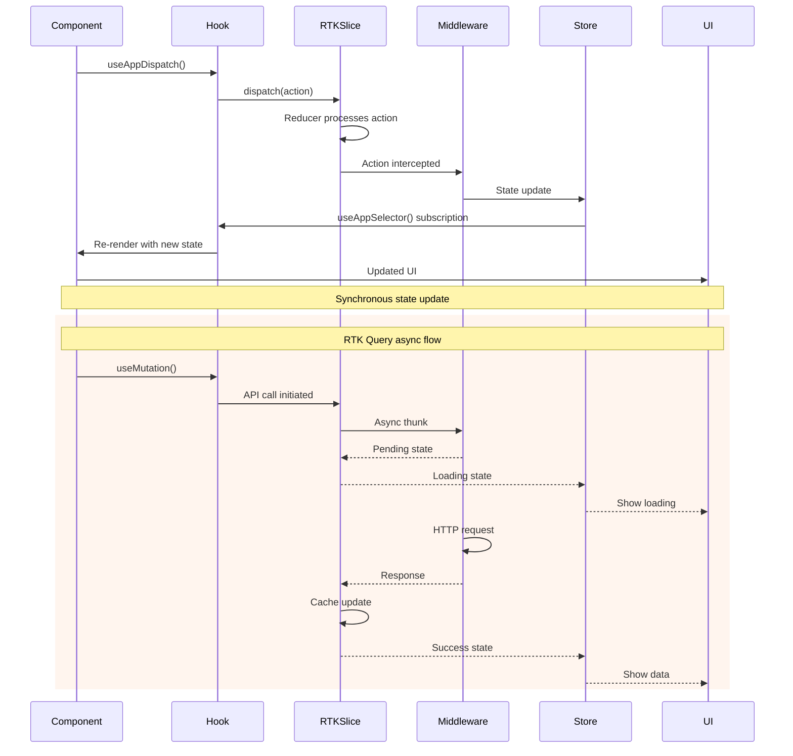

---

## Conclusion

These visual diagrams and flowcharts provide comprehensive documentation of the frontend architecture from multiple perspectives:

1. **System Overview** - High-level architecture and module dependencies
2. **Application Flow** - Bootstrap, navigation, and page transitions
3. **Component Hierarchy** - Complete component tree and relationships
4. **Data Flow** - State management, API integration, and caching
5. **User Journeys** - Complete user workflows and decision points
6. **State Management** - Redux store structure and RTK Query patterns

**Key Visual Insights:**

- **Modular Architecture**: Clear separation between feature modules
- **Type-Safe Pipeline**: Runtime validation with compile-time safety
- **Unidirectional Data Flow**: Predictable state updates through Redux
- **User-Centric Design**: Workflows optimized for user experience
- **Performance Optimization**: Strategic caching and code splitting

These diagrams serve as both documentation and implementation guides for developers and LLMs working with this complex React TypeScript frontend architecture.
