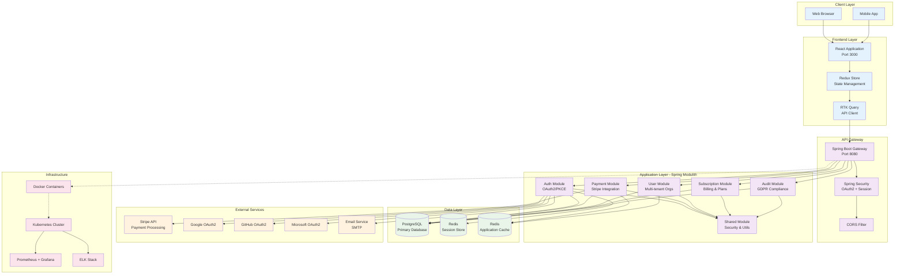
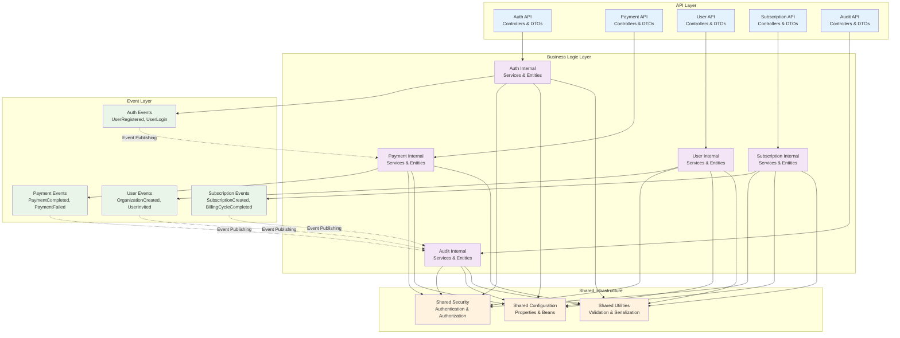
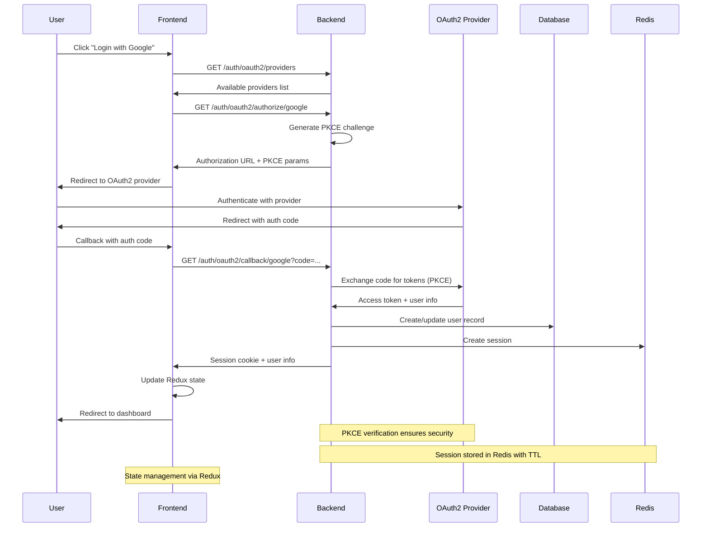
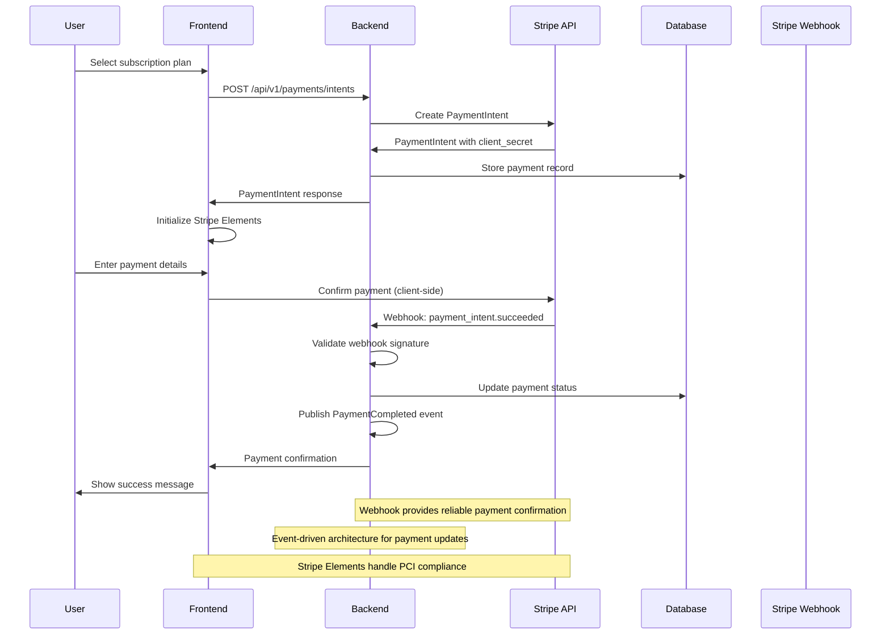
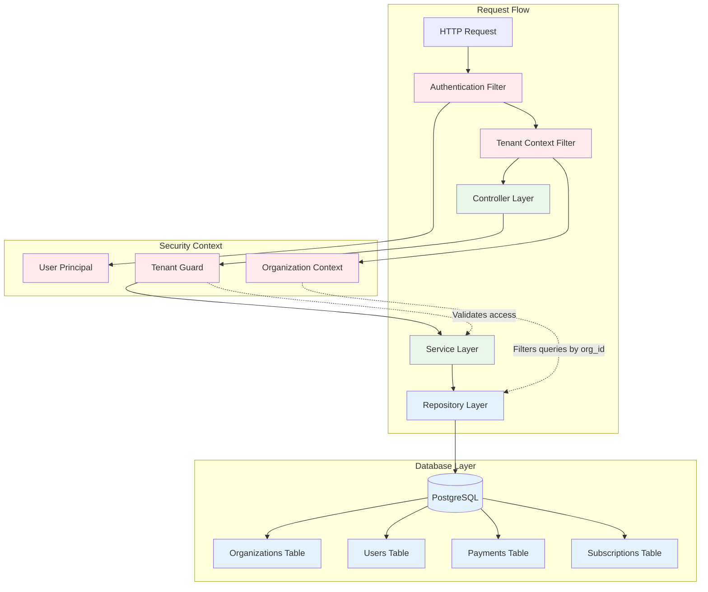
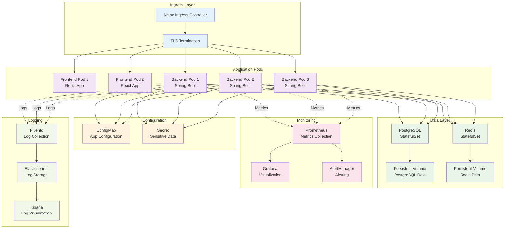
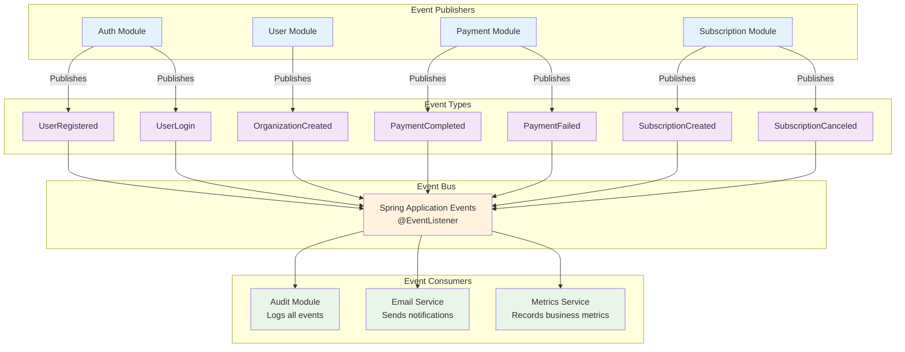
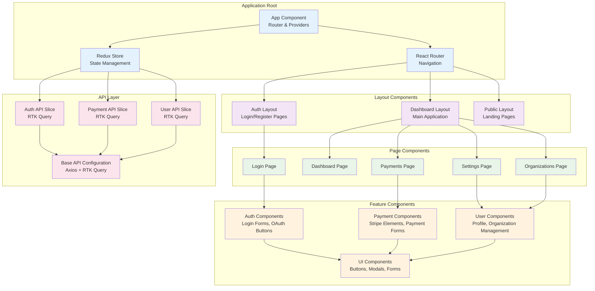
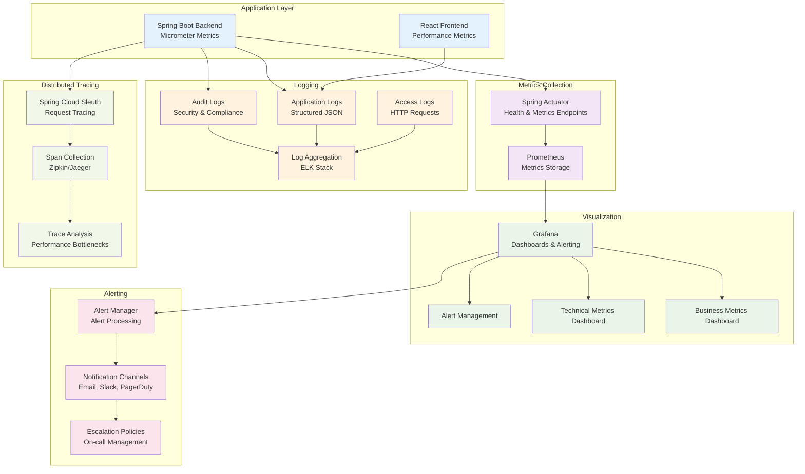

# Architecture Diagrams - Spring Boot Modulith Payment Platform

This document provides visual representations of the system architecture, data flows, and component interactions.

## System Overview

### High-Level Architecture



## Module Dependencies

### Spring Modulith Module Structure



## Authentication Flow

### OAuth2/PKCE Authentication Sequence



## Payment Processing Flow

### Stripe Payment Intent Flow



## Data Flow Architecture

### Multi-Tenant Data Access



## Deployment Architecture

### Kubernetes Deployment



## Event-Driven Architecture

### Inter-Module Communication



## Security Architecture

### Security Layers and Controls

```mermaid
graph TB
    subgraph "Network Security"
        WAF[Web Application Firewall]
        LoadBalancer[Load Balancer]
        TLS[TLS 1.3 Encryption]
    end

    subgraph "Application Security"
        CORS[CORS Protection]
        CSP[Content Security Policy]
        RateLimit[Rate Limiting]
        InputValidation[Input Validation]
    end

    subgraph "Authentication & Authorization"
        OAuth2[OAuth2/PKCE Flow]
        SessionMgmt[Session Management]
        JWTValidation[JWT Validation]
        RBAC[Role-Based Access Control]
        TenantIsolation[Tenant Isolation]
    end

    subgraph "Data Protection"
        Encryption[Data Encryption at Rest]
        PIIRedaction[PII Redaction]
        AuditLogging[Audit Logging]
        BackupEncryption[Backup Encryption]
    end

    subgraph "Infrastructure Security"
        NetworkPolicies[Kubernetes Network Policies]
        PodSecurity[Pod Security Standards]
        SecretMgmt[Secret Management]
        VulnScanning[Vulnerability Scanning]
    end

    WAF --> LoadBalancer
    LoadBalancer --> TLS
    TLS --> CORS
    CORS --> CSP
    CSP --> RateLimit
    RateLimit --> InputValidation

    InputValidation --> OAuth2
    OAuth2 --> SessionMgmt
    SessionMgmt --> JWTValidation
    JWTValidation --> RBAC
    RBAC --> TenantIsolation

    TenantIsolation --> Encryption
    Encryption --> PIIRedaction
    PIIRedaction --> AuditLogging
    AuditLogging --> BackupEncryption

    BackupEncryption --> NetworkPolicies
    NetworkPolicies --> PodSecurity
    PodSecurity --> SecretMgmt
    SecretMgmt --> VulnScanning

    classDef network fill:#ffebee
    classDef app fill:#e8f5e8
    classDef auth fill:#e3f2fd
    classDef data fill:#f3e5f5
    classDef infra fill:#fff3e0

    class WAF,LoadBalancer,TLS network
    class CORS,CSP,RateLimit,InputValidation app
    class OAuth2,SessionMgmt,JWTValidation,RBAC,TenantIsolation auth
    class Encryption,PIIRedaction,AuditLogging,BackupEncryption data
    class NetworkPolicies,PodSecurity,SecretMgmt,VulnScanning infra
```



## Frontend Architecture

### React Component Hierarchy



## Monitoring and Observability

### Observability Stack



## Integration Patterns

### External Service Integration

```mermaid
graph LR
    subgraph "Payment Platform"
        PaymentService[Payment Service]
        AuthService[Auth Service]
        NotificationService[Notification Service]
        AuditService[Audit Service]
    end

    subgraph "Stripe Integration"
        StripeAPI[Stripe API]
        StripeWebhooks[Stripe Webhooks]
        StripeEvents[Stripe Events]
    end

    subgraph "OAuth Providers"
        GoogleOAuth[Google OAuth2]
        GitHubOAuth[GitHub OAuth2]
        MicrosoftOAuth[Microsoft OAuth2]
    end

    subgraph "Communication Services"
        EmailProvider[Email Service Provider<br/>SendGrid/AWS SES]
        SMSProvider[SMS Provider<br/>Twilio]
    end

    subgraph "Monitoring & Logging"
        MetricsCollector[Metrics Collector<br/>Prometheus]
        LogAggregator[Log Aggregator<br/>ELK Stack]
        ErrorTracking[Error Tracking<br/>Sentry]
    end

    PaymentService -->|API Calls| StripeAPI
    PaymentService <--|Webhooks| StripeWebhooks
    PaymentService -->|Event Processing| StripeEvents

    AuthService -->|OAuth Flow| GoogleOAuth
    AuthService -->|OAuth Flow| GitHubOAuth
    AuthService -->|OAuth Flow| MicrosoftOAuth

    NotificationService -->|Send Emails| EmailProvider
    NotificationService -->|Send SMS| SMSProvider

    PaymentService -.->|Metrics| MetricsCollector
    AuthService -.->|Metrics| MetricsCollector
    PaymentService -.->|Logs| LogAggregator
    AuthService -.->|Logs| LogAggregator
    PaymentService -.->|Errors| ErrorTracking
    AuthService -.->|Errors| ErrorTracking

    AuditService -.->|Compliance Logs| LogAggregator

    classDef internal fill:#e3f2fd
    classDef payment fill:#f3e5f5
    classDef auth fill:#e8f5e8
    classDef communication fill:#fff3e0
    classDef monitoring fill:#fce4ec

    class PaymentService,AuthService,NotificationService,AuditService internal
    class StripeAPI,StripeWebhooks,StripeEvents payment
    class GoogleOAuth,GitHubOAuth,MicrosoftOAuth auth
    class EmailProvider,SMSProvider communication
    class MetricsCollector,LogAggregator,ErrorTracking monitoring
```

---

## Diagram Key

### Color Coding
- 🔵 **Blue**: Frontend components and user interfaces
- 🟣 **Purple**: Backend services and business logic
- 🟢 **Green**: Data storage and caching layers
- 🟡 **Yellow**: External services and integrations
- 🔴 **Red**: Security and authentication components
- 🟠 **Orange**: Infrastructure and deployment components

### Component Types
- **Rectangles**: Services, modules, and applications
- **Cylinders**: Databases and storage systems
- **Diamonds**: Decision points and gateways
- **Circles**: Events and messages
- **Hexagons**: External systems and APIs

### Connection Types
- **Solid Lines**: Direct dependencies and data flow
- **Dashed Lines**: Event publishing and asynchronous communication
- **Dotted Lines**: Monitoring and observability connections

---

This architecture documentation provides comprehensive visual representations of the Spring Boot Modulith Payment Platform, enabling better understanding of system components, data flows, and integration patterns.