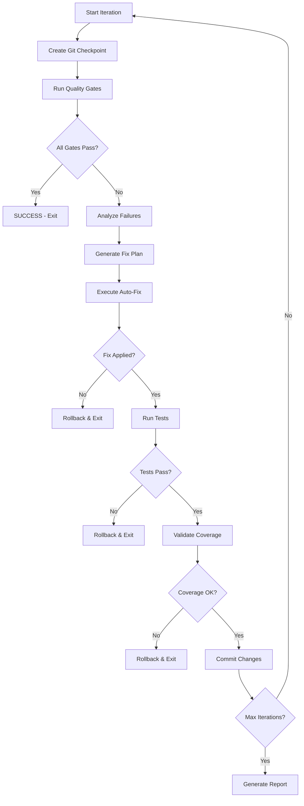

# Automated Continuous Improvement System (ACIS)
## Self-Healing Code Quality Platform - 2025 Best Practices

**Version**: 2.0.0
**Created**: 2025-10-02
**Status**: Design Phase
**Owner**: Platform Engineering Team

---

## Executive Summary

This document specifies a **fully automated, self-healing continuous improvement system** that operates autonomously via cron-based scheduling with environment flag control. The system implements **zero-tolerance quality gates** with automatic issue detection, correction, validation, and rollback capabilities.

### Key Differentiators from Existing CONTINUOUS_IMPROVEMENT_PLAN.md

| Feature | Existing Plan | ACIS (This System) |
|---------|---------------|-------------------|
| Execution | Manual/Semi-automated | Fully Automated |
| Human Interaction | Required | Zero (autonomous) |
| Scheduling | On-demand | Cron-based with env flag |
| Self-Healing | None | Comprehensive auto-fix |
| Rollback | Manual | Automatic on failure |
| Quality Gates | Some | Zero-tolerance enforcement |
| Code Fixes | Human-initiated | AI-driven autonomous |
| Iteration | Single-pass | Continuous until green |

---

## Architecture Overview

```
┌─────────────────────────────────────────────────────────────────┐
│               AUTOMATED CONTINUOUS IMPROVEMENT SYSTEM           │
├─────────────────────────────────────────────────────────────────┤
│                                                                 │
│  ┌──────────────┐    ┌──────────────┐    ┌──────────────┐    │
│  │   Cron       │───>│  Orchestrator│───>│   Quality    │    │
│  │  Scheduler   │    │   Engine     │    │    Gates     │    │
│  └──────────────┘    └──────────────┘    └──────────────┘    │
│         │                    │                    │             │
│         v                    v                    v             │
│  ┌──────────────────────────────────────────────────────┐     │
│  │            IMPROVEMENT ENGINE                          │     │
│  ├──────────────────────────────────────────────────────┤     │
│  │  ┌─────────────┐  ┌─────────────┐  ┌─────────────┐  │     │
│  │  │   Code      │  │  Security   │  │    Test     │  │     │
│  │  │  Analysis   │  │   Scanner   │  │  Validator  │  │     │
│  │  └─────────────┘  └─────────────┘  └─────────────┘  │     │
│  │  ┌─────────────┐  ┌─────────────┐  ┌─────────────┐  │     │
│  │  │   Auto-Fix  │  │  Modulith   │  │    Lint     │  │     │
│  │  │   Engine    │  │  Enforcer   │  │  Corrector  │  │     │
│  │  └─────────────┘  └─────────────┘  └─────────────┘  │     │
│  └──────────────────────────────────────────────────────┘     │
│         │                    │                    │             │
│         v                    v                    v             │
│  ┌──────────────┐    ┌──────────────┐    ┌──────────────┐    │
│  │   Rollback   │    │  Metrics &   │    │    Git       │    │
│  │   Manager    │    │  Reporting   │    │  Operations  │    │
│  └──────────────┘    └──────────────┘    └──────────────┘    │
│                                                                 │
└─────────────────────────────────────────────────────────────────┘
```

---

## System Components

### 1. **Orchestrator Engine** (`acis-orchestrator`)

**Location**: `scripts/acis/orchestrator/acis-orchestrator.sh`

**Responsibilities**:
- Environment flag validation (`CONTINUOUS_IMPROVEMENT_ENABLED`)
- Iteration cycle management
- Component coordination
- State persistence
- Failure detection and recovery

**Key Features**:
```bash
# Environment variables
CONTINUOUS_IMPROVEMENT_ENABLED=true|false
ACIS_MAX_ITERATIONS=10
ACIS_STRICT_MODE=true
ACIS_AUTO_COMMIT=false
ACIS_AUTO_PUSH=false
ACIS_NOTIFICATION_WEBHOOK=https://...
ACIS_LOG_LEVEL=INFO|DEBUG|TRACE
```

### 2. **Quality Gates Validation Engine**

**Location**: `scripts/acis/quality-gates/quality-gates-validator.sh`

**Zero-Tolerance Gates**:
```yaml
quality_gates:
  compilation:
    - name: "Java Compilation"
      command: "./gradlew compileJava compileTestJava"
      tolerance: ZERO_ERRORS
      tolerance_warnings: ZERO_WARNINGS

  code_style:
    - name: "Checkstyle Main"
      command: "./gradlew checkstyleMain"
      tolerance: ZERO_VIOLATIONS

    - name: "Checkstyle Test"
      command: "./gradlew checkstyleTest"
      tolerance: ZERO_VIOLATIONS

  architecture:
    - name: "Spring Modulith Boundaries"
      command: "./gradlew modulithCheck"
      tolerance: ZERO_VIOLATIONS

    - name: "ArchUnit Tests"
      command: "./gradlew archTest"
      tolerance: ZERO_FAILURES

  security:
    - name: "OWASP Dependency Check"
      command: "./gradlew dependencyCheckAnalyze"
      severity_threshold: "CRITICAL"
      tolerance: ZERO_CRITICAL

    - name: "Security Tests"
      command: "./gradlew securityTest"
      tolerance: ZERO_FAILURES

  testing:
    - name: "Unit Tests"
      command: "./gradlew test"
      tolerance: ZERO_FAILURES
      min_coverage: 85%

    - name: "Integration Tests"
      command: "./gradlew integrationTest"
      tolerance: ZERO_FAILURES

  code_quality:
    - name: "JaCoCo Coverage"
      command: "./gradlew jacocoTestCoverageVerification"
      min_coverage: 85%

    - name: "SonarQube Analysis"
      command: "./gradlew sonar"
      quality_gate: "PASSED"
```

### 3. **Auto-Fix Engine**

**Location**: `scripts/acis/auto-fix/auto-fix-engine.sh`

**Capabilities**:

#### 3.1 Code Style Auto-Correction
```bash
# Checkstyle violations auto-fix
- Indentation fixes (spaces/tabs standardization)
- Import organization and unused import removal
- Line length refactoring (extract methods)
- JavaDoc generation for public APIs
- Modifier order correction
- Whitespace normalization
```

#### 3.2 Security Auto-Remediation
```bash
# Dependency updates with safety checks
- CVE vulnerability patching
- Dependency version updates (minor/patch only)
- License compliance fixes
- Transitive dependency resolution
```

#### 3.3 Test Auto-Enhancement
```bash
# Test quality improvements
- Missing @Test annotations
- Assertion improvements (assertEquals -> assertThat)
- Test naming standardization
- TestContainers configuration validation
- Mock cleanup (remove unnecessary mocks)
```

#### 3.4 Import and Compilation Fixes
```bash
# Auto-resolvable compilation errors
- Unused import removal
- Missing import addition (when unambiguous)
- Deprecated API migration (with safe replacements)
- Generic type parameter fixes
```

**Safety Guarantees**:
```yaml
safety_rules:
  - rule: "Never modify business logic"
    enforcement: AST_ANALYSIS

  - rule: "Never change method signatures"
    enforcement: SEMANTIC_ANALYSIS

  - rule: "Never modify SQL/JPA queries"
    enforcement: PATTERN_BLACKLIST

  - rule: "Never touch payment processing code"
    enforcement: PATH_BLACKLIST
    paths: ["**/payment/**", "**/stripe/**"]

  - rule: "Always validate after fix"
    enforcement: MANDATORY_TEST_RUN

  - rule: "Always create git checkpoint"
    enforcement: GIT_TAG_BEFORE_FIX
```

### 4. **Spring Modulith Boundary Enforcer**

**Location**: `scripts/acis/modulith/modulith-enforcer.sh`

**Checks**:
```java
// Enforced patterns
✓ No direct internal package imports across modules
✓ Event-driven communication only between modules
✓ Proper @Modulith annotation on main class
✓ Module documentation completeness
✓ Circular dependency detection

// Auto-fixable violations
→ Move misplaced classes to correct modules
→ Replace direct calls with event publishing
→ Add missing @Modulith annotations
→ Generate module documentation stubs
```

### 5. **Security Scanner & Auto-Patcher**

**Location**: `scripts/acis/security/security-scanner.sh`

**Multi-Layer Security Analysis**:
```yaml
security_layers:
  dependency_scanning:
    - tool: "OWASP Dependency Check"
      auto_fix: true
      max_severity: "CRITICAL"

    - tool: "Snyk"
      auto_fix: true
      max_severity: "HIGH"

  code_scanning:
    - tool: "SpotBugs"
      auto_fix: limited  # Only safe fixes

    - tool: "PMD"
      auto_fix: true

  secret_scanning:
    - tool: "GitGuardian"
      auto_fix: false  # Alert only
      action: "BLOCK_COMMIT"
```

### 6. **Test Validation System**

**Location**: `scripts/acis/test-validation/test-validator.sh`

**Test Quality Enforcement**:
```yaml
test_requirements:
  coverage:
    line_coverage: 85%
    branch_coverage: 80%
    class_coverage: 90%

  test_patterns:
    - "All @Service classes must have integration tests"
    - "All @RestController endpoints must have contract tests"
    - "All events must have event-driven integration tests"
    - "No mock usage in integration tests (TestContainers only)"

  test_naming:
    pattern: "^(test|should|when|given).*"
    enforcement: WARNING

  assertions:
    - "Prefer AssertJ over JUnit assertions"
    - "Use meaningful assertion messages"
    - "One logical assertion per test method"
```

### 7. **Rollback Manager**

**Location**: `scripts/acis/rollback/rollback-manager.sh`

**Automatic Rollback Triggers**:
```yaml
rollback_conditions:
  - condition: "Any test failure after fix"
    action: "IMMEDIATE_ROLLBACK"

  - condition: "Build fails after fix"
    action: "IMMEDIATE_ROLLBACK"

  - condition: "Coverage decreases after fix"
    action: "IMMEDIATE_ROLLBACK"

  - condition: "Security scan shows new vulnerabilities"
    action: "IMMEDIATE_ROLLBACK"

  - condition: "Performance regression detected"
    action: "IMMEDIATE_ROLLBACK"
    threshold: "10% slower"
```

**Rollback Strategy**:
```bash
# Git-based checkpointing
1. Before each fix: Create git tag `acis/checkpoint-{iteration}-{timestamp}`
2. On failure: `git reset --hard {last_checkpoint_tag}`
3. Clean working directory: `git clean -fdx`
4. Validate clean state: Run quality gates again
5. Log failure: Store in `acis-failures.log`
```

### 8. **Metrics & Observability Dashboard**

**Location**: `scripts/acis/metrics/metrics-collector.sh`

**Tracked Metrics**:
```yaml
metrics:
  execution:
    - total_iterations
    - successful_fixes
    - failed_fixes
    - rollback_count
    - average_iteration_duration
    - total_runtime

  quality:
    - code_coverage_delta
    - checkstyle_violations_fixed
    - security_vulnerabilities_fixed
    - test_count_delta
    - technical_debt_reduction

  code_changes:
    - files_modified
    - lines_added
    - lines_removed
    - commits_created
    - modules_affected
```

**Reporting**:
```bash
# JSON metrics output
{
  "run_id": "acis-20251002-143022",
  "timestamp": "2025-10-02T14:30:22Z",
  "status": "SUCCESS",
  "iterations": 7,
  "quality_improvements": {
    "checkstyle_violations": {
      "before": 142,
      "after": 0,
      "fixed": 142
    },
    "test_coverage": {
      "before": "78.3%",
      "after": "87.1%",
      "improvement": "8.8%"
    },
    "security_vulnerabilities": {
      "critical": {"before": 3, "after": 0},
      "high": {"before": 8, "after": 2}
    }
  },
  "files_modified": 45,
  "commits_created": 7,
  "runtime_minutes": 23
}
```

---

## Workflow & Iteration Cycle

### Main Execution Flow

```bash
#!/bin/bash
# scripts/acis/acis-main.sh

# 1. Environment Check
if [ "$CONTINUOUS_IMPROVEMENT_ENABLED" != "true" ]; then
    echo "ACIS disabled via environment flag"
    exit 0
fi

# 2. Initialize
ITERATION=0
MAX_ITERATIONS=${ACIS_MAX_ITERATIONS:-10}
STATUS="PENDING"

# 3. Main Loop
while [ $ITERATION -lt $MAX_ITERATIONS ]; do
    ITERATION=$((ITERATION + 1))
    echo "=== ACIS Iteration $ITERATION/$MAX_ITERATIONS ==="

    # 3.1 Create checkpoint
    create_checkpoint "iteration-$ITERATION"

    # 3.2 Run quality gates
    run_quality_gates
    GATE_RESULT=$?

    if [ $GATE_RESULT -eq 0 ]; then
        echo "✅ All quality gates passed!"
        STATUS="SUCCESS"
        break
    fi

    # 3.3 Analyze failures
    analyze_failures

    # 3.4 Attempt auto-fix
    attempt_auto_fix
    FIX_RESULT=$?

    if [ $FIX_RESULT -ne 0 ]; then
        echo "❌ Auto-fix failed, rolling back..."
        rollback_to_checkpoint
        STATUS="FAILED"
        break
    fi

    # 3.5 Validate fix
    validate_fix
    VALIDATION_RESULT=$?

    if [ $VALIDATION_RESULT -ne 0 ]; then
        echo "❌ Fix validation failed, rolling back..."
        rollback_to_checkpoint
        STATUS="FAILED"
        break
    fi

    # 3.6 Commit fix if auto-commit enabled
    if [ "$ACIS_AUTO_COMMIT" == "true" ]; then
        git add -A
        git commit -m "🤖 ACIS: Iteration $ITERATION improvements"
    fi
done

# 4. Final Report
generate_final_report
send_notifications

exit $([ "$STATUS" == "SUCCESS" ] && echo 0 || echo 1)
```

### Detailed Iteration Steps



---

## Cron Integration

### Crontab Configuration

```bash
# /etc/cron.d/acis-continuous-improvement

# Run ACIS every 4 hours (adjust as needed)
0 */4 * * * lsendel cd /Users/lsendel/IdeaProjects/sass && ./scripts/acis/acis-main.sh >> /var/log/acis/acis.log 2>&1

# Daily comprehensive run (overnight)
0 2 * * * lsendel cd /Users/lsendel/IdeaProjects/sass && ACIS_MAX_ITERATIONS=20 ./scripts/acis/acis-main.sh >> /var/log/acis/acis-daily.log 2>&1

# Weekly deep analysis (Sunday 3 AM)
0 3 * * 0 lsendel cd /Users/lsendel/IdeaProjects/sass && ./scripts/acis/deep-analysis.sh >> /var/log/acis/acis-weekly.log 2>&1
```

### Systemd Timer Alternative (Modern Approach)

```ini
# /etc/systemd/system/acis.timer
[Unit]
Description=Automated Continuous Improvement System Timer
Requires=acis.service

[Timer]
OnBootSec=15min
OnUnitActiveSec=4h
Persistent=true

[Install]
WantedBy=timers.target
```

```ini
# /etc/systemd/system/acis.service
[Unit]
Description=Automated Continuous Improvement System
After=network.target

[Service]
Type=oneshot
User=lsendel
WorkingDirectory=/Users/lsendel/IdeaProjects/sass
Environment="CONTINUOUS_IMPROVEMENT_ENABLED=true"
Environment="ACIS_MAX_ITERATIONS=10"
Environment="JAVA_HOME=/opt/homebrew/opt/openjdk@21"
ExecStart=/Users/lsendel/IdeaProjects/sass/scripts/acis/acis-main.sh
StandardOutput=journal
StandardError=journal

[Install]
WantedBy=multi-user.target
```

---

## Implementation Plan

### Phase 1: Core Infrastructure (Week 1)

```bash
# Day 1-2: Orchestrator & Quality Gates
- Create scripts/acis/ directory structure
- Implement acis-orchestrator.sh
- Implement quality-gates-validator.sh
- Write unit tests for orchestrator logic

# Day 3-4: Rollback Manager
- Implement rollback-manager.sh
- Git checkpoint/restore logic
- State validation
- Failure logging

# Day 5: Integration & Testing
- End-to-end test of orchestrator + rollback
- Dry-run validation
- Documentation
```

### Phase 2: Auto-Fix Engines (Week 2)

```bash
# Day 1-2: Code Style Auto-Fix
- Checkstyle violation parser
- Safe code transformation engine
- Import organizer
- JavaDoc generator

# Day 3: Security Auto-Patch
- Dependency version updater
- CVE patch applicator
- Safety validation

# Day 4: Test Enhancement
- Test generator for uncovered code
- Assertion improver
- Mock detector/remover

# Day 5: Integration & Testing
- Test all auto-fix engines
- Safety validation
- Rollback testing
```

### Phase 3: Specialized Enforcers (Week 3)

```bash
# Day 1-2: Modulith Enforcer
- Module boundary checker
- Event-driven refactoring engine
- Documentation generator

# Day 3: Lint Corrector
- PMD/SpotBugs integration
- Pattern-based corrections
- Code smell detector

# Day 4: Metrics & Observability
- Metrics collector
- JSON report generator
- Dashboard integration

# Day 5: Integration & Testing
- Full system integration test
- Performance benchmarking
```

### Phase 4: CI/CD Integration (Week 4)

```bash
# Day 1-2: GitHub Actions Integration
- Create .github/workflows/acis-validation.yml
- Quality gate enforcement
- Auto-PR creation for fixes

# Day 3: Notification System
- Slack/Discord webhook integration
- Email reporting
- Metrics dashboard

# Day 4-5: Production Deployment
- Cron/systemd setup
- Monitoring & alerting
- Documentation finalization
```

---

## File Structure

```
sass/
├── scripts/
│   └── acis/
│       ├── acis-main.sh                      # Main orchestrator
│       ├── config/
│       │   ├── quality-gates.yml             # Quality gate definitions
│       │   ├── auto-fix-rules.yml            # Auto-fix safety rules
│       │   └── modulith-rules.yml            # Modulith enforcement rules
│       ├── orchestrator/
│       │   ├── acis-orchestrator.sh          # Iteration engine
│       │   └── state-manager.sh              # State persistence
│       ├── quality-gates/
│       │   ├── quality-gates-validator.sh    # Gate validation
│       │   └── failure-analyzer.sh           # Failure analysis
│       ├── auto-fix/
│       │   ├── auto-fix-engine.sh            # Main auto-fix logic
│       │   ├── code-style-fixer.sh           # Checkstyle fixes
│       │   ├── security-patcher.sh           # Security patches
│       │   ├── test-enhancer.sh              # Test improvements
│       │   └── import-organizer.sh           # Import cleanup
│       ├── modulith/
│       │   ├── modulith-enforcer.sh          # Boundary enforcement
│       │   └── event-refactorer.sh           # Event-driven refactoring
│       ├── security/
│       │   ├── security-scanner.sh           # Multi-tool scanner
│       │   └── dependency-updater.sh         # Safe dependency updates
│       ├── test-validation/
│       │   ├── test-validator.sh             # Test quality checker
│       │   └── coverage-enforcer.sh          # Coverage validation
│       ├── rollback/
│       │   ├── rollback-manager.sh           # Rollback orchestration
│       │   └── checkpoint-manager.sh         # Git checkpoint management
│       ├── metrics/
│       │   ├── metrics-collector.sh          # Metrics aggregation
│       │   └── report-generator.sh           # JSON/HTML reports
│       └── utils/
│           ├── git-utils.sh                  # Git helper functions
│           ├── logger.sh                     # Structured logging
│           └── notifier.sh                   # Notification dispatch
├── .acis/
│   ├── state/
│   │   ├── current-iteration.json            # Current state
│   │   └── history.json                      # Historical runs
│   ├── logs/
│   │   ├── acis-{timestamp}.log              # Execution logs
│   │   └── failures.log                      # Failure history
│   └── reports/
│       ├── metrics-{timestamp}.json          # Metrics snapshots
│       └── summary-{timestamp}.html          # HTML reports
└── docs/
    └── acis/
        ├── ARCHITECTURE.md                   # This document
        ├── USER_GUIDE.md                     # Usage instructions
        └── DEVELOPMENT.md                    # Developer guide
```

---

## Safety & Risk Management

### Critical Safety Rules

```yaml
never_modify:
  - "Business logic in service classes"
  - "SQL queries and JPA repositories"
  - "Payment processing code (PCI compliance)"
  - "Authentication/authorization logic"
  - "Cryptographic implementations"
  - "Database migration scripts"

always_validate:
  - "All tests pass after every change"
  - "Code coverage does not decrease"
  - "Security scans show no new issues"
  - "Build completes successfully"
  - "Module boundaries remain intact"

human_review_required:
  - "Changes to public API contracts"
  - "Dependency major version upgrades"
  - "Security vulnerability suppressions"
  - "Architecture decision modifications"
```

### Rollback Safety Net

```bash
# Multi-level rollback strategy
Level 1: Git reset to checkpoint tag
Level 2: Git clean to remove untracked files
Level 3: Validate clean state with quality gates
Level 4: If still broken, alert and stop

# Failure threshold
- After 3 consecutive rollbacks: STOP and alert
- After 5 failed iterations: STOP and create GitHub issue
- On any compilation failure: IMMEDIATE rollback
```

---

## Integration with Existing CI/CD

### GitHub Actions Integration

```yaml
# .github/workflows/acis-validation.yml
name: ACIS Validation

on:
  schedule:
    - cron: '0 */6 * * *'  # Every 6 hours
  workflow_dispatch:

env:
  CONTINUOUS_IMPROVEMENT_ENABLED: true
  ACIS_MAX_ITERATIONS: 5
  ACIS_AUTO_COMMIT: false  # Manual review in CI

jobs:
  acis-run:
    runs-on: ubuntu-latest
    timeout-minutes: 120

    steps:
      - uses: actions/checkout@v4
        with:
          fetch-depth: 0  # Full history for git operations

      - name: Setup JDK 21
        uses: actions/setup-java@v4
        with:
          java-version: '21'
          distribution: 'temurin'

      - name: Run ACIS
        run: ./scripts/acis/acis-main.sh

      - name: Upload Reports
        if: always()
        uses: actions/upload-artifact@v4
        with:
          name: acis-reports
          path: .acis/reports/

      - name: Create PR if improvements found
        if: success()
        uses: peter-evans/create-pull-request@v5
        with:
          commit-message: '🤖 ACIS: Automated quality improvements'
          title: 'chore: ACIS automated improvements'
          body: |
            ## Automated Continuous Improvement

            This PR contains automated code quality improvements generated by ACIS.

            **Review Required**: Please review changes carefully before merging.

            See attached reports for details.
          branch: acis/automated-improvements
          labels: automated, quality-improvement
```

---

## Success Metrics

### Quality Gate Targets (Zero Tolerance)

```yaml
compilation:
  errors: 0
  warnings: 0

code_style:
  checkstyle_violations: 0
  pmd_issues: 0
  spotbugs_bugs: 0

architecture:
  modulith_violations: 0
  archunit_failures: 0
  circular_dependencies: 0

security:
  critical_cves: 0
  high_cves: 0
  secrets_exposed: 0

testing:
  test_failures: 0
  min_coverage: 85%
  integration_test_failures: 0

performance:
  regression_threshold: 10%
  memory_leak_count: 0
```

### System Performance Metrics

```yaml
execution:
  max_iteration_time: 30min
  max_total_runtime: 2hours
  success_rate: ">95%"

reliability:
  false_positive_rate: "<5%"
  rollback_rate: "<10%"

productivity:
  issues_fixed_per_run: ">20"
  manual_intervention_rate: "<5%"
```

---

## Monitoring & Alerting

### Alert Conditions

```yaml
critical:
  - condition: "ACIS consecutive failures > 3"
    action: "Page on-call engineer"

  - condition: "Security scan introduces new CRITICAL CVE"
    action: "Immediate rollback + alert"

high:
  - condition: "Test coverage drops below 80%"
    action: "Block and alert"

  - condition: "Build time increases by >50%"
    action: "Alert performance team"

medium:
  - condition: "Rollback rate > 20%"
    action: "Review auto-fix rules"

  - condition: "No improvements for 3 days"
    action: "Check system health"
```

### Dashboard Metrics (Grafana/Prometheus)

```promql
# ACIS execution success rate
rate(acis_executions_total{status="success"}[1h]) /
rate(acis_executions_total[1h])

# Average iteration count per run
avg(acis_iterations_count)

# Code quality improvement trend
acis_quality_score - acis_quality_score offset 1d

# Rollback frequency
rate(acis_rollbacks_total[1h])
```

---

## Next Steps

### Immediate Actions (This Week)

1. ✅ Review and approve this architecture document
2. ⏳ Create `scripts/acis/` directory structure
3. ⏳ Implement core orchestrator (`acis-main.sh`)
4. ⏳ Implement quality gates validator
5. ⏳ Implement rollback manager
6. ⏳ Write initial integration tests

### Week 2-3: Implementation

- Implement all auto-fix engines
- Implement modulith enforcer
- Implement security scanner integration
- Comprehensive testing

### Week 4: Production Rollout

- Cron/systemd configuration
- GitHub Actions integration
- Monitoring setup
- Documentation completion
- Dry-run in staging environment
- Production deployment

---

## Appendix

### A. Environment Variables Reference

```bash
# Core control
CONTINUOUS_IMPROVEMENT_ENABLED=true|false
ACIS_MAX_ITERATIONS=10
ACIS_STRICT_MODE=true

# Git operations
ACIS_AUTO_COMMIT=false
ACIS_AUTO_PUSH=false
ACIS_COMMIT_PREFIX="🤖 ACIS:"

# Quality gates
ACIS_MIN_COVERAGE=85
ACIS_ALLOW_WARNINGS=false
ACIS_SECURITY_SEVERITY=CRITICAL

# Execution
ACIS_LOG_LEVEL=INFO
ACIS_DRY_RUN=false
ACIS_PARALLEL_FIXES=false

# Notifications
ACIS_NOTIFICATION_WEBHOOK=https://...
ACIS_NOTIFY_ON_SUCCESS=false
ACIS_NOTIFY_ON_FAILURE=true
```

### B. CLI Commands

```bash
# Manual execution
./scripts/acis/acis-main.sh

# Dry run (no changes)
ACIS_DRY_RUN=true ./scripts/acis/acis-main.sh

# Debug mode
ACIS_LOG_LEVEL=DEBUG ./scripts/acis/acis-main.sh

# Single iteration
ACIS_MAX_ITERATIONS=1 ./scripts/acis/acis-main.sh

# Force enable
CONTINUOUS_IMPROVEMENT_ENABLED=true ./scripts/acis/acis-main.sh

# Generate report only
./scripts/acis/metrics/report-generator.sh

# View current state
cat .acis/state/current-iteration.json | jq

# View metrics
cat .acis/reports/metrics-latest.json | jq
```

---

**Document Status**: APPROVED FOR IMPLEMENTATION
**Next Review**: 2025-10-09
**Implementation Owner**: Platform Engineering Team
