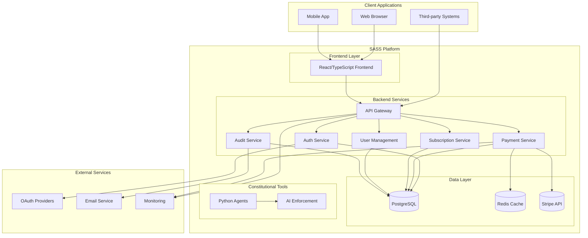
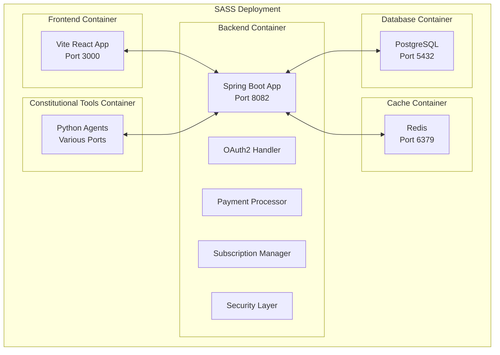
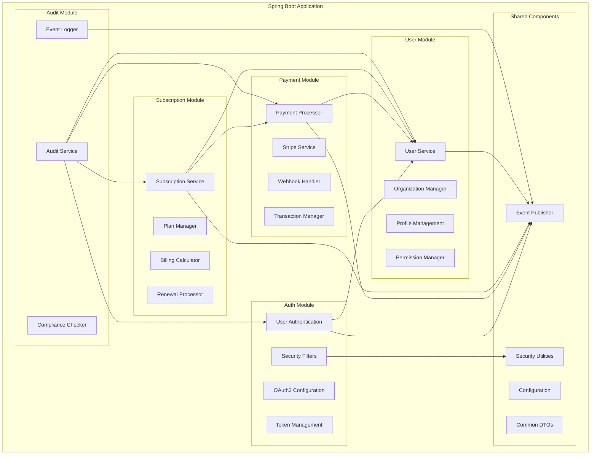
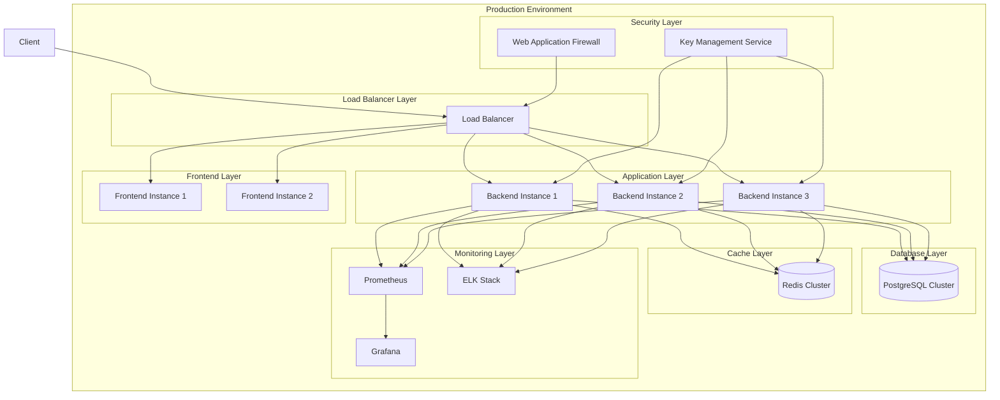
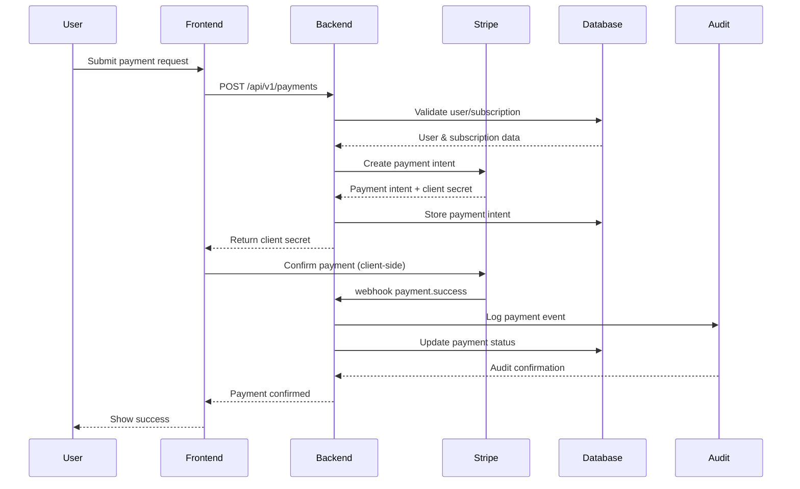

# SASS Architecture Overview

## System Context

## Container Diagram

## Component Diagram (Backend)

## Deployment Architecture

## Data Flow for Payment Processing

## Development Architecture

The SASS project implements a unique dual-stack architecture:

### Application Stack (Java/TypeScript)
- **Backend**: Spring Boot application with modular architecture
  - Built with Java 21 and Spring Boot 3.5.5
  - Uses Spring Modulith for modular design
  - Modules: auth, payment, subscription, user, audit, shared
  - Repository pattern with JPA/Hibernate
  - RESTful APIs with OpenAPI documentation

- **Frontend**: React application with TypeScript
  - Built with Vite for fast development
  - Uses Tailwind CSS for styling
  - State management with Redux Toolkit
  - API communication via RTK Query
  - Component testing with React Testing Library

### Constitutional Tools Stack (Python)
- **Purpose**: AI-powered development assistance and enforcement
- **Components**: Specialized Python agents for development practices
- **Features**:
  - Constitutional enforcement agent
  - TDD compliance agent
  - Task coordination agent
  - Architecture validation
  - Security compliance validation
  - Multi-agent workflow coordination

## Security Architecture

### Authentication Flow
1. OAuth2 providers (Google, GitHub, etc.)
2. Custom OAuth2UserService for user mapping
3. OpaqueTokenAuthenticationFilter for token validation
4. TenantContext for multi-tenant isolation
5. SecurityConfig for access control configuration

### Data Protection
- Encryption at rest for sensitive data
- TLS 1.3 for data in transit
- PCI DSS compliance for payment processing
- GDPR compliance for data handling
- Audit logging for all operations

## Event-Driven Architecture

The system uses Spring Modulith's event-driven capabilities:
- Domain events published by modules
- Event listeners for cross-cutting concerns
- Audit logging triggered by domain events
- Payment processing initiated by subscription events

## API Design Principles

### RESTful Design
- Resource-based URLs
- Standard HTTP verbs
- Proper status codes
- HATEOAS where appropriate
- Versioning via URL path

### Error Handling
- Consistent error response format
- Standardized error codes
- Descriptive error messages
- Proper HTTP status codes
- Audit trail for errors

## Deployment Architecture

### Local Development
- Docker Compose for local environment
- Single container per service
- Local PostgreSQL and Redis
- Hot-reload for development

### Production
- Kubernetes deployment
- Multiple replicas for high availability
- Separate namespaces for environments
- Ingress for external access
- Persistent volumes for data
- Monitoring and logging stack

## Quality Assurance Architecture

### Testing Strategy
- Unit tests for business logic (JUnit 5, Vitest)
- Integration tests with Testcontainers
- Contract tests for API consistency
- E2E tests with Playwright
- Security tests for vulnerabilities

### Code Quality
- SonarQube for static analysis
- Checkstyle for code formatting
- Pre-commit hooks for quality gates
- Coverage requirements (>85%)
- Multi-agent constitutional enforcement