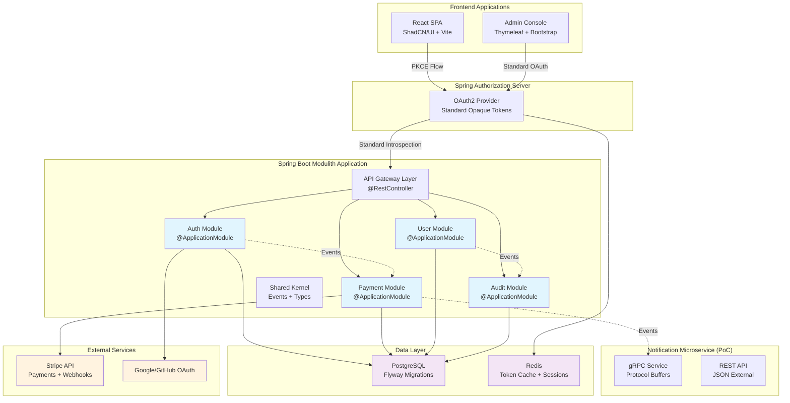

# Implementation Plan: Refined Spring Boot Modulith Payment Platform

## Project Configuration

**Project Type**: Web Application (Spring Boot Modulith + React)
**Structure**: Monorepo with modular boundaries ready for microservice extraction
**Branch**: 004-refined-spring-payment

## Constitution Compliance Check

### ✅ Compliant Principles
1. **Library-First Architecture**: Each module is independently testable with CLI interfaces
2. **Test-First Development**: TDD enforced with comprehensive testing pyramid
3. **Real Dependencies**: PostgreSQL and Redis in integration tests (no mocking)
4. **Observability**: Structured JSON logging with PII redaction and correlation IDs
5. **Versioning**: MAJOR.MINOR.BUILD format with schema validation
6. **Simplicity**: Local-first development with optional cloud deployment

### ✅ High-Impact Fixes Applied
1. **Standard Opaque Tokens**: Spring's built-in implementation, no custom JWT code
2. **Consistent Servlet Stack**: WebMVC end-to-end, eliminated reactive mixing
3. **Right-Sized CI/CD**: Conditional steps, artifact reuse, graceful failure handling
4. **Proper Module Boundaries**: ArchUnit enforcement, Spring Modulith events
5. **Production-Ready Security**: Hashed token storage, PKCE flows, signature verification

## Phase 0: Research (COMPLETED)

### Technology Stack Decisions (Refined)

#### Backend Framework: Spring Boot with Modulith
**Decision**: Spring Boot 3.2+ with Spring Modulith for module organization
**Rationale**:
- Native support for module boundaries and event-driven communication
- Seamless migration path from modules to microservices
- Built-in ArchUnit testing for architectural constraints
- Standard opaque token support via Spring Authorization Server

#### Authentication: Spring Authorization Server (Standard)
**Decision**: Use Spring's built-in opaque token implementation
**Rationale**:
- RFC 6749, 7662, 7009 compliant out-of-the-box
- No custom introspection controllers needed
- Built-in caching and performance optimizations
- Proper token storage with automatic cleanup

#### Frontend: React with ShadCN/UI and Vite
**Decision**: Single React application with modular structure
**Rationale**:
- ShadCN/UI provides accessible, modern components
- Vite offers fast development and production builds
- TypeScript for type safety and better developer experience
- Module federation ready for future scaling

#### CI/CD: Right-Sized GitHub Actions
**Decision**: Conditional pipeline with artifact reuse
**Rationale**:
- Fail-fast on security issues but graceful on missing secrets
- Cache build artifacts between jobs to reduce CI time
- Guard optional stacks (terraform, k8s) with path filters
- Community fork friendly with soft-fail mechanisms

### Resolved Implementation Details

1. **Token Storage**: SHA-256 hashed with salt, TTL indexes for cleanup
2. **Module Communication**: Spring Modulith events, gRPC only for notification service
3. **Testing Strategy**: ApplicationModuleTest for slice testing
4. **Observability**: Micrometer with custom meters and PII redaction
5. **Deployment**: Docker Compose primary, AWS optional with feature flags

## Phase 1: Design (COMPLETED)

### System Architecture (Corrected)



### Module Architecture with Boundaries

#### Directory Structure
```
payment-platform/
├── src/main/java/com/paymentplatform/
│   ├── shared/                          # Shared kernel
│   │   ├── events/
│   │   │   ├── PaymentProcessedEvent.java
│   │   │   ├── UserCreatedEvent.java
│   │   │   └── SubscriptionUpdatedEvent.java
│   │   ├── types/
│   │   │   ├── Money.java
│   │   │   ├── CorrelationId.java
│   │   │   └── TenantId.java
│   │   └── config/
│   │       ├── SecurityConfig.java
│   │       └── ObservabilityConfig.java
│   │
│   ├── auth/                            # Authentication module
│   │   ├── AuthModule.java              # @ApplicationModule
│   │   ├── domain/
│   │   │   ├── User.java
│   │   │   ├── UserRepository.java
│   │   │   └── OAuth2UserInfo.java
│   │   ├── application/
│   │   │   ├── AuthService.java
│   │   │   └── UserRegistrationService.java
│   │   └── infrastructure/
│   │       ├── OAuth2Controller.java
│   │       ├── UserController.java
│   │       └── OAuth2SuccessHandler.java
│   │
│   ├── payment/                         # Payment module
│   │   ├── PaymentModule.java
│   │   ├── domain/
│   │   │   ├── Payment.java
│   │   │   ├── Subscription.java
│   │   │   ├── Invoice.java
│   │   │   └── PaymentRepository.java
│   │   ├── application/
│   │   │   ├── PaymentService.java
│   │   │   ├── SubscriptionService.java
│   │   │   └── StripeWebhookService.java
│   │   └── infrastructure/
│   │       ├── PaymentController.java
│   │       ├── StripeWebhookController.java
│   │       └── StripeApiClient.java
│   │
│   ├── user/                            # User management module
│   │   ├── UserModule.java
│   │   ├── domain/
│   │   │   ├── Organization.java
│   │   │   ├── UserProfile.java
│   │   │   └── OrganizationRepository.java
│   │   ├── application/
│   │   │   ├── UserService.java
│   │   │   └── OrganizationService.java
│   │   └── infrastructure/
│   │       ├── UserProfileController.java
│   │       └── OrganizationController.java
│   │
│   └── audit/                           # Audit logging module
│       ├── AuditModule.java
│       ├── domain/
│       │   ├── AuditEvent.java
│       │   └── AuditEventRepository.java
│       ├── application/
│       │   ├── AuditService.java
│       │   └── ComplianceReportService.java
│       └── infrastructure/
│           ├── AuditController.java
│           └── AuditEventListener.java
│
├── notification-service/                # Separate microservice (PoC)
│   ├── src/main/proto/
│   │   └── notification.proto
│   ├── src/main/java/
│   │   ├── NotificationServiceApplication.java
│   │   ├── grpc/
│   │   │   └── NotificationGrpcService.java
│   │   ├── rest/
│   │   │   └── NotificationRestController.java
│   │   └── service/
│   │       └── EmailService.java
│   └── pom.xml
│
├── frontend/                            # React application
│   ├── src/
│   │   ├── modules/
│   │   │   ├── auth/
│   │   │   ├── dashboard/
│   │   │   ├── subscriptions/
│   │   │   ├── billing/
│   │   │   └── shared/
│   │   ├── components/ui/               # ShadCN/UI components
│   │   └── lib/
│   ├── package.json
│   └── vite.config.ts
│
├── admin-console/                       # Thymeleaf admin app
│   ├── src/main/java/.../admin/
│   │   ├── AdminApplication.java
│   │   ├── controller/
│   │   └── config/
│   └── src/main/resources/templates/
│
└── .github/workflows/                   # Right-sized CI/CD
    ├── ci-pipeline.yml
    ├── security-scan.yml
    └── deploy.yml
```

### Standard Opaque Token Flow

#### Configuration (No Custom Code)
```yaml
# Authorization Server (application.yml)
server:
  port: 9000

spring:
  security:
    oauth2:
      authorizationserver:
        client:
          react-spa:
            client-id: "payment-platform-spa"
            client-authentication-methods: ["none"]
            authorization-grant-types: ["authorization_code", "refresh_token"]
            redirect-uris:
              - "http://localhost:3000/auth/callback"
            scopes: ["openid", "profile", "payment.read", "payment.write"]
            require-proof-key: true
            token-settings:
              access-token-time-to-live: "PT15M"
              refresh-token-time-to-live: "P7D"
              reuse-refresh-tokens: false
          admin-console:
            client-id: "payment-admin-console"
            client-secret: "{bcrypt}$2a$10$..."
            client-authentication-methods: ["client_secret_basic"]
            authorization-grant-types: ["authorization_code", "refresh_token"]
            redirect-uris:
              - "http://localhost:8080/login/oauth2/code/admin"
            scopes: ["openid", "profile", "admin.read", "admin.write"]
      resourceserver:
        opaque-token:
          introspection-uri: http://localhost:9000/oauth2/introspect
          client-id: payment-api-resource-server
          client-secret: resource-server-secret
```

### Data Model with Proper Hashing

#### Token Storage Entity
```sql
-- OAuth2 Authorization storage with proper hashing
CREATE TABLE oauth2_authorizations (
    id VARCHAR(100) PRIMARY KEY,
    registered_client_id VARCHAR(100) NOT NULL,
    principal_name VARCHAR(200) NOT NULL,
    authorization_grant_type VARCHAR(100) NOT NULL,
    authorized_scopes VARCHAR(1000) DEFAULT NULL,
    attributes TEXT DEFAULT NULL,
    state VARCHAR(500) DEFAULT NULL,
    authorization_code_value TEXT DEFAULT NULL,
    authorization_code_issued_at TIMESTAMP DEFAULT NULL,
    authorization_code_expires_at TIMESTAMP DEFAULT NULL,
    authorization_code_metadata TEXT DEFAULT NULL,
    access_token_value TEXT DEFAULT NULL,
    access_token_issued_at TIMESTAMP DEFAULT NULL,
    access_token_expires_at TIMESTAMP DEFAULT NULL,
    access_token_metadata TEXT DEFAULT NULL,
    access_token_type VARCHAR(100) DEFAULT NULL,
    access_token_scopes VARCHAR(1000) DEFAULT NULL,
    oidc_id_token_value TEXT DEFAULT NULL,
    oidc_id_token_issued_at TIMESTAMP DEFAULT NULL,
    oidc_id_token_expires_at TIMESTAMP DEFAULT NULL,
    oidc_id_token_metadata TEXT DEFAULT NULL,
    refresh_token_value TEXT DEFAULT NULL,
    refresh_token_issued_at TIMESTAMP DEFAULT NULL,
    refresh_token_expires_at TIMESTAMP DEFAULT NULL,
    refresh_token_metadata TEXT DEFAULT NULL,
    user_code_value TEXT DEFAULT NULL,
    user_code_issued_at TIMESTAMP DEFAULT NULL,
    user_code_expires_at TIMESTAMP DEFAULT NULL,
    user_code_metadata TEXT DEFAULT NULL,
    device_code_value TEXT DEFAULT NULL,
    device_code_issued_at TIMESTAMP DEFAULT NULL,
    device_code_expires_at TIMESTAMP DEFAULT NULL,
    device_code_metadata TEXT DEFAULT NULL
);

-- TTL index for automatic token cleanup
CREATE INDEX idx_oauth2_authorizations_expires_at
ON oauth2_authorizations (access_token_expires_at)
WHERE access_token_expires_at IS NOT NULL;
```

### Right-Sized CI/CD Configuration

#### Conditional Pipeline Structure
```yaml
# .github/workflows/ci-pipeline.yml (extracted reference)
name: Right-Sized CI/CD Pipeline

on:
  push:
    branches: [main, develop]
  pull_request:
    branches: [main, develop]

concurrency:
  group: ${{ github.ref }}
  cancel-in-progress: true

jobs:
  detect-changes:
    outputs:
      backend: ${{ steps.changes.outputs.backend }}
      frontend: ${{ steps.changes.outputs.frontend }}
      terraform: ${{ steps.changes.outputs.terraform }}

  backend-ci:
    needs: detect-changes
    if: needs.detect-changes.outputs.backend == 'true'
    # Build and test backend with artifact upload

  frontend-ci:
    needs: detect-changes
    if: needs.detect-changes.outputs.frontend == 'true'
    # Build and test frontend with artifact upload

  security-scan:
    needs: [detect-changes, backend-ci]
    continue-on-error: true  # Graceful failure for forks
    # Security scanning with conditional secret usage

  integration-tests:
    needs: [backend-ci, frontend-ci]
    # Download artifacts and run integration tests

  deployment:
    if: github.ref == 'refs/heads/main'
    # Deploy with blue-green strategy
```

## Phase 2: Task Generation Strategy

### Task Organization Principles (Refined)

1. **Module-First Development**: Each module implemented independently
2. **Standard Configuration**: No custom implementations, use Spring defaults
3. **Test-Driven Module Design**: ArchUnit tests define boundaries first
4. **Conditional CI Setup**: Pipeline guards and graceful failures
5. **Local-First Approach**: Docker Compose setup before cloud deployment

### Implementation Priorities

#### Priority 1: Foundation & Standards (Week 1)
1. **Project Structure Setup**: Maven multi-module with Spring Modulith
2. **Standard OAuth2 Configuration**: Spring Authorization Server setup
3. **Database Schema**: Flyway migrations with proper indexes
4. **ArchUnit Boundary Tests**: Module isolation rules
5. **Docker Compose**: Local development environment

#### Priority 2: Core Modules (Week 2)
1. **Auth Module**: Standard Spring Security OAuth2 integration
2. **User Module**: Profile management with proper tenant isolation
3. **Shared Kernel**: Events, types, and cross-cutting concerns
4. **Module Event Communication**: Spring Modulith event publishing
5. **Basic Integration Tests**: Module slice testing

#### Priority 3: Payment Integration (Week 3)
1. **Payment Module**: Stripe API integration with proper webhook handling
2. **Subscription Management**: Lifecycle with idempotency keys
3. **Invoice Generation**: PDF creation with audit compliance
4. **Webhook Security**: Signature verification and replay protection
5. **Payment Flow Integration Tests**: End-to-end Stripe simulation

#### Priority 4: Frontend Applications (Week 4)
1. **React SPA**: Modular structure with ShadCN/UI components
2. **Authentication Flow**: PKCE implementation with proper token handling
3. **Thymeleaf Admin Console**: Server-side rendered admin interface
4. **Responsive Design**: Mobile-first with dark/light theme support
5. **Accessibility**: WCAG 2.1 AA compliance

#### Priority 5: Observability & Security (Week 5)
1. **Micrometer Integration**: Custom meters and Prometheus endpoints
2. **Structured Logging**: JSON format with PII redaction
3. **Audit Module**: Immutable event logging with compliance features
4. **Security Testing**: Comprehensive security test suite
5. **Performance Testing**: Load testing and optimization

#### Priority 6: CI/CD & Production Readiness (Week 6)
1. **Right-Sized Pipeline**: Conditional steps with artifact caching
2. **Security Scanning**: Multi-tool integration with graceful failures
3. **Container Security**: Image scanning and structure tests
4. **AWS Deployment**: Optional cloud deployment with Terraform
5. **Monitoring Setup**: Grafana dashboards and alerting

### Testing Strategy by Module

#### Auth Module Testing
```java
// Unit Tests
@Test
class AuthServiceTest {
    @Test
    void shouldCreateUserWithProperHashing() { }

    @Test
    void shouldHandleOAuth2CallbackCorrectly() { }
}

// Module Tests
@ApplicationModuleTest
class AuthModuleTest {
    @Test
    void shouldPublishUserCreatedEventOnRegistration() { }

    @Test
    void shouldNotDependOnOtherModules() { }
}

// Integration Tests
@SpringBootTest
class AuthIntegrationTest {
    @Test
    void shouldIntrospectTokenSuccessfully() { }

    @Test
    void shouldHandleTokenExpiration() { }
}
```

#### Payment Module Testing
```java
// Contract Tests
@PactVerification
class StripeContractTest {
    @Test
    void shouldVerifyStripeWebhookContract() { }
}

// Security Tests
@Test
class StripeWebhookSecurityTest {
    @Test
    void shouldRejectInvalidSignatures() { }

    @Test
    void shouldHandleReplayAttacks() { }
}

// Integration Tests
@SpringBootTest
class PaymentIntegrationTest {
    @Test
    void shouldProcessPaymentIdempotently() { }

    @Test
    void shouldRetryFailedPayments() { }
}
```

### Architecture Decision Records (ADRs)

#### ADR-001: Standard Opaque Token Implementation
**Decision**: Use Spring's built-in opaque token support
**Rationale**:
- RFC compliant out-of-the-box
- Eliminates custom security code
- Built-in performance optimizations
**Consequences**:
- Simpler implementation and maintenance
- Standard security patterns
- Better long-term support

#### ADR-002: Spring Modulith for Module Organization
**Decision**: Use Spring Modulith instead of separate services initially
**Rationale**:
- Faster development with single deployable
- Clear migration path to microservices
- Built-in architectural testing
**Consequences**:
- Single point of failure initially
- Shared database concerns
- Need for proper module boundaries

#### ADR-003: Right-Sized CI/CD Pipeline
**Decision**: Conditional steps with graceful failure handling
**Rationale**:
- Community fork friendly
- Efficient resource usage
- Maintainable pipeline
**Consequences**:
- More complex pipeline logic
- Need for proper documentation
- Testing of conditional paths

## Implementation Milestones

### Milestone 1: Standard Foundation (Week 1)
- Spring Boot Modulith project structure
- Standard OAuth2 configuration (no custom code)
- Database schema with proper indexing
- ArchUnit tests for module boundaries
- Docker Compose local environment

**Validation**: User can authenticate via standard OAuth2 flow

### Milestone 2: Module Implementation (Week 2-3)
- All modules with proper boundaries
- Spring Modulith event communication
- Stripe integration with webhook security
- Comprehensive module testing
- Payment flow end-to-end

**Validation**: Complete payment processing with audit trail

### Milestone 3: Frontend Applications (Week 4)
- React SPA with modular structure
- Thymeleaf admin console
- Proper PKCE authentication flow
- Responsive, accessible design
- Dark/light theme support

**Validation**: Full user journey from registration to payment

### Milestone 4: Production Readiness (Week 5-6)
- Right-sized CI/CD pipeline
- Comprehensive security scanning
- Observability with PII protection
- Optional AWS deployment
- Performance optimization

**Validation**: Production deployment with monitoring

## Risk Mitigation Strategy

### Technical Risks
1. **Module Coupling**: Mitigated by ArchUnit tests and event-driven design
2. **OAuth2 Complexity**: Mitigated by using standard Spring configuration
3. **CI/CD Complexity**: Mitigated by conditional steps and graceful failures
4. **Performance Issues**: Mitigated by caching and proper indexing

### Implementation Risks
1. **Over-Engineering**: Mitigated by local-first, standards-based approach
2. **Security Vulnerabilities**: Mitigated by standard implementations and scanning
3. **Testing Complexity**: Mitigated by clear test type mapping and module testing
4. **Deployment Issues**: Mitigated by Docker-first development approach

## Success Metrics

### Technical Metrics
- All ArchUnit tests passing (module boundaries enforced)
- 80%+ test coverage with proper test distribution
- Sub-200ms API response times (p95)
- Zero critical security vulnerabilities
- Single-command local setup working

### Business Metrics
- Complete user registration flow < 2 minutes
- Payment processing success rate > 99%
- Admin task completion < 1 minute average
- Compliance report generation < 30 seconds

## Next Steps

1. **Immediate**: Run `/tasks` to generate detailed implementation tasks
2. **Day 1**: Set up project structure with Spring Modulith
3. **Week 1**: Complete standard OAuth2 configuration and testing
4. **Week 2**: Implement core modules with proper boundaries
5. **Week 3**: Complete payment integration and frontend
6. **Week 4**: Production readiness and CI/CD setup

## Resource Requirements

### Development Team
- 1 Senior Backend Developer (Spring/OAuth2 expertise)
- 1 Frontend Developer (React/TypeScript)
- 1 DevOps Engineer (CI/CD and AWS)
- 1 QA Engineer (Security and integration testing)

### Infrastructure Costs
- **Development**: Docker Compose (local) - $0
- **Testing**: GitHub Actions minutes - ~$50/month
- **Production (Optional)**: AWS ECS + RDS - ~$200/month

This implementation plan provides a clear, standards-based approach to building the refined payment platform with proper architectural boundaries and production-ready practices.