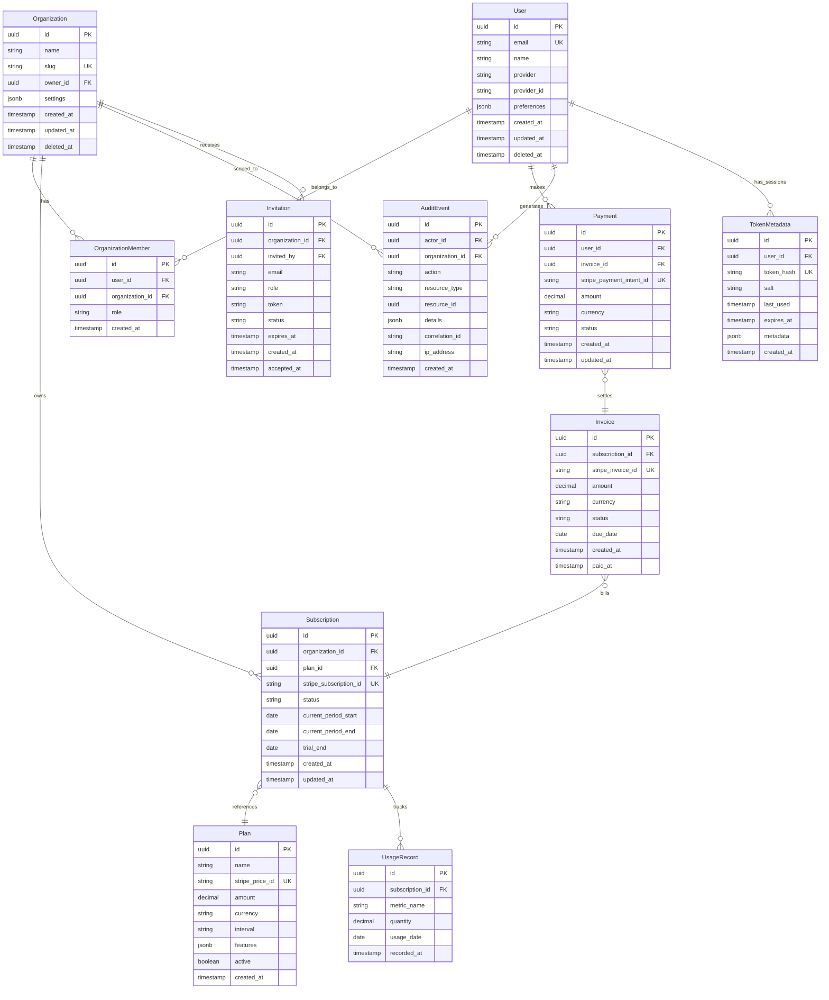

# Data Model: Spring Boot Modulith Payment Platform

## Entity Relationship Overview



## Core Domain Entities

### User Entity

**Purpose**: Represents authenticated users in the system

```sql
CREATE TABLE users (
    id UUID PRIMARY KEY DEFAULT gen_random_uuid(),
    email VARCHAR(255) UNIQUE NOT NULL,
    name VARCHAR(255) NOT NULL,
    provider VARCHAR(50) NOT NULL, -- 'google', 'github', 'microsoft'
    provider_id VARCHAR(255) NOT NULL,
    preferences JSONB DEFAULT '{}',
    created_at TIMESTAMP WITH TIME ZONE DEFAULT CURRENT_TIMESTAMP,
    updated_at TIMESTAMP WITH TIME ZONE DEFAULT CURRENT_TIMESTAMP,
    deleted_at TIMESTAMP WITH TIME ZONE,

    UNIQUE(provider, provider_id),
    INDEX idx_users_email (email) WHERE deleted_at IS NULL,
    INDEX idx_users_provider (provider, provider_id),
    INDEX idx_users_deleted_at (deleted_at)
);
```

**Validation Rules**:
- Email must be valid format
- Name required and non-empty
- Provider must be supported OAuth2 provider
- Preferences stored as structured JSON

**State Transitions**:
- Created → Active (on first login)
- Active → Soft Deleted (user deletion)
- Soft Deleted → Hard Deleted (after retention period)

### Organization Entity

**Purpose**: Multi-tenant isolation and team management

```sql
CREATE TABLE organizations (
    id UUID PRIMARY KEY DEFAULT gen_random_uuid(),
    name VARCHAR(255) NOT NULL,
    slug VARCHAR(100) UNIQUE NOT NULL,
    owner_id UUID REFERENCES users(id) ON DELETE SET NULL,
    settings JSONB DEFAULT '{}',
    created_at TIMESTAMP WITH TIME ZONE DEFAULT CURRENT_TIMESTAMP,
    updated_at TIMESTAMP WITH TIME ZONE DEFAULT CURRENT_TIMESTAMP,
    deleted_at TIMESTAMP WITH TIME ZONE,

    INDEX idx_organizations_slug (slug) WHERE deleted_at IS NULL,
    INDEX idx_organizations_owner (owner_id),
    INDEX idx_organizations_deleted_at (deleted_at)
);
```

**Validation Rules**:
- Name required and non-empty (max 255 chars)
- Slug must be URL-safe and unique
- Owner must be valid user
- Settings stored as structured JSON

**Business Rules**:
- Owner has full administrative privileges
- Slug used for tenant identification in URLs
- Settings include billing preferences, feature flags

### OrganizationMember Entity

**Purpose**: Many-to-many relationship between users and organizations

```sql
CREATE TABLE organization_members (
    id UUID PRIMARY KEY DEFAULT gen_random_uuid(),
    user_id UUID NOT NULL REFERENCES users(id) ON DELETE CASCADE,
    organization_id UUID NOT NULL REFERENCES organizations(id) ON DELETE CASCADE,
    role VARCHAR(50) NOT NULL DEFAULT 'member',
    created_at TIMESTAMP WITH TIME ZONE DEFAULT CURRENT_TIMESTAMP,

    UNIQUE(user_id, organization_id),
    INDEX idx_org_members_user (user_id),
    INDEX idx_org_members_org (organization_id),
    INDEX idx_org_members_role (role)
);
```

**Roles**:
- `owner`: Full administrative access
- `admin`: Can manage users and billing
- `member`: Basic access to organization resources

### Plan Entity

**Purpose**: Subscription plan definitions with Stripe integration

```sql
CREATE TABLE plans (
    id UUID PRIMARY KEY DEFAULT gen_random_uuid(),
    name VARCHAR(255) NOT NULL,
    stripe_price_id VARCHAR(255) UNIQUE NOT NULL,
    amount DECIMAL(10,2) NOT NULL,
    currency CHAR(3) NOT NULL DEFAULT 'USD',
    interval VARCHAR(20) NOT NULL, -- 'month', 'year'
    features JSONB DEFAULT '{}',
    active BOOLEAN DEFAULT true,
    created_at TIMESTAMP WITH TIME ZONE DEFAULT CURRENT_TIMESTAMP,

    INDEX idx_plans_active (active),
    INDEX idx_plans_stripe_price (stripe_price_id)
);
```

**Features JSON Structure**:
```json
{
  "max_users": 10,
  "api_calls_per_month": 100000,
  "support_level": "email",
  "custom_integrations": false,
  "advanced_analytics": true
}
```

### Subscription Entity

**Purpose**: Active subscriptions linking organizations to plans

```sql
CREATE TABLE subscriptions (
    id UUID PRIMARY KEY DEFAULT gen_random_uuid(),
    organization_id UUID NOT NULL REFERENCES organizations(id) ON DELETE CASCADE,
    plan_id UUID NOT NULL REFERENCES plans(id),
    stripe_subscription_id VARCHAR(255) UNIQUE,
    status VARCHAR(50) NOT NULL,
    current_period_start DATE,
    current_period_end DATE,
    trial_end DATE,
    created_at TIMESTAMP WITH TIME ZONE DEFAULT CURRENT_TIMESTAMP,
    updated_at TIMESTAMP WITH TIME ZONE DEFAULT CURRENT_TIMESTAMP,

    INDEX idx_subscriptions_org (organization_id),
    INDEX idx_subscriptions_status (status),
    INDEX idx_subscriptions_stripe (stripe_subscription_id),
    INDEX idx_subscriptions_period (current_period_end)
);
```

**Status Values**:
- `trialing`: In trial period
- `active`: Paid and active
- `past_due`: Payment failed, grace period
- `canceled`: Canceled, access until period end
- `unpaid`: Failed payment, suspended

### Payment Entity

**Purpose**: Payment transaction records

```sql
CREATE TABLE payments (
    id UUID PRIMARY KEY DEFAULT gen_random_uuid(),
    user_id UUID NOT NULL REFERENCES users(id),
    invoice_id UUID REFERENCES invoices(id),
    stripe_payment_intent_id VARCHAR(255) UNIQUE NOT NULL,
    amount DECIMAL(10,2) NOT NULL,
    currency CHAR(3) NOT NULL,
    status VARCHAR(50) NOT NULL,
    created_at TIMESTAMP WITH TIME ZONE DEFAULT CURRENT_TIMESTAMP,
    updated_at TIMESTAMP WITH TIME ZONE DEFAULT CURRENT_TIMESTAMP,

    INDEX idx_payments_user (user_id),
    INDEX idx_payments_invoice (invoice_id),
    INDEX idx_payments_stripe (stripe_payment_intent_id),
    INDEX idx_payments_status (status),
    INDEX idx_payments_created (created_at)
);
```

**Status Values**:
- `requires_payment_method`: Payment method needed
- `requires_confirmation`: 3D Secure confirmation
- `processing`: Payment being processed
- `succeeded`: Payment completed successfully
- `requires_action`: Additional action needed
- `canceled`: Payment canceled
- `failed`: Payment failed

### Invoice Entity

**Purpose**: Billing documents for subscriptions

```sql
CREATE TABLE invoices (
    id UUID PRIMARY KEY DEFAULT gen_random_uuid(),
    subscription_id UUID NOT NULL REFERENCES subscriptions(id),
    stripe_invoice_id VARCHAR(255) UNIQUE NOT NULL,
    amount DECIMAL(10,2) NOT NULL,
    currency CHAR(3) NOT NULL,
    status VARCHAR(50) NOT NULL,
    due_date DATE,
    created_at TIMESTAMP WITH TIME ZONE DEFAULT CURRENT_TIMESTAMP,
    paid_at TIMESTAMP WITH TIME ZONE,

    INDEX idx_invoices_subscription (subscription_id),
    INDEX idx_invoices_stripe (stripe_invoice_id),
    INDEX idx_invoices_status (status),
    INDEX idx_invoices_due_date (due_date)
);
```

### AuditEvent Entity

**Purpose**: Compliance and security audit logging

```sql
CREATE TABLE audit_events (
    id UUID PRIMARY KEY DEFAULT gen_random_uuid(),
    actor_id UUID REFERENCES users(id),
    organization_id UUID REFERENCES organizations(id),
    action VARCHAR(100) NOT NULL,
    resource_type VARCHAR(100),
    resource_id UUID,
    details JSONB,
    correlation_id VARCHAR(100),
    ip_address INET,
    created_at TIMESTAMP WITH TIME ZONE DEFAULT CURRENT_TIMESTAMP,

    INDEX idx_audit_events_actor (actor_id),
    INDEX idx_audit_events_org (organization_id),
    INDEX idx_audit_events_correlation (correlation_id),
    INDEX idx_audit_events_created (created_at),
    INDEX idx_audit_events_action (action)
) PARTITION BY RANGE (created_at);

-- Monthly partitions for performance
CREATE TABLE audit_events_2024_01 PARTITION OF audit_events
    FOR VALUES FROM ('2024-01-01') TO ('2024-02-01');
```

**Action Types**:
- `user.login`, `user.logout`
- `organization.created`, `organization.updated`
- `subscription.created`, `subscription.canceled`
- `payment.processed`, `payment.failed`
- `user.invited`, `user.removed`

### TokenMetadata Entity

**Purpose**: Secure session and token management

```sql
CREATE TABLE token_metadata (
    id UUID PRIMARY KEY DEFAULT gen_random_uuid(),
    user_id UUID NOT NULL REFERENCES users(id) ON DELETE CASCADE,
    token_hash VARCHAR(255) UNIQUE NOT NULL,
    salt VARCHAR(255) NOT NULL,
    last_used TIMESTAMP WITH TIME ZONE DEFAULT CURRENT_TIMESTAMP,
    expires_at TIMESTAMP WITH TIME ZONE NOT NULL,
    metadata JSONB DEFAULT '{}',
    created_at TIMESTAMP WITH TIME ZONE DEFAULT CURRENT_TIMESTAMP,

    INDEX idx_token_metadata_user (user_id),
    INDEX idx_token_metadata_hash (token_hash),
    INDEX idx_token_metadata_expires (expires_at)
);
```

**Metadata JSON Structure**:
```json
{
  "ip_address": "192.168.1.1",
  "user_agent": "Mozilla/5.0...",
  "oauth_provider": "google",
  "session_type": "web"
}
```

### UsageRecord Entity

**Purpose**: Track usage for billing and limits

```sql
CREATE TABLE usage_records (
    id UUID PRIMARY KEY DEFAULT gen_random_uuid(),
    subscription_id UUID NOT NULL REFERENCES subscriptions(id),
    metric_name VARCHAR(100) NOT NULL,
    quantity DECIMAL(15,4) NOT NULL,
    usage_date DATE NOT NULL,
    recorded_at TIMESTAMP WITH TIME ZONE DEFAULT CURRENT_TIMESTAMP,

    INDEX idx_usage_records_subscription (subscription_id),
    INDEX idx_usage_records_metric (metric_name),
    INDEX idx_usage_records_date (usage_date),
    UNIQUE(subscription_id, metric_name, usage_date)
);
```

**Metric Types**:
- `api_calls`: Number of API requests
- `users`: Active user count
- `storage_gb`: Storage usage in GB
- `bandwidth_gb`: Bandwidth usage in GB

### Invitation Entity

**Purpose**: Organization member invitations

```sql
CREATE TABLE invitations (
    id UUID PRIMARY KEY DEFAULT gen_random_uuid(),
    organization_id UUID NOT NULL REFERENCES organizations(id) ON DELETE CASCADE,
    invited_by UUID NOT NULL REFERENCES users(id),
    email VARCHAR(255) NOT NULL,
    role VARCHAR(50) NOT NULL DEFAULT 'member',
    token VARCHAR(255) UNIQUE NOT NULL,
    status VARCHAR(50) NOT NULL DEFAULT 'pending',
    expires_at TIMESTAMP WITH TIME ZONE NOT NULL,
    created_at TIMESTAMP WITH TIME ZONE DEFAULT CURRENT_TIMESTAMP,
    accepted_at TIMESTAMP WITH TIME ZONE,

    INDEX idx_invitations_org (organization_id),
    INDEX idx_invitations_email (email),
    INDEX idx_invitations_token (token),
    INDEX idx_invitations_status (status),
    INDEX idx_invitations_expires (expires_at)
);
```

**Status Values**:
- `pending`: Invitation sent, awaiting response
- `accepted`: Invitation accepted, user added
- `declined`: Invitation declined by recipient
- `expired`: Invitation expired without response
- `revoked`: Invitation canceled by sender

## Domain Value Objects

### Money Value Object
```java
@Embeddable
public class Money {
    private BigDecimal amount;
    private String currency;

    // Validation, arithmetic operations, formatting
}
```

### Email Value Object
```java
@Embeddable
public class Email {
    private String value;

    // Email validation, normalization
}
```

### TenantContext Value Object
```java
public class TenantContext {
    private UUID organizationId;
    private String organizationSlug;

    // Thread-local context for multi-tenancy
}
```

## Data Consistency Rules

### Referential Integrity
- Soft deletes preserve referential relationships
- Foreign key constraints ensure data consistency
- Cascade deletes only for true ownership relationships

### Business Rules
1. **One Active Subscription**: Organizations can have max one active subscription
2. **Owner Membership**: Organization owner must be a member
3. **Payment-Invoice Link**: Payments must reference valid invoices
4. **Token Expiration**: Expired tokens automatically cleaned up
5. **Audit Retention**: Audit events follow compliance retention policies

### Concurrency Controls
- Optimistic locking for subscription updates
- Pessimistic locking for payment processing
- Database constraints for unique business rules

---

*Data model supports multi-tenant SaaS with GDPR compliance and audit requirements*