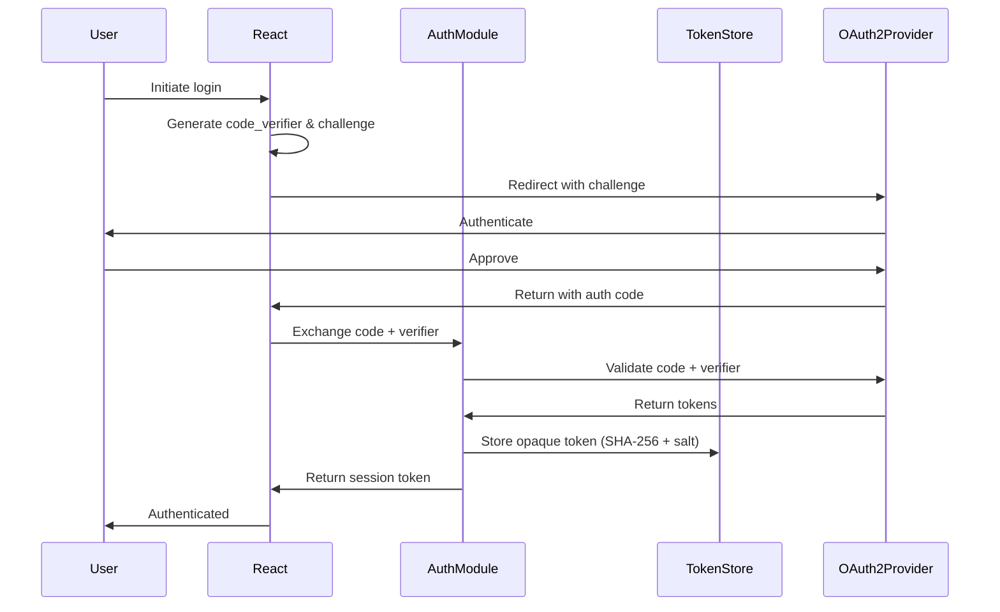
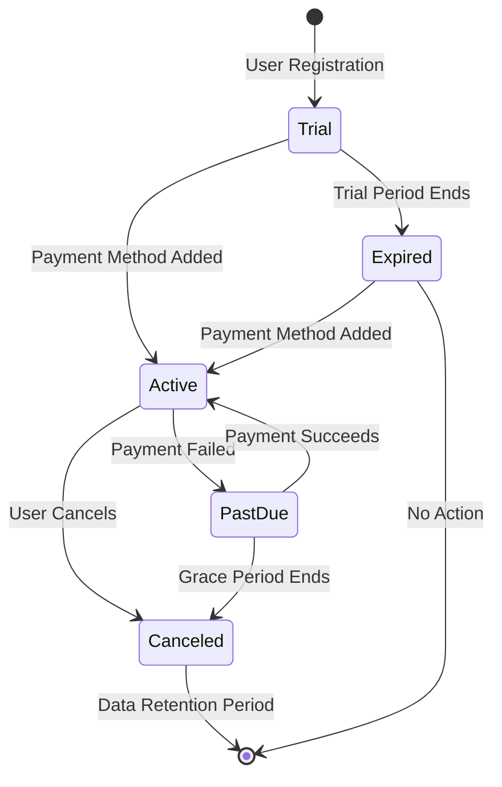
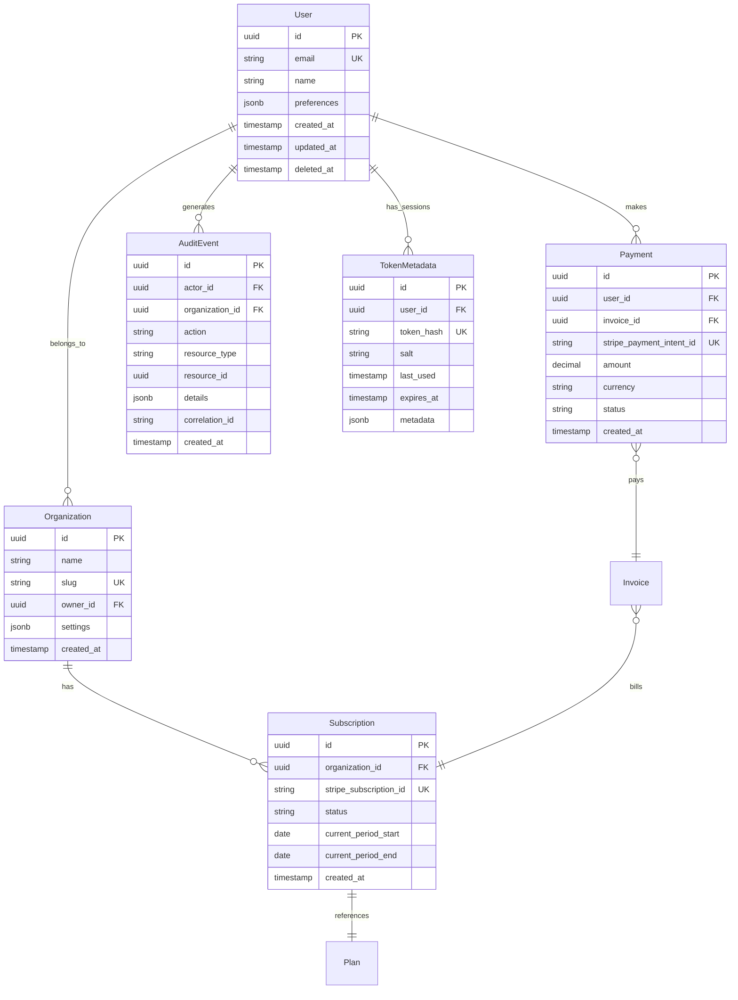
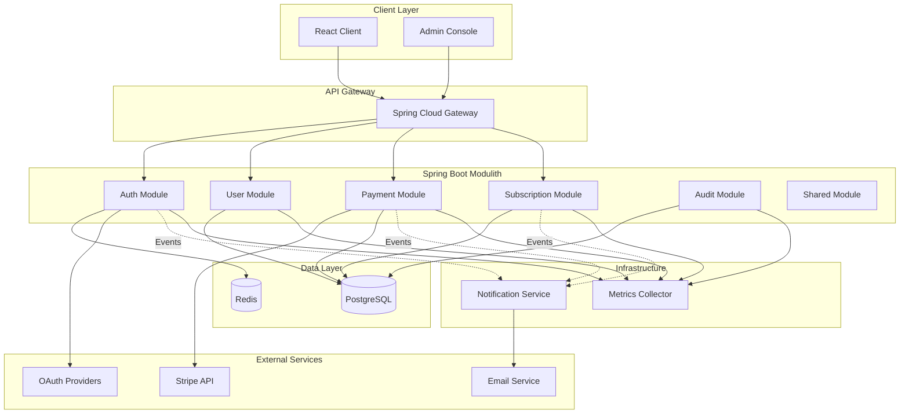

/# Spring Boot Modulith + React Micro-SaaS Payment Platform Specification

## 1. Executive Summary

### Purpose
This specification defines a production-ready, multi-tenant SaaS payment platform built with Spring Boot Modulith architecture and React frontend. The platform provides subscription management, payment processing via Stripe, and comprehensive administrative capabilities while maintaining strict module boundaries and GDPR compliance.

### Scope
The system encompasses:
- OAuth2/PKCE authentication with opaque tokens
- Stripe-powered subscription and payment management
- Multi-tenant organization support
- Administrative console for platform operations
- Event-driven notification service
- Comprehensive audit logging and compliance features

### High-Level Description
A modular monolith architecture leveraging Spring Modulith for internal boundaries, React for user interfaces, and PostgreSQL for data persistence. The platform implements RFC-compliant OAuth2 flows, integrates with Stripe for payment processing, and maintains strict GDPR compliance through structured logging and data retention policies.

## 2. Actors & Roles

### Primary Actors

#### End Users
- **Description**: Customers subscribing to services
- **Capabilities**:
  - Register/authenticate via OAuth2
  - Manage profile and preferences
  - View/update subscription plans
  - Access payment history
  - Download invoices

#### Organization Admins
- **Description**: Customer organization administrators
- **Capabilities**:
  - Manage organization settings
  - Invite/remove team members
  - Configure billing information
  - View organization-wide usage metrics
  - Access audit logs for their organization

#### Platform Administrators
- **Description**: Internal platform operators
- **Capabilities**:
  - Manage all organizations and users
  - Configure subscription plans and pricing
  - Monitor platform health and metrics
  - Access comprehensive audit logs
  - Manage feature flags and configurations

### System Actors

#### Notification Service
- **Type**: Internal microservice
- **Responsibilities**:
  - Process asynchronous events from modules
  - Send emails via SendGrid/AWS SES
  - Manage notification templates
  - Track delivery status

#### CI/CD Pipeline
- **Type**: GitHub Actions automation
- **Responsibilities**:
  - Build and test all components
  - Perform security scanning
  - Deploy to environments
  - Execute database migrations

#### External Integrators
- **Type**: Third-party systems
- **Integration Points**:
  - Stripe (payment processing)
  - OAuth2 providers (Google, GitHub, Microsoft)
  - Email service providers
  - Monitoring services (DataDog/New Relic)

## 3. Core Workflows

### 3.1 OAuth2/PKCE Authentication Flow



### 3.2 Subscription Lifecycle



### 3.3 Payment Processing Workflow

1. **Payment Initiation**
   - User selects plan or updates payment method
   - Frontend creates SetupIntent via backend
   - Stripe Elements collects payment details
   - Frontend confirms SetupIntent

2. **Webhook Processing**
   ```java
   @EventListener
   public void handleStripeWebhook(StripeWebhookEvent event) {
       // Verify signature
       String signature = headers.get("Stripe-Signature");
       Event stripeEvent = Webhook.constructEvent(payload, signature, secret);

       // Idempotency check
       if (eventRepository.existsByStripeEventId(stripeEvent.getId())) {
           return; // Already processed
       }

       // Process based on type
       switch (stripeEvent.getType()) {
           case "payment_intent.succeeded":
               processPayment(stripeEvent);
               break;
           case "invoice.payment_failed":
               handleFailedPayment(stripeEvent);
               break;
       }

       // Store for idempotency
       eventRepository.save(new ProcessedEvent(stripeEvent.getId()));
   }
   ```

### 3.4 Audit Logging Workflow

Every significant action triggers audit event creation:

```java
@Component
public class AuditEventPublisher {
    private final ApplicationEventPublisher publisher;

    public void publishAuditEvent(AuditableAction action) {
        AuditEvent event = AuditEvent.builder()
            .timestamp(Instant.now())
            .actor(SecurityContext.getCurrentUser())
            .action(action.getType())
            .resource(action.getResource())
            .organizationId(SecurityContext.getOrganizationId())
            .correlationId(MDC.get("correlationId"))
            .details(sanitizeDetails(action.getDetails()))
            .build();

        publisher.publishEvent(event);
    }

    private Map<String, Object> sanitizeDetails(Map<String, Object> details) {
        // Redact PII fields
        return PIIRedactor.redact(details);
    }
}
```

## 4. Constraints

### 4.1 Authentication Constraints
- **Opaque Tokens Only**: No custom JWT implementation
- **Token Storage**: SHA-256 hash with per-token salt
- **Session Management**: Server-side sessions with Redis backing
- **Token Introspection**: Cached for 5 minutes per token

### 4.2 Technology Stack Constraints
- **WebMVC Only**: No WebFlux/reactive stack
- **Spring Boot 3.2+**: Latest stable version
- **Java 21**: LTS version with virtual threads enabled
- **PostgreSQL 15+**: Primary database
- **Redis 7+**: Session and cache storage

### 4.3 Module Communication Constraints
- **Spring Modulith Events**: Primary inter-module communication
- **Direct Service Calls**: Only for synchronous, time-critical operations
- **ArchUnit Rules**: Enforced at build time

```java
@ArchTest
static final ArchRule modulesShouldNotDependOnEachOther =
    noClasses()
        .that().resideInAPackage("..payment..")
        .should().dependOnClassesThat()
        .resideInAPackage("..user..")
        .orShould().dependOnClassesThat()
        .resideInAPackage("..audit..");
```

### 4.4 GDPR Compliance Constraints
- **PII Logging**: Structured with redaction
- **Data Retention**: Configurable per data type
- **Right to Erasure**: Soft delete with purge after retention
- **Data Portability**: Export in JSON/CSV formats

## 5. Data Entities

### 5.1 Core Entity Relationships



### 5.2 Database Schema

```sql
-- Users table with soft delete
CREATE TABLE users (
    id UUID PRIMARY KEY DEFAULT gen_random_uuid(),
    email VARCHAR(255) UNIQUE NOT NULL,
    name VARCHAR(255),
    preferences JSONB DEFAULT '{}',
    created_at TIMESTAMP WITH TIME ZONE DEFAULT CURRENT_TIMESTAMP,
    updated_at TIMESTAMP WITH TIME ZONE DEFAULT CURRENT_TIMESTAMP,
    deleted_at TIMESTAMP WITH TIME ZONE,

    INDEX idx_users_email (email) WHERE deleted_at IS NULL,
    INDEX idx_users_deleted_at (deleted_at)
);

-- Organizations with unique slugs
CREATE TABLE organizations (
    id UUID PRIMARY KEY DEFAULT gen_random_uuid(),
    name VARCHAR(255) NOT NULL,
    slug VARCHAR(100) UNIQUE NOT NULL,
    owner_id UUID REFERENCES users(id),
    settings JSONB DEFAULT '{}',
    created_at TIMESTAMP WITH TIME ZONE DEFAULT CURRENT_TIMESTAMP,

    INDEX idx_organizations_slug (slug),
    INDEX idx_organizations_owner (owner_id)
);

-- Subscription management
CREATE TABLE subscriptions (
    id UUID PRIMARY KEY DEFAULT gen_random_uuid(),
    organization_id UUID REFERENCES organizations(id),
    plan_id UUID REFERENCES plans(id),
    stripe_subscription_id VARCHAR(255) UNIQUE,
    status VARCHAR(50) NOT NULL,
    current_period_start DATE,
    current_period_end DATE,
    created_at TIMESTAMP WITH TIME ZONE DEFAULT CURRENT_TIMESTAMP,
    updated_at TIMESTAMP WITH TIME ZONE DEFAULT CURRENT_TIMESTAMP,

    INDEX idx_subscriptions_org (organization_id),
    INDEX idx_subscriptions_status (status),
    INDEX idx_subscriptions_stripe (stripe_subscription_id)
);

-- Audit events with retention
CREATE TABLE audit_events (
    id UUID PRIMARY KEY DEFAULT gen_random_uuid(),
    actor_id UUID REFERENCES users(id),
    organization_id UUID REFERENCES organizations(id),
    action VARCHAR(100) NOT NULL,
    resource_type VARCHAR(100),
    resource_id UUID,
    details JSONB,
    correlation_id VARCHAR(100),
    created_at TIMESTAMP WITH TIME ZONE DEFAULT CURRENT_TIMESTAMP,

    INDEX idx_audit_events_actor (actor_id),
    INDEX idx_audit_events_org (organization_id),
    INDEX idx_audit_events_correlation (correlation_id),
    INDEX idx_audit_events_created (created_at)
) PARTITION BY RANGE (created_at);

-- Monthly partitions for audit events
CREATE TABLE audit_events_2024_01 PARTITION OF audit_events
    FOR VALUES FROM ('2024-01-01') TO ('2024-02-01');
```

## 6. Architecture

### 6.1 High-Level System Architecture



### 6.2 Detailed Module Structure

```
backend/
 src/main/java/com/platform/
    auth/                          # Authentication Module
       internal/
          domain/
             Token.java
             TokenRepository.java
             SessionManager.java
          service/
             OAuth2Service.java
             TokenIntrospectionService.java
             SessionService.java
          web/
              AuthController.java
              SessionController.java
       api/                       # Public API
          AuthenticationService.java
          UserAuthenticated.java  # Event
       AuthModuleConfiguration.java
   
    payment/                       # Payment Module
       internal/
          domain/
             Payment.java
             Invoice.java
             PaymentMethod.java
          service/
             StripeService.java
             WebhookProcessor.java
             InvoiceGenerator.java
          integration/
             StripeWebhookController.java
          scheduled/
              PaymentRetryJob.java
       api/
          PaymentService.java
          PaymentProcessed.java   # Event
          PaymentFailed.java      # Event
       PaymentModuleConfiguration.java
   
    user/                          # User Module
       internal/
          domain/
             User.java
             Organization.java
             UserPreferences.java
          service/
             UserService.java
             OrganizationService.java
             InvitationService.java
          web/
              UserController.java
              OrganizationController.java
       api/
          UserManagementService.java
          UserCreated.java        # Event
          OrganizationCreated.java # Event
       UserModuleConfiguration.java
   
    subscription/                  # Subscription Module
       internal/
          domain/
             Subscription.java
             Plan.java
             Usage.java
          service/
             SubscriptionService.java
             PlanService.java
             UsageTracker.java
          web/
              SubscriptionController.java
              PlanController.java
       api/
          SubscriptionManagement.java
          SubscriptionCreated.java # Event
          SubscriptionCanceled.java # Event
       SubscriptionModuleConfiguration.java
   
    audit/                         # Audit Module
       internal/
          domain/
             AuditEvent.java
             AuditPolicy.java
          service/
             AuditService.java
             PIIRedactor.java
             RetentionService.java
          listener/
              AuditEventListener.java
       api/
          AuditLogger.java
       AuditModuleConfiguration.java
   
    shared/                        # Shared Module
        domain/
           Money.java
           Email.java
           TenantContext.java
        infrastructure/
           security/
              SecurityConfig.java
              TenantFilter.java
           persistence/
              BaseEntity.java
              JpaConfig.java
           observability/
               MetricsConfig.java
               LoggingConfig.java
        util/
            JsonUtils.java
            ValidationUtils.java
```

### 6.3 Frontend Structure

```
frontend/
 src/
    components/
       auth/
          LoginForm.tsx
          OAuthCallback.tsx
          ProtectedRoute.tsx
       subscription/
          PlanSelector.tsx
          PaymentForm.tsx
          UsageMetrics.tsx
       common/
          Layout.tsx
          ErrorBoundary.tsx
          LoadingSpinner.tsx
       admin/
           Dashboard.tsx
           UserManagement.tsx
           AuditLog.tsx
   
    hooks/
       useAuth.ts
       useSubscription.ts
       useApi.ts
   
    services/
       api.ts
       auth.service.ts
       payment.service.ts
       websocket.service.ts
   
    store/
       auth.slice.ts
       subscription.slice.ts
       store.ts
   
    utils/
        constants.ts
        validators.ts
        formatters.ts
```

### 6.4 Module Communication Patterns

#### Event-Driven Communication
```java
// Publishing module
@Service
@RequiredArgsConstructor
public class UserService {
    private final ApplicationEventPublisher eventPublisher;

    @Transactional
    public User createUser(CreateUserRequest request) {
        User user = userRepository.save(new User(request));

        // Publish domain event
        eventPublisher.publishEvent(
            new UserCreated(user.getId(), user.getEmail(), user.getOrganizationId())
        );

        return user;
    }
}

// Consuming module
@Component
@RequiredArgsConstructor
public class NotificationEventHandler {
    private final NotificationService notificationService;

    @EventListener
    @Async
    public void on(UserCreated event) {
        notificationService.sendWelcomeEmail(event.email());
    }

    @TransactionalEventListener(phase = TransactionPhase.AFTER_COMMIT)
    public void onPaymentProcessed(PaymentProcessed event) {
        notificationService.sendPaymentConfirmation(event);
    }
}
```

#### Direct Service Calls (Limited Use)
```java
// Public API interface
package com.platform.auth.api;

public interface AuthenticationService {
    Optional<UserPrincipal> validateToken(String token);
    void invalidateToken(String token);
}

// Implementation kept internal
package com.platform.auth.internal.service;

@Service
class AuthenticationServiceImpl implements AuthenticationService {
    // Implementation details hidden from other modules
}
```

## 7. Authentication & Security

### 7.1 Token Storage Strategy

```java
@Entity
@Table(name = "token_metadata")
public class TokenMetadata {
    @Id
    private UUID id;

    @Column(name = "token_hash", unique = true)
    private String tokenHash;  // SHA-256(token + salt)

    @Column(name = "salt")
    private String salt;       // Per-token salt

    @Column(name = "user_id")
    private UUID userId;

    @Column(name = "expires_at")
    private Instant expiresAt;

    @Column(name = "last_used")
    private Instant lastUsed;

    @Type(JsonType.class)
    @Column(name = "metadata", columnDefinition = "jsonb")
    private Map<String, Object> metadata;
}

@Service
public class TokenService {
    private static final SecureRandom SECURE_RANDOM = new SecureRandom();

    public String generateToken() {
        byte[] tokenBytes = new byte[32];
        SECURE_RANDOM.nextBytes(tokenBytes);
        return Base64.getUrlEncoder().withoutPadding().encodeToString(tokenBytes);
    }

    public TokenMetadata storeToken(String token, UUID userId, Duration ttl) {
        String salt = generateSalt();
        String hash = hashToken(token, salt);

        TokenMetadata metadata = TokenMetadata.builder()
            .id(UUID.randomUUID())
            .tokenHash(hash)
            .salt(salt)
            .userId(userId)
            .expiresAt(Instant.now().plus(ttl))
            .metadata(Map.of(
                "created_at", Instant.now(),
                "ip_address", getClientIp()
            ))
            .build();

        return tokenRepository.save(metadata);
    }

    private String hashToken(String token, String salt) {
        try {
            MessageDigest digest = MessageDigest.getInstance("SHA-256");
            digest.update(salt.getBytes(StandardCharsets.UTF_8));
            byte[] hash = digest.digest(token.getBytes(StandardCharsets.UTF_8));
            return Base64.getUrlEncoder().withoutPadding().encodeToString(hash);
        } catch (NoSuchAlgorithmException e) {
            throw new RuntimeException("SHA-256 not available", e);
        }
    }
}
```

### 7.2 Token Introspection & Caching

```java
@Service
@RequiredArgsConstructor
public class TokenIntrospectionService {
    private final TokenRepository tokenRepository;
    private final RedisTemplate<String, TokenInfo> redisTemplate;
    private static final Duration CACHE_TTL = Duration.ofMinutes(5);

    public Optional<TokenInfo> introspect(String token) {
        // Check cache first
        String cacheKey = "token:info:" + hashForCache(token);
        TokenInfo cached = redisTemplate.opsForValue().get(cacheKey);
        if (cached != null) {
            return Optional.of(cached);
        }

        // Database lookup
        Optional<TokenMetadata> metadata = findTokenInDatabase(token);
        if (metadata.isEmpty()) {
            return Optional.empty();
        }

        // Validate expiration
        if (metadata.get().getExpiresAt().isBefore(Instant.now())) {
            tokenRepository.delete(metadata.get());
            return Optional.empty();
        }

        // Build token info
        TokenInfo info = TokenInfo.builder()
            .userId(metadata.get().getUserId())
            .scopes(metadata.get().getScopes())
            .expiresAt(metadata.get().getExpiresAt())
            .build();

        // Cache for next time
        redisTemplate.opsForValue().set(cacheKey, info, CACHE_TTL);

        // Update last used
        metadata.get().setLastUsed(Instant.now());
        tokenRepository.save(metadata.get());

        return Optional.of(info);
    }

    private Optional<TokenMetadata> findTokenInDatabase(String token) {
        // Try each salt in the database (optimize with bloom filter in production)
        return tokenRepository.findAll().stream()
            .filter(tm -> hashToken(token, tm.getSalt()).equals(tm.getTokenHash()))
            .findFirst();
    }
}
```

### 7.3 Webhook Signature Verification

```java
@RestController
@RequestMapping("/webhooks")
@RequiredArgsConstructor
public class StripeWebhookController {
    private final WebhookProcessor webhookProcessor;

    @Value("${stripe.webhook.secret}")
    private String webhookSecret;

    @PostMapping("/stripe")
    public ResponseEntity<Void> handleStripeWebhook(
            @RequestBody String payload,
            @RequestHeader("Stripe-Signature") String signature) {

        try {
            // Verify signature
            Event event = Webhook.constructEvent(payload, signature, webhookSecret);

            // Check idempotency
            String idempotencyKey = event.getId();
            if (!webhookProcessor.tryAcquireLock(idempotencyKey)) {
                return ResponseEntity.ok().build(); // Already processing
            }

            try {
                // Process webhook
                webhookProcessor.process(event);
                return ResponseEntity.ok().build();
            } finally {
                webhookProcessor.releaseLock(idempotencyKey);
            }

        } catch (SignatureVerificationException e) {
            log.error("Invalid webhook signature", e);
            return ResponseEntity.status(HttpStatus.UNAUTHORIZED).build();
        } catch (Exception e) {
            log.error("Webhook processing failed", e);
            return ResponseEntity.status(HttpStatus.INTERNAL_SERVER_ERROR).build();
        }
    }
}
```

### 7.4 Idempotency Handling

```java
@Component
@RequiredArgsConstructor
public class IdempotencyManager {
    private final RedisTemplate<String, String> redisTemplate;
    private static final Duration LOCK_TTL = Duration.ofMinutes(5);

    public boolean tryAcquireLock(String key) {
        String lockKey = "idempotency:lock:" + key;
        Boolean acquired = redisTemplate.opsForValue()
            .setIfAbsent(lockKey, "locked", LOCK_TTL);
        return Boolean.TRUE.equals(acquired);
    }

    public void releaseLock(String key) {
        redisTemplate.delete("idempotency:lock:" + key);
    }

    @Retryable(maxAttempts = 3, backoff = @Backoff(delay = 1000))
    public <T> T executeIdempotent(String key, Supplier<T> operation) {
        if (!tryAcquireLock(key)) {
            throw new IdempotencyException("Operation already in progress: " + key);
        }

        try {
            return operation.get();
        } finally {
            releaseLock(key);
        }
    }
}
```

## 8. CI/CD Pipeline

### 8.1 GitHub Actions Workflow

```yaml
name: CI/CD Pipeline

on:
  push:
    branches: [main, develop]
  pull_request:
    types: [opened, synchronize, reopened]
  workflow_dispatch:
    inputs:
      deploy_environment:
        description: 'Environment to deploy'
        required: false
        default: 'staging'
        type: choice
        options:
          - staging
          - production

env:
  JAVA_VERSION: '21'
  NODE_VERSION: '20'
  DOCKER_REGISTRY: ghcr.io
  GRADLE_OPTS: '-Dorg.gradle.daemon=false -Dorg.gradle.parallel=true'

jobs:
  # Build and test backend
  backend:
    runs-on: ubuntu-latest
    outputs:
      artifact-name: ${{ steps.artifact.outputs.name }}
      version: ${{ steps.version.outputs.version }}

    steps:
      - uses: actions/checkout@v4
        with:
          fetch-depth: 0  # For SonarQube

      - name: Set up JDK
        uses: actions/setup-java@v4
        with:
          java-version: ${{ env.JAVA_VERSION }}
          distribution: 'temurin'
          cache: 'gradle'

      - name: Cache Gradle dependencies
        uses: actions/cache@v3
        with:
          path: |
            ~/.gradle/caches
            ~/.gradle/wrapper
          key: gradle-${{ runner.os }}-${{ hashFiles('**/*.gradle*', '**/gradle-wrapper.properties') }}
          restore-keys: |
            gradle-${{ runner.os }}-

      - name: Extract version
        id: version
        run: |
          VERSION=$(./gradlew -q printVersion)
          echo "version=${VERSION}" >> $GITHUB_OUTPUT

      - name: Run tests with coverage
        run: |
          ./gradlew test jacocoTestReport \
            --build-cache \
            --scan \
            --no-daemon

      - name: Run ArchUnit tests
        run: ./gradlew archTest

      - name: SonarQube analysis
        if: github.event_name != 'pull_request' || github.event.pull_request.head.repo.full_name == github.repository
        env:
          GITHUB_TOKEN: ${{ secrets.GITHUB_TOKEN }}
          SONAR_TOKEN: ${{ secrets.SONAR_TOKEN }}
        run: |
          ./gradlew sonarqube \
            -Dsonar.projectKey=payment-platform \
            -Dsonar.organization=${{ github.repository_owner }}

      - name: Build application
        run: ./gradlew bootJar

      - name: Upload artifact
        id: artifact
        uses: actions/upload-artifact@v3
        with:
          name: backend-${{ steps.version.outputs.version }}
          path: build/libs/*.jar
          retention-days: 7

      - name: Generate SBOM
        if: github.ref == 'refs/heads/main'
        run: ./gradlew cyclonedxBom

      - name: Upload SBOM
        if: github.ref == 'refs/heads/main'
        uses: actions/upload-artifact@v3
        with:
          name: sbom-backend
          path: build/reports/bom.json

  # Build and test frontend
  frontend:
    runs-on: ubuntu-latest
    outputs:
      artifact-name: ${{ steps.artifact.outputs.name }}

    steps:
      - uses: actions/checkout@v4

      - name: Setup Node.js
        uses: actions/setup-node@v4
        with:
          node-version: ${{ env.NODE_VERSION }}
          cache: 'npm'
          cache-dependency-path: frontend/package-lock.json

      - name: Install dependencies
        working-directory: frontend
        run: npm ci --prefer-offline --no-audit

      - name: Lint code
        working-directory: frontend
        run: npm run lint

      - name: Type check
        working-directory: frontend
        run: npm run type-check

      - name: Run tests
        working-directory: frontend
        run: npm run test:ci

      - name: Build application
        working-directory: frontend
        run: npm run build
        env:
          NODE_ENV: production

      - name: Upload artifact
        id: artifact
        uses: actions/upload-artifact@v3
        with:
          name: frontend-dist
          path: frontend/dist
          retention-days: 7

  # Security scanning
  security:
    runs-on: ubuntu-latest
    if: github.event_name != 'pull_request' || github.event.pull_request.head.repo.full_name == github.repository
    needs: [backend, frontend]

    steps:
      - uses: actions/checkout@v4

      - name: Run Trivy vulnerability scanner
        uses: aquasecurity/trivy-action@master
        with:
          scan-type: 'fs'
          scan-ref: '.'
          format: 'sarif'
          output: 'trivy-results.sarif'
          severity: 'CRITICAL,HIGH'

      - name: Upload Trivy results to GitHub Security
        uses: github/codeql-action/upload-sarif@v2
        if: always()
        with:
          sarif_file: 'trivy-results.sarif'

      - name: Dependency check
        uses: dependency-check/Dependency-Check_Action@main
        with:
          project: 'payment-platform'
          path: '.'
          format: 'HTML'
          args: >
            --enableRetired
            --enableExperimental

      - name: Upload dependency check results
        uses: actions/upload-artifact@v3
        if: always()
        with:
          name: dependency-check-report
          path: reports/

  # Container build
  docker:
    runs-on: ubuntu-latest
    needs: [backend, frontend, security]
    if: github.ref == 'refs/heads/main' || github.ref == 'refs/heads/develop'

    steps:
      - uses: actions/checkout@v4

      - name: Download backend artifact
        uses: actions/download-artifact@v3
        with:
          name: backend-${{ needs.backend.outputs.version }}
          path: build/libs

      - name: Download frontend artifact
        uses: actions/download-artifact@v3
        with:
          name: frontend-dist
          path: frontend/dist

      - name: Set up Docker Buildx
        uses: docker/setup-buildx-action@v3

      - name: Log in to GitHub Container Registry
        uses: docker/login-action@v3
        with:
          registry: ${{ env.DOCKER_REGISTRY }}
          username: ${{ github.actor }}
          password: ${{ secrets.GITHUB_TOKEN }}

      - name: Build and push backend image
        uses: docker/build-push-action@v5
        with:
          context: .
          file: ./docker/backend.Dockerfile
          push: true
          tags: |
            ${{ env.DOCKER_REGISTRY }}/${{ github.repository }}/backend:${{ needs.backend.outputs.version }}
            ${{ env.DOCKER_REGISTRY }}/${{ github.repository }}/backend:${{ github.sha }}
            ${{ env.DOCKER_REGISTRY }}/${{ github.repository }}/backend:latest
          cache-from: type=gha
          cache-to: type=gha,mode=max
          platforms: linux/amd64,linux/arm64

      - name: Build and push frontend image
        uses: docker/build-push-action@v5
        with:
          context: ./frontend
          file: ./docker/frontend.Dockerfile
          push: true
          tags: |
            ${{ env.DOCKER_REGISTRY }}/${{ github.repository }}/frontend:${{ github.sha }}
            ${{ env.DOCKER_REGISTRY }}/${{ github.repository }}/frontend:latest
          cache-from: type=gha
          cache-to: type=gha,mode=max

  # Database migrations
  migrations:
    runs-on: ubuntu-latest
    needs: [docker]
    if: github.ref == 'refs/heads/main' || github.ref == 'refs/heads/develop'

    steps:
      - uses: actions/checkout@v4

      - name: Setup Flyway
        run: |
          wget -qO- https://repo1.maven.org/maven2/org/flywaydb/flyway-commandline/9.22.3/flyway-commandline-9.22.3-linux-x64.tar.gz | tar xvz
          sudo ln -s `pwd`/flyway-9.22.3/flyway /usr/local/bin

      - name: Run migrations (staging)
        if: github.ref == 'refs/heads/develop'
        run: |
          flyway migrate \
            -url="${{ secrets.STAGING_DB_URL }}" \
            -user="${{ secrets.STAGING_DB_USER }}" \
            -password="${{ secrets.STAGING_DB_PASSWORD }}" \
            -locations="filesystem:./backend/src/main/resources/db/migration"

      - name: Validate migrations (production)
        if: github.ref == 'refs/heads/main'
        run: |
          flyway validate \
            -url="${{ secrets.PROD_DB_URL }}" \
            -user="${{ secrets.PROD_DB_USER }}" \
            -password="${{ secrets.PROD_DB_PASSWORD }}" \
            -locations="filesystem:./backend/src/main/resources/db/migration"

  # Optional Terraform deployment
  terraform:
    runs-on: ubuntu-latest
    needs: [docker, migrations]
    if: |
      (github.ref == 'refs/heads/main' || github.ref == 'refs/heads/develop') &&
      github.event.inputs.deploy_environment != ''

    steps:
      - uses: actions/checkout@v4

      - name: Setup Terraform
        uses: hashicorp/setup-terraform@v3
        with:
          terraform_version: 1.6.0

      - name: Terraform Init
        working-directory: infrastructure/terraform
        run: terraform init
        env:
          AWS_ACCESS_KEY_ID: ${{ secrets.AWS_ACCESS_KEY_ID }}
          AWS_SECRET_ACCESS_KEY: ${{ secrets.AWS_SECRET_ACCESS_KEY }}

      - name: Terraform Plan
        working-directory: infrastructure/terraform
        run: |
          terraform plan \
            -var="environment=${{ github.event.inputs.deploy_environment }}" \
            -var="image_tag=${{ github.sha }}" \
            -out=tfplan

      - name: Terraform Apply
        if: github.event.inputs.deploy_environment == 'production'
        working-directory: infrastructure/terraform
        run: terraform apply -auto-approve tfplan

  # Kubernetes deployment (alternative to Terraform)
  kubernetes:
    runs-on: ubuntu-latest
    needs: [docker, migrations]
    if: |
      (github.ref == 'refs/heads/main' || github.ref == 'refs/heads/develop') &&
      vars.DEPLOYMENT_METHOD == 'kubernetes'

    steps:
      - uses: actions/checkout@v4

      - name: Setup kubectl
        uses: azure/setup-kubectl@v3
        with:
          version: 'v1.28.0'

      - name: Configure kubectl
        run: |
          echo "${{ secrets.KUBE_CONFIG }}" | base64 -d > kubeconfig
          export KUBECONFIG=kubeconfig

      - name: Deploy to Kubernetes
        run: |
          kubectl set image deployment/backend \
            backend=${{ env.DOCKER_REGISTRY }}/${{ github.repository }}/backend:${{ github.sha }} \
            -n ${{ github.ref == 'refs/heads/main' && 'production' || 'staging' }}

          kubectl set image deployment/frontend \
            frontend=${{ env.DOCKER_REGISTRY }}/${{ github.repository }}/frontend:${{ github.sha }} \
            -n ${{ github.ref == 'refs/heads/main' && 'production' || 'staging' }}

          kubectl rollout status deployment/backend -n ${{ github.ref == 'refs/heads/main' && 'production' || 'staging' }}
          kubectl rollout status deployment/frontend -n ${{ github.ref == 'refs/heads/main' && 'production' || 'staging' }}

  # E2E tests
  e2e:
    runs-on: ubuntu-latest
    needs: [docker]
    if: github.ref == 'refs/heads/develop'

    steps:
      - uses: actions/checkout@v4

      - name: Setup Node.js
        uses: actions/setup-node@v4
        with:
          node-version: ${{ env.NODE_VERSION }}

      - name: Install Playwright
        working-directory: e2e
        run: |
          npm ci
          npx playwright install --with-deps

      - name: Run E2E tests
        working-directory: e2e
        run: npm run test:e2e
        env:
          BASE_URL: ${{ secrets.STAGING_URL }}
          TEST_USER_EMAIL: ${{ secrets.E2E_USER_EMAIL }}
          TEST_USER_PASSWORD: ${{ secrets.E2E_USER_PASSWORD }}

      - name: Upload test results
        if: always()
        uses: actions/upload-artifact@v3
        with:
          name: e2e-results
          path: e2e/test-results
```

### 8.2 Conditional Execution Strategy

```yaml
# Optimization for external contributors
on:
  pull_request_target:
    types: [opened, synchronize, reopened]

jobs:
  # Minimal checks for external PRs
  external-validation:
    if: github.event.pull_request.head.repo.full_name != github.repository
    runs-on: ubuntu-latest
    steps:
      - uses: actions/checkout@v4
        with:
          ref: ${{ github.event.pull_request.head.sha }}

      - name: Run basic checks
        run: |
          ./gradlew check --no-daemon
          npm --prefix frontend run lint

      - name: Comment on PR
        uses: actions/github-script@v7
        with:
          script: |
            github.rest.issues.createComment({
              issue_number: context.issue.number,
              owner: context.repo.owner,
              repo: context.repo.repo,
              body: ' Basic validation passed. Full CI will run after maintainer approval.'
            })
```

## 9. Testing Strategy

### 9.1 YAML Acceptance Test Mapping

```yaml
# acceptance-tests.yaml
feature: User Authentication
  scenarios:
    - name: Successful OAuth2 login
      given:
        - OAuth provider is configured
        - User has valid provider account
      when:
        - User initiates login
        - User authorizes application
      then:
        - User session is created
        - User is redirected to dashboard
      maps_to:
        - test: auth.integration.OAuth2FlowTest#successfulLogin
        - test: auth.e2e.LoginE2ETest#completeOAuthFlow

    - name: Token expiration handling
      given:
        - User has active session
        - Token TTL is 1 hour
      when:
        - 61 minutes pass
        - User makes API request
      then:
        - 401 response returned
        - User redirected to login
      maps_to:
        - test: auth.integration.TokenExpirationTest#handleExpiredToken
        - test: auth.unit.TokenServiceTest#validateExpiredToken

feature: Payment Processing
  scenarios:
    - name: Successful subscription creation
      given:
        - User has no active subscription
        - Valid payment method provided
      when:
        - User selects plan
        - Payment details submitted
      then:
        - Stripe subscription created
        - User subscription activated
        - Welcome email sent
      maps_to:
        - test: payment.integration.StripeIntegrationTest#createSubscription
        - test: payment.contract.StripeWebhookContractTest#subscriptionCreated
        - test: notification.integration.EmailServiceTest#sendWelcomeEmail
```

### 9.2 Test Layer Implementation

#### Unit Tests
```java
@Test
class TokenServiceTest {
    @InjectMocks
    private TokenService tokenService;

    @Mock
    private TokenRepository tokenRepository;

    @Test
    void shouldGenerateUniqueTokens() {
        // Given
        Set<String> tokens = new HashSet<>();

        // When
        for (int i = 0; i < 1000; i++) {
            tokens.add(tokenService.generateToken());
        }

        // Then
        assertThat(tokens).hasSize(1000);
    }

    @Test
    void shouldHashTokenWithSalt() {
        // Given
        String token = "test-token";
        String salt = "test-salt";

        // When
        String hash1 = tokenService.hashToken(token, salt);
        String hash2 = tokenService.hashToken(token, salt);
        String hash3 = tokenService.hashToken(token, "different-salt");

        // Then
        assertThat(hash1).isEqualTo(hash2);
        assertThat(hash1).isNotEqualTo(hash3);
    }
}
```

#### Module Tests
```java
@SpringBootTest
@AutoConfigureMockMvc
class PaymentModuleTest {
    @Autowired
    private MockMvc mockMvc;

    @MockBean
    private StripeService stripeService;

    @Test
    @WithMockUser
    void shouldCreatePaymentIntent() throws Exception {
        // Given
        when(stripeService.createPaymentIntent(any()))
            .thenReturn(PaymentIntent.builder().id("pi_test").build());

        // When & Then
        mockMvc.perform(post("/api/payments/intent")
                .contentType(MediaType.APPLICATION_JSON)
                .content("""
                    {
                        "amount": 9900,
                        "currency": "USD"
                    }
                    """))
            .andExpect(status().isOk())
            .andExpect(jsonPath("$.clientSecret").exists());
    }
}
```

#### Integration Tests
```java
@SpringBootTest
@AutoConfigureMockMvc
@Testcontainers
class SubscriptionIntegrationTest {
    @Container
    static PostgreSQLContainer<?> postgres = new PostgreSQLContainer<>("postgres:15")
            .withDatabaseName("testdb")
            .withUsername("test")
            .withPassword("test");

    @Container
    static GenericContainer<?> redis = new GenericContainer<>("redis:7")
            .withExposedPorts(6379);

    @Autowired
    private TestRestTemplate restTemplate;

    @Test
    void shouldCreateAndCancelSubscription() {
        // Given - Create user and organization
        User user = createTestUser();
        Organization org = createTestOrganization(user);

        // When - Create subscription
        CreateSubscriptionRequest request = new CreateSubscriptionRequest(
            org.getId(), "plan_monthly", "pm_test_visa"
        );
        ResponseEntity<Subscription> createResponse = restTemplate.postForEntity(
            "/api/subscriptions", request, Subscription.class
        );

        // Then - Verify creation
        assertThat(createResponse.getStatusCode()).isEqualTo(HttpStatus.CREATED);
        Subscription subscription = createResponse.getBody();
        assertThat(subscription.getStatus()).isEqualTo("active");

        // When - Cancel subscription
        ResponseEntity<Void> cancelResponse = restTemplate.exchange(
            "/api/subscriptions/{id}/cancel",
            HttpMethod.POST,
            null,
            Void.class,
            subscription.getId()
        );

        // Then - Verify cancellation
        assertThat(cancelResponse.getStatusCode()).isEqualTo(HttpStatus.OK);

        Subscription canceled = restTemplate.getForObject(
            "/api/subscriptions/{id}",
            Subscription.class,
            subscription.getId()
        );
        assertThat(canceled.getStatus()).isEqualTo("canceled");
    }
}
```

#### Contract Tests
```java
@SpringBootTest
@AutoConfigureMockMvc
class StripeWebhookContractTest {
    @Autowired
    private MockMvc mockMvc;

    @Value("${stripe.webhook.secret}")
    private String webhookSecret;

    @Test
    void shouldHandleSubscriptionCreatedWebhook() throws Exception {
        // Given - Stripe webhook payload
        String payload = """
            {
                "id": "evt_test",
                "type": "customer.subscription.created",
                "data": {
                    "object": {
                        "id": "sub_test",
                        "customer": "cus_test",
                        "status": "active"
                    }
                }
            }
            """;

        String signature = generateStripeSignature(payload, webhookSecret);

        // When & Then
        mockMvc.perform(post("/webhooks/stripe")
                .header("Stripe-Signature", signature)
                .content(payload))
            .andExpect(status().isOk());

        // Verify subscription was created in database
        await().atMost(5, SECONDS).untilAsserted(() -> {
            Optional<Subscription> subscription = subscriptionRepository
                .findByStripeSubscriptionId("sub_test");
            assertThat(subscription).isPresent();
            assertThat(subscription.get().getStatus()).isEqualTo("active");
        });
    }
}
```

#### Architecture Tests
```java
@AnalyzeClasses(packages = "com.platform")
class ArchitectureTest {
    @ArchTest
    static final ArchRule modulesShouldBeIndependent =
        noClasses()
            .that().resideInAPackage("..payment.internal..")
            .should().dependOnClassesThat()
            .resideInAPackage("..user.internal..")
            .because("Modules should only communicate through public APIs");

    @ArchTest
    static final ArchRule controllersShouldBeInWebPackage =
        classes()
            .that().areAnnotatedWith(RestController.class)
            .should().resideInAPackage("..web..")
            .because("Controllers should be in web package");

    @ArchTest
    static final ArchRule servicesShouldNotDependOnControllers =
        noClasses()
            .that().resideInAPackage("..service..")
            .should().dependOnClassesThat()
            .areAnnotatedWith(RestController.class)
            .because("Services should not depend on controllers");

    @ArchTest
    static final ArchRule domainShouldNotDependOnInfrastructure =
        noClasses()
            .that().resideInAPackage("..domain..")
            .should().dependOnClassesThat()
            .resideInAnyPackage("..infrastructure..", "..web..", "..config..")
            .because("Domain should be independent of infrastructure");
}
```

#### E2E Tests
```typescript
// e2e/tests/subscription-flow.spec.ts
import { test, expect } from '@playwright/test';

test.describe('Subscription Flow', () => {
  test('should complete full subscription lifecycle', async ({ page }) => {
    // Login
    await page.goto('/login');
    await page.click('button:has-text("Login with Google")');

    // Handle OAuth flow
    await page.waitForURL(/accounts\.google\.com/);
    await page.fill('input[type="email"]', process.env.TEST_USER_EMAIL);
    await page.click('button:has-text("Next")');
    await page.fill('input[type="password"]', process.env.TEST_USER_PASSWORD);
    await page.click('button:has-text("Next")');

    // Wait for redirect back
    await page.waitForURL(/\/dashboard/);

    // Navigate to subscription page
    await page.click('a:has-text("Subscription")');

    // Select plan
    await page.click('button:has-text("Select Pro Plan")');

    // Fill payment details
    const stripeFrame = page.frameLocator('iframe[title="Secure payment input frame"]');
    await stripeFrame.locator('[placeholder="Card number"]').fill('4242424242424242');
    await stripeFrame.locator('[placeholder="MM / YY"]').fill('12/30');
    await stripeFrame.locator('[placeholder="CVC"]').fill('123');

    // Submit payment
    await page.click('button:has-text("Subscribe")');

    // Verify subscription active
    await expect(page.locator('text=Subscription Status: Active')).toBeVisible();

    // Cancel subscription
    await page.click('button:has-text("Cancel Subscription")');
    await page.click('button:has-text("Confirm Cancellation")');

    // Verify cancellation
    await expect(page.locator('text=Subscription will end on')).toBeVisible();
  });
});
```

## 10. Observability & Compliance

### 10.1 Metrics Configuration

```java
@Configuration
@EnableConfigurationProperties(MetricsProperties.class)
public class MetricsConfig {

    @Bean
    public MeterRegistry meterRegistry(MetricsProperties properties) {
        CompositeMeterRegistry composite = new CompositeMeterRegistry();

        // Add Micrometer registries based on configuration
        if (properties.isPrometheusEnabled()) {
            composite.add(new PrometheusMeterRegistry(PrometheusConfig.DEFAULT));
        }

        if (properties.isDatadogEnabled()) {
            DatadogConfig config = new DatadogConfig() {
                @Override
                public String apiKey() {
                    return properties.getDatadogApiKey();
                }

                @Override
                public String get(String key) {
                    return null;
                }
            };
            composite.add(new DatadogMeterRegistry(config, Clock.SYSTEM));
        }

        return composite;
    }

    @Bean
    public TimedAspect timedAspect(MeterRegistry registry) {
        return new TimedAspect(registry);
    }

    @Component
    public static class BusinessMetrics {
        private final MeterRegistry registry;

        public BusinessMetrics(MeterRegistry registry) {
            this.registry = registry;

            // Register custom metrics
            Gauge.builder("subscription.active.count", this, BusinessMetrics::getActiveSubscriptionCount)
                .description("Number of active subscriptions")
                .register(registry);
        }

        public void recordPayment(double amount, String currency, String status) {
            registry.counter("payment.processed",
                "currency", currency,
                "status", status
            ).increment();

            if ("success".equals(status)) {
                registry.summary("payment.amount", "currency", currency)
                    .record(amount);
            }
        }

        private double getActiveSubscriptionCount() {
            // Implementation to fetch count from database
            return subscriptionRepository.countByStatus("active");
        }
    }
}
```

### 10.2 Structured Logging

```java
@Configuration
public class LoggingConfig {

    @Bean
    public LoggingEventListener loggingEventListener() {
        return new LoggingEventListener();
    }

    @Component
    public static class LoggingEventListener {
        private static final Logger logger = LoggerFactory.getLogger(LoggingEventListener.class);

        @EventListener
        public void handleAuditEvent(AuditEvent event) {
            MDC.put("correlationId", event.getCorrelationId());
            MDC.put("organizationId", String.valueOf(event.getOrganizationId()));
            MDC.put("userId", String.valueOf(event.getActorId()));

            try {
                // Structured JSON logging
                logger.info(Json.write(Map.of(
                    "type", "audit",
                    "action", event.getAction(),
                    "resource", event.getResourceType(),
                    "resourceId", event.getResourceId(),
                    "details", redactPII(event.getDetails()),
                    "timestamp", event.getCreatedAt()
                )));
            } finally {
                MDC.clear();
            }
        }

        private Map<String, Object> redactPII(Map<String, Object> details) {
            PIIRedactor redactor = new PIIRedactor();
            return redactor.redact(details);
        }
    }
}

// logback-spring.xml
<configuration>
    <springProperty scope="context" name="appName" source="spring.application.name"/>

    <appender name="JSON" class="ch.qos.logback.core.ConsoleAppender">
        <encoder class="net.logstash.logback.encoder.LogstashEncoder">
            <includeMdcKeyName>correlationId</includeMdcKeyName>
            <includeMdcKeyName>organizationId</includeMdcKeyName>
            <includeMdcKeyName>userId</includeMdcKeyName>
            <customFields>{"app":"${appName}","env":"${ENVIRONMENT}"}</customFields>
        </encoder>
    </appender>

    <appender name="ASYNC" class="ch.qos.logback.classic.AsyncAppender">
        <appender-ref ref="JSON"/>
        <queueSize>5000</queueSize>
        <discardingThreshold>0</discardingThreshold>
    </appender>

    <root level="INFO">
        <appender-ref ref="ASYNC"/>
    </root>

    <!-- PII-sensitive loggers at WARN level -->
    <logger name="com.platform.user" level="WARN"/>
    <logger name="com.platform.payment" level="WARN"/>
</configuration>
```

### 10.3 PII Redaction

```java
@Component
public class PIIRedactor {
    private static final Pattern EMAIL_PATTERN =
        Pattern.compile("([a-zA-Z0-9._%+-]+)@[a-zA-Z0-9.-]+\\.[a-zA-Z]{2,}");
    private static final Pattern CARD_PATTERN =
        Pattern.compile("\\b(?:\\d[ -]*?){13,16}\\b");
    private static final Pattern SSN_PATTERN =
        Pattern.compile("\\b\\d{3}-\\d{2}-\\d{4}\\b");

    private final Set<String> PII_FIELDS = Set.of(
        "email", "name", "phone", "address", "ssn",
        "cardNumber", "cvv", "dateOfBirth", "password"
    );

    public Map<String, Object> redact(Map<String, Object> data) {
        Map<String, Object> redacted = new HashMap<>();

        for (Map.Entry<String, Object> entry : data.entrySet()) {
            String key = entry.getKey();
            Object value = entry.getValue();

            if (PII_FIELDS.contains(key.toLowerCase())) {
                redacted.put(key, "[REDACTED]");
            } else if (value instanceof String) {
                redacted.put(key, redactString((String) value));
            } else if (value instanceof Map) {
                redacted.put(key, redact((Map<String, Object>) value));
            } else {
                redacted.put(key, value);
            }
        }

        return redacted;
    }

    private String redactString(String value) {
        String result = value;

        // Redact email addresses
        result = EMAIL_PATTERN.matcher(result)
            .replaceAll(m -> m.group(1).substring(0, 2) + "***@***.***");

        // Redact card numbers
        result = CARD_PATTERN.matcher(result)
            .replaceAll("****-****-****-****");

        // Redact SSNs
        result = SSN_PATTERN.matcher(result)
            .replaceAll("***-**-****");

        return result;
    }
}
```

### 10.4 GDPR Retention Configuration

```yaml
# application.yml
compliance:
  gdpr:
    enabled: true
    retention:
      user-data: 7 years
      payment-data: 10 years
      audit-logs: 3 years
      session-data: 90 days
      temporary-data: 7 days

    deletion:
      soft-delete-enabled: true
      hard-delete-delay: 30 days

    export:
      formats:
        - JSON
        - CSV
      include-audit-logs: true
      redact-other-users: true

# Retention policy implementation
@Component
@EnableScheduling
public class DataRetentionService {
    @Value("${compliance.gdpr.retention.user-data}")
    private Duration userDataRetention;

    @Scheduled(cron = "0 0 2 * * *") // Daily at 2 AM
    public void enforceRetentionPolicies() {
        // Soft delete expired user data
        Instant cutoff = Instant.now().minus(userDataRetention);
        userRepository.softDeleteBefore(cutoff);

        // Hard delete after grace period
        Instant hardDeleteCutoff = Instant.now().minus(Duration.ofDays(30));
        userRepository.hardDeleteSoftDeletedBefore(hardDeleteCutoff);

        // Archive old audit logs
        archiveOldAuditLogs();
    }

    @Transactional
    public ExportedData exportUserData(UUID userId) {
        User user = userRepository.findById(userId)
            .orElseThrow(() -> new NotFoundException("User not found"));

        return ExportedData.builder()
            .userData(sanitizeUserData(user))
            .subscriptions(subscriptionRepository.findByUserId(userId))
            .payments(paymentRepository.findByUserId(userId))
            .auditLogs(auditRepository.findByActorId(userId))
            .exportedAt(Instant.now())
            .format(ExportFormat.JSON)
            .build();
    }
}
```

## 11. Architecture Decision Records (ADRs)

### ADR-001: Opaque Tokens Over JWT

**Status**: Accepted
**Date**: 2024-01-15

**Context**: Need to implement secure authentication while maintaining server-side control over sessions.

**Decision**: Use opaque tokens stored server-side instead of self-contained JWTs.

**Consequences**:
-  Immediate revocation capability
-  No token size limitations
-  Reduced attack surface (no JWT vulnerabilities)
- L Additional database/cache lookups required
- L Cannot validate tokens without server round-trip

**Mitigation**: Implement 5-minute Redis cache for token introspection to reduce database load.

### ADR-002: Spring Modulith Architecture

**Status**: Accepted
**Date**: 2024-01-15

**Context**: Need clear module boundaries while avoiding microservice complexity.

**Decision**: Use Spring Modulith for modular monolith with enforced boundaries.

**Consequences**:
-  Clear module boundaries with compile-time enforcement
-  Simplified deployment and operations
-  Event-driven communication between modules
-  Easy refactoring to microservices if needed
- L All modules share same runtime
- L Cannot scale modules independently

### ADR-003: Right-Sized CI/CD Pipeline

**Status**: Accepted
**Date**: 2024-01-15

**Context**: Need comprehensive CI/CD without excessive complexity or cost.

**Decision**: Implement conditional execution with fail-soft for optional steps.

**Consequences**:
-  Full pipeline for main branches
-  Reduced cost for external contributors
-  Optional expensive operations (Terraform, K8s)
- L Different validation levels for different contexts
- L Potential for issues only caught in full pipeline

### ADR-004: Token Introspection Caching

**Status**: Proposed
**Date**: 2024-01-15

**Context**: Every API request requires token validation causing database load.

**Options**:
1. No caching - Always hit database
2. Short-lived cache (5 minutes)
3. Long-lived cache with invalidation
4. Distributed cache with event-based invalidation

**Recommendation**: Option 2 - Short-lived cache provides good balance of performance and security.

## 12. Milestones

### Week 1-2: Foundation & Setup
**Deliverables**:
- Project structure setup
- Spring Modulith configuration
- Database schema and migrations
- Basic CI/CD pipeline
- Development environment setup

**Validation Criteria**:
- All modules compile independently
- ArchUnit tests pass
- Database migrations run successfully
- CI pipeline executes on PR

### Week 3-4: Authentication Module
**Deliverables**:
- OAuth2/PKCE implementation
- Token storage and introspection
- Session management
- Security configuration

**Validation Criteria**:
- OAuth2 login flow works end-to-end
- Tokens properly hashed and stored
- Session expiration handled correctly
- Security headers configured

### Week 5-6: User & Organization Management
**Deliverables**:
- User CRUD operations
- Organization management
- Team invitations
- User preferences

**Validation Criteria**:
- Users can register and manage profiles
- Organizations support multiple users
- Invitation flow works correctly
- Soft delete implemented

### Week 7-8: Payment Integration
**Deliverables**:
- Stripe integration
- Payment method management
- Webhook processing
- Invoice generation

**Validation Criteria**:
- Stripe checkout flow works
- Webhooks verified and processed
- Idempotency guaranteed
- Invoices generated correctly

### Week 9-10: Subscription Management
**Deliverables**:
- Plan management
- Subscription lifecycle
- Usage tracking
- Billing cycles

**Validation Criteria**:
- Subscriptions created/canceled properly
- Trial periods work correctly
- Usage limits enforced
- Billing cycles accurate

### Week 11-12: Admin Console
**Deliverables**:
- Admin dashboard
- User management interface
- Metrics visualization
- Audit log viewer

**Validation Criteria**:
- Admins can manage all entities
- Metrics displayed accurately
- Audit logs searchable
- RBAC properly enforced

### Week 13-14: Observability & Compliance
**Deliverables**:
- Structured logging
- Metrics collection
- GDPR compliance
- Data retention policies

**Validation Criteria**:
- All actions logged with correlation IDs
- Business metrics tracked
- PII properly redacted
- Retention policies enforced

### Week 15-16: Testing & Hardening
**Deliverables**:
- Complete test suite
- Performance testing
- Security scanning
- Documentation

**Validation Criteria**:
- 80%+ code coverage
- All test layers implemented
- No critical security issues
- API documentation complete

## 13. Risks & Mitigation

### Technical Risks

#### Risk: Module Coupling
**Probability**: Medium
**Impact**: High
**Mitigation**:
- Enforce ArchUnit rules in CI
- Regular architecture reviews
- Clear module API definitions
- Event-driven communication

#### Risk: OAuth2 Complexity
**Probability**: Medium
**Impact**: Medium
**Mitigation**:
- Use Spring Security OAuth2 client
- Implement comprehensive logging
- Provide fallback authentication
- Thorough integration testing

#### Risk: Payment Processing Failures
**Probability**: Low
**Impact**: High
**Mitigation**:
- Implement retry logic
- Webhook idempotency
- Payment status monitoring
- Manual intervention tools

### Implementation Risks

#### Risk: CI/CD Overhead
**Probability**: Low
**Impact**: Medium
**Mitigation**:
- Conditional execution
- Artifact caching
- Parallel job execution
- Fail-soft for optional steps

#### Risk: Compliance Debt
**Probability**: Medium
**Impact**: High
**Mitigation**:
- GDPR compliance from day one
- Automated retention policies
- Regular compliance audits
- Clear data governance

#### Risk: Performance Degradation
**Probability**: Medium
**Impact**: Medium
**Mitigation**:
- Performance testing in CI
- Database query optimization
- Caching strategy
- Monitoring and alerting

## 14. Success Metrics

### Technical KPIs

| Metric | Target | Measurement |
|--------|--------|-------------|
| Code Coverage | > 80% | JaCoCo reports |
| API Latency (p99) | < 200ms | Micrometer metrics |
| Availability | > 99.9% | Uptime monitoring |
| Security Score | A+ | Mozilla Observatory |
| Build Time | < 10 min | CI/CD metrics |
| Deployment Frequency | Daily | GitHub deployments |
| MTTR | < 1 hour | Incident tracking |
| Error Rate | < 0.1% | APM monitoring |

### Business KPIs

| Metric | Target | Measurement |
|--------|--------|-------------|
| Payment Success Rate | > 95% | Stripe dashboard |
| Subscription Conversion | > 20% | Analytics |
| Churn Rate | < 5% | Monthly calculation |
| Admin Task Time | -50% | Time tracking |
| Compliance Audit Pass | 100% | Quarterly audits |
| API Response Time | < 100ms | Custom metrics |
| User Activation Rate | > 60% | Product analytics |
| Support Ticket Volume | -30% | Help desk metrics |

### Operational KPIs

| Metric | Target | Measurement |
|--------|--------|-------------|
| Database Query Time | < 50ms | pg_stat_statements |
| Cache Hit Rate | > 90% | Redis metrics |
| Background Job Success | > 99% | Job monitoring |
| Log Ingestion Rate | < 1GB/day | Log aggregator |
| Alert Noise Ratio | < 10% | PagerDuty metrics |

## 15. Open Decisions

### Token Caching Strategy
**Options**:
1. No caching - Direct database lookup
2. 5-minute TTL cache
3. Session-length cache with invalidation
4. Distributed cache with pub/sub

**Considerations**:
- Security vs performance tradeoff
- Cache invalidation complexity
- Infrastructure requirements

**Recommendation Needed By**: Week 3

### CI/CD Deployment Scope
**Options**:
1. GitHub Actions only
2. GitHub Actions + Terraform
3. GitHub Actions + Kubernetes
4. Full GitOps with ArgoCD

**Considerations**:
- Team expertise
- Infrastructure costs
- Operational complexity

**Recommendation Needed By**: Week 2

### E2E Testing Framework
**Options**:
1. Playwright
2. Cypress
3. Selenium WebDriver
4. TestCafe

**Considerations**:
- Cross-browser support
- CI integration
- Developer experience
- Maintenance burden

**Recommendation Needed By**: Week 11

### Monitoring Platform
**Options**:
1. DataDog
2. New Relic
3. Grafana + Prometheus
4. Elastic Stack

**Considerations**:
- Cost at scale
- Feature completeness
- Integration complexity
- Team familiarity

**Recommendation Needed By**: Week 10

### Email Service Provider
**Options**:
1. SendGrid
2. AWS SES
3. Mailgun
4. Postmark

**Considerations**:
- Delivery rates
- Cost per email
- API complexity
- Compliance features

**Recommendation Needed By**: Week 6

---

## Appendix A: Configuration Examples

### Spring Boot Configuration
```yaml
spring:
  application:
    name: payment-platform

  datasource:
    url: jdbc:postgresql://localhost:5432/platform
    username: ${DB_USERNAME}
    password: ${DB_PASSWORD}
    hikari:
      maximum-pool-size: 20
      minimum-idle: 5
      connection-timeout: 30000

  jpa:
    hibernate:
      ddl-auto: validate
    properties:
      hibernate:
        dialect: org.hibernate.dialect.PostgreSQLDialect
        jdbc:
          batch_size: 25
        order_inserts: true
        order_updates: true

  redis:
    host: ${REDIS_HOST:localhost}
    port: ${REDIS_PORT:6379}
    timeout: 2000ms
    lettuce:
      pool:
        max-active: 10
        max-idle: 5

  security:
    oauth2:
      client:
        registration:
          google:
            client-id: ${GOOGLE_CLIENT_ID}
            client-secret: ${GOOGLE_CLIENT_SECRET}
            scope:
              - email
              - profile
          github:
            client-id: ${GITHUB_CLIENT_ID}
            client-secret: ${GITHUB_CLIENT_SECRET}
            scope:
              - user:email

stripe:
  api-key: ${STRIPE_API_KEY}
  webhook-secret: ${STRIPE_WEBHOOK_SECRET}

management:
  endpoints:
    web:
      exposure:
        include: health,info,metrics,prometheus
  metrics:
    export:
      prometheus:
        enabled: true
    tags:
      application: ${spring.application.name}
      environment: ${ENVIRONMENT:development}
```

### Docker Compose Development Environment
```yaml
version: '3.8'

services:
  postgres:
    image: postgres:15
    environment:
      POSTGRES_DB: platform
      POSTGRES_USER: platform
      POSTGRES_PASSWORD: platform
    ports:
      - "5432:5432"
    volumes:
      - postgres_data:/var/lib/postgresql/data

  redis:
    image: redis:7-alpine
    ports:
      - "6379:6379"
    command: redis-server --appendonly yes
    volumes:
      - redis_data:/data

  mailhog:
    image: mailhog/mailhog
    ports:
      - "1025:1025"  # SMTP
      - "8025:8025"  # Web UI

  stripe-cli:
    image: stripe/stripe-cli
    command: listen --forward-to localhost:8080/webhooks/stripe
    environment:
      STRIPE_API_KEY: ${STRIPE_API_KEY}
    network_mode: host

volumes:
  postgres_data:
  redis_data:
```

---

## Appendix B: Security Checklist

- [ ] HTTPS enforced everywhere
- [ ] HSTS headers configured
- [ ] CSP headers implemented
- [ ] CORS properly configured
- [ ] SQL injection prevention (parameterized queries)
- [ ] XSS protection (input validation, output encoding)
- [ ] CSRF tokens implemented
- [ ] Rate limiting configured
- [ ] Input validation on all endpoints
- [ ] Authentication required for all non-public endpoints
- [ ] Authorization checks for all operations
- [ ] Sensitive data encrypted at rest
- [ ] Secrets management (no hardcoded credentials)
- [ ] Security headers configured
- [ ] Dependency scanning automated
- [ ] Container scanning enabled
- [ ] OWASP Top 10 addressed
- [ ] PII data redacted in logs
- [ ] Audit logging comprehensive
- [ ] Data retention policies enforced

---

## Appendix C: Development Team Handoff Checklist

### Prerequisites
- [ ] Java 21 installed
- [ ] Node.js 20+ installed
- [ ] Docker & Docker Compose installed
- [ ] PostgreSQL client tools
- [ ] Redis client tools
- [ ] Stripe CLI configured
- [ ] IDE with Spring Boot support

### Repository Setup
- [ ] Clone repository
- [ ] Copy `.env.example` to `.env`
- [ ] Configure local environment variables
- [ ] Run `docker-compose up -d` for services
- [ ] Run database migrations
- [ ] Install frontend dependencies
- [ ] Configure OAuth2 providers

### Verification Steps
- [ ] Backend compiles: `./gradlew build`
- [ ] Tests pass: `./gradlew test`
- [ ] Frontend builds: `npm run build`
- [ ] E2E tests pass: `npm run test:e2e`
- [ ] Can login via OAuth2
- [ ] Can create subscription
- [ ] Webhooks received from Stripe

### Documentation
- [ ] README.md reviewed
- [ ] API documentation accessible
- [ ] Architecture diagrams understood
- [ ] Module boundaries clear
- [ ] Testing strategy understood
- [ ] Deployment process documented

---

*This specification is version 1.0.0 and subject to updates based on implementation feedback and requirement changes.*