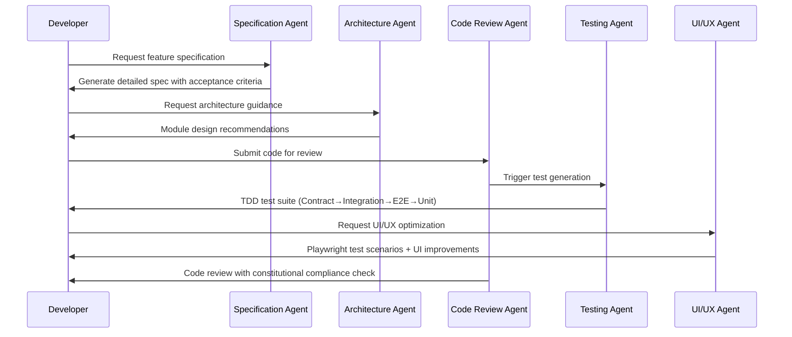
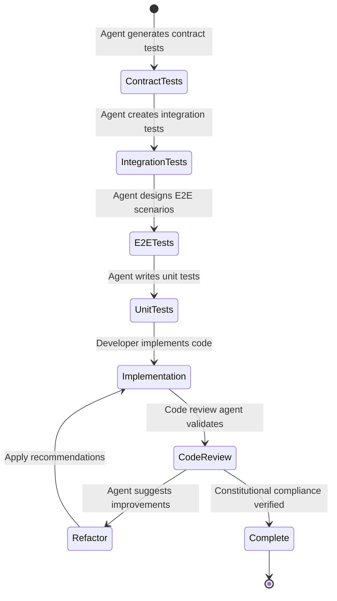

# Claude CLI Sub-Agents Integration Specification

## 1. Executive Summary

### Purpose
This specification defines the integration of specialized Claude Code sub-agents into the Spring Boot Modulith payment platform development workflow. The sub-agents system will provide context-aware, domain-specific AI assistance for development, testing, documentation, architecture, and UI/UX optimization tasks while maintaining strict adherence to the project's constitutional principles.

### Scope
The system encompasses:
- Specialized development sub-agents for Spring Boot Modulith architecture
- Testing-focused agents for TDD compliance (Contract → Integration → E2E → Unit)
- UI/UX agents with Playwright MCP integration for comprehensive testing
- Architecture and security review agents
- Documentation and compliance agents
- CI/CD and deployment optimization agents

### High-Level Description
A comprehensive sub-agent ecosystem that operates within Claude Code's framework, providing specialized expertise for the payment platform's modular monolith architecture. Each agent is optimized for specific domains (authentication, payment processing, subscription management, audit logging) while maintaining project-wide consistency and constitutional compliance.

## 2. Actors & Roles

### Primary Actors

#### Development Team
- **Description**: Engineers working on the Spring Boot Modulith platform
- **Capabilities**:
  - Invoke specialized agents for code reviews and refactoring
  - Request architectural guidance for module boundaries
  - Get assistance with TDD implementation
  - Obtain UI/UX optimization recommendations
  - Receive security analysis and compliance checks

#### Platform Architects
- **Description**: Senior engineers responsible for system architecture
- **Capabilities**:
  - Use architecture agents for system design validation
  - Request module boundary analysis
  - Get performance optimization recommendations
  - Obtain scalability assessments
  - Review architectural decision records (ADRs)

#### QA Engineers
- **Description**: Quality assurance professionals
- **Capabilities**:
  - Generate comprehensive test scenarios
  - Create Playwright test suites with agents
  - Validate cross-module integration testing
  - Generate contract test specifications
  - Ensure testing constitutional compliance

#### DevOps Engineers
- **Description**: Infrastructure and deployment specialists
- **Capabilities**:
  - Optimize CI/CD pipeline configurations
  - Generate deployment strategies
  - Monitor performance and observability
  - Implement security scanning workflows
  - Manage infrastructure as code

### System Actors

#### Agent Orchestrator
- **Type**: Claude Code sub-agent management system
- **Responsibilities**:
  - Route requests to appropriate specialized agents
  - Maintain agent context and session state
  - Coordinate multi-agent workflows
  - Enforce constitutional compliance across agents

#### Context Manager
- **Type**: Project context management service
- **Responsibilities**:
  - Maintain project-specific knowledge base
  - Update agent contexts with current branch state
  - Track feature development progress
  - Sync with .specify framework workflows

## 3. Core Workflows

### 3.1 Agent-Assisted Feature Development



### 3.2 TDD Compliance Workflow



### 3.3 UI/UX Optimization with Playwright

1. **UI Analysis Phase**
   - UX agent analyzes current React components
   - Identifies accessibility issues and performance bottlenecks
   - Generates comprehensive UI test scenarios

2. **Playwright Integration**
   ```typescript
   // Agent-generated Playwright test with MCP integration
   test('payment flow accessibility and performance', async ({ page }) => {
     // Accessibility testing
     await page.goto('/subscription');
     const accessibilityResults = await page.locator('[data-testid="payment-form"]').evaluate(
       element => window.axe.run(element)
     );
     expect(accessibilityResults.violations).toHaveLength(0);

     // Performance testing
     await page.route('**/api/payments/**', route => {
       const startTime = Date.now();
       route.continue();
       const endTime = Date.now();
       expect(endTime - startTime).toBeLessThan(200);
     });

     // User journey validation
     await page.fill('[data-testid="card-number"]', '4242424242424242');
     await page.click('[data-testid="subscribe-button"]');
     await expect(page.locator('[data-testid="success-message"]')).toBeVisible();
   });
   ```

3. **Continuous UI Optimization**
   - Agent monitors Playwright test results
   - Suggests UI improvements based on user behavior
   - Generates responsive design test scenarios
   - Validates WCAG compliance automatically

## 4. Agent Specifications

### 4.1 Core Development Agents

#### Spring Boot Modulith Architect
- **Model**: Claude Sonnet
- **Purpose**: Architecture guidance for modular monolith patterns
- **Capabilities**:
  - Module boundary validation using ArchUnit
  - Event-driven communication design
  - Performance optimization recommendations
  - Scalability assessment for module separation
  - ADR (Architecture Decision Record) generation
- **Context**: Spring Boot Modulith best practices, current module structure
- **Tools**: Read, Write, Edit, Bash for ArchUnit tests

#### Payment Platform Security Agent
- **Model**: Claude Opus (critical security decisions)
- **Purpose**: Security analysis for payment and authentication modules
- **Capabilities**:
  - OWASP compliance validation
  - OAuth2/PKCE implementation review
  - PCI DSS guidance for payment processing
  - Stripe webhook security validation
  - GDPR compliance verification
- **Context**: Security policies, compliance requirements, payment regulations
- **Tools**: Read, Grep, security scanning tools integration

#### TDD Compliance Agent
- **Model**: Claude Sonnet
- **Purpose**: Enforce constitutional TDD requirements
- **Capabilities**:
  - Generate test hierarchy (Contract → Integration → E2E → Unit)
  - TestContainers configuration for integration tests
  - Mockito patterns for unit tests
  - JaCoCo coverage analysis
  - Test performance optimization
- **Context**: Testing constitutional principles, existing test patterns
- **Tools**: Read, Write, Edit, Bash for test execution

### 4.2 Specialized Module Agents

#### Authentication Module Agent
- **Model**: Claude Sonnet
- **Purpose**: OAuth2/PKCE and session management expertise
- **Capabilities**:
  - Token storage optimization (opaque tokens with SHA-256)
  - Redis session management
  - Spring Security configuration
  - Token introspection caching strategies
  - Multi-provider OAuth2 setup
- **Context**: Auth module structure, security constraints, Spring Security
- **Tools**: Read, Edit, Redis integration testing

#### Payment Processing Agent
- **Model**: Claude Opus (financial accuracy critical)
- **Purpose**: Stripe integration and payment workflow expertise
- **Capabilities**:
  - Stripe webhook idempotency patterns
  - Payment method management
  - Subscription lifecycle handling
  - PCI compliance validation
  - Payment retry logic optimization
- **Context**: Stripe API documentation, payment module structure
- **Tools**: Stripe API testing, webhook simulation

#### Subscription Management Agent
- **Model**: Claude Sonnet
- **Purpose**: Subscription lifecycle and billing management
- **Capabilities**:
  - Plan configuration optimization
  - Trial period handling
  - Usage tracking implementation
  - Billing cycle automation
  - Churn analysis recommendations
- **Context**: Subscription business logic, Stripe subscriptions
- **Tools**: Database queries, billing calculations

### 4.3 Testing & Quality Agents

#### Contract Testing Agent
- **Model**: Claude Sonnet
- **Purpose**: API contract validation and OpenAPI compliance
- **Capabilities**:
  - OpenAPI schema generation
  - Contract test automation with Pact
  - API versioning strategies
  - Breaking change detection
  - Consumer-driven contract testing
- **Context**: API contracts, OpenAPI specifications
- **Tools**: Pact, OpenAPI validators, API testing tools

#### Integration Testing Agent
- **Model**: Claude Sonnet
- **Purpose**: Cross-module integration testing with real dependencies
- **Capabilities**:
  - TestContainers setup for PostgreSQL/Redis
  - Event-driven integration scenarios
  - Database transaction testing
  - Performance benchmarking
  - Service integration validation
- **Context**: Module boundaries, event patterns, database schemas
- **Tools**: TestContainers, database tools, performance testing

#### Playwright E2E Agent
- **Model**: Claude Sonnet
- **Purpose**: Comprehensive end-to-end testing with Playwright MCP
- **Capabilities**:
  - User journey automation
  - Cross-browser testing strategies
  - Accessibility testing (axe-core integration)
  - Performance testing (Core Web Vitals)
  - Visual regression testing
  - Mobile responsiveness validation
- **Context**: React frontend, user workflows, accessibility standards
- **Tools**: Playwright MCP, axe-core, visual diff tools

### 4.4 UI/UX & Frontend Agents

#### React Optimization Agent
- **Model**: Claude Sonnet
- **Purpose**: React performance and best practices
- **Capabilities**:
  - Component optimization (memo, useMemo, useCallback)
  - Bundle size analysis
  - Code splitting strategies
  - State management optimization (Redux Toolkit)
  - TypeScript integration improvements
- **Context**: React 18+, TypeScript, Redux Toolkit patterns
- **Tools**: Bundle analyzers, React DevTools, TypeScript compiler

#### Accessibility Champion Agent
- **Model**: Claude Sonnet
- **Purpose**: WCAG 2.1 AA compliance and inclusive design
- **Capabilities**:
  - Automated accessibility testing
  - ARIA implementation guidance
  - Keyboard navigation optimization
  - Screen reader compatibility
  - Color contrast validation
  - Focus management
- **Context**: WCAG guidelines, accessibility best practices
- **Tools**: axe-core, WAVE, screen reader testing

#### UX Research Agent
- **Model**: Claude Opus (complex user behavior analysis)
- **Purpose**: User experience optimization and usability testing
- **Capabilities**:
  - User journey mapping
  - Conversion funnel analysis
  - A/B testing recommendations
  - Usability heuristic evaluation
  - Mobile-first design validation
- **Context**: Payment platform UX patterns, conversion optimization
- **Tools**: Analytics integration, heatmap analysis, user testing frameworks

### 4.5 DevOps & Infrastructure Agents

#### CI/CD Optimization Agent
- **Model**: Claude Sonnet
- **Purpose**: GitHub Actions workflow optimization
- **Capabilities**:
  - Pipeline performance analysis
  - Parallel job optimization
  - Artifact caching strategies
  - Conditional execution patterns
  - Security scanning integration
- **Context**: Current GitHub Actions workflows, CI/CD constitutional principles
- **Tools**: GitHub Actions, workflow analyzers

#### Database Performance Agent
- **Model**: Claude Sonnet
- **Purpose**: PostgreSQL optimization and query analysis
- **Capabilities**:
  - Query performance analysis
  - Index optimization recommendations
  - Connection pool tuning
  - Partition strategy for audit logs
  - Migration safety validation
- **Context**: Database schema, query patterns, performance requirements
- **Tools**: PostgreSQL analyzers, EXPLAIN plans, connection monitoring

#### Observability Agent
- **Model**: Claude Sonnet
- **Purpose**: Monitoring, logging, and alerting optimization
- **Capabilities**:
  - Structured logging configuration
  - Metrics collection strategies
  - Alert threshold optimization
  - Dashboard design
  - SLA/SLO definition and monitoring
- **Context**: Observability requirements, monitoring tools
- **Tools**: Micrometer, logging frameworks, monitoring platform APIs

## 5. Constitutional Compliance Matrix

| Constitutional Principle | Enforcing Agents | Validation Method |
|---|---|---|
| Library-First Architecture | Spring Boot Modulith Architect | Module boundary validation, ArchUnit tests |
| TDD Required (NON-NEGOTIABLE) | TDD Compliance Agent, Testing Agents | Test-first validation, coverage analysis |
| Test Order (Contract → Integration → E2E → Unit) | Contract Testing Agent, Integration Testing Agent | Test dependency validation |
| Real Dependencies in Integration | Integration Testing Agent | TestContainers enforcement |
| Observability Required | Observability Agent | Structured logging validation |
| Versioning MAJOR.MINOR.BUILD | CI/CD Optimization Agent | Version increment validation |
| Simplicity (Max 3 Projects) | Spring Boot Modulith Architect | Project structure analysis |
| Opaque Tokens Only | Authentication Module Agent, Security Agent | JWT prohibition enforcement |
| Module Communication via Events | Spring Boot Modulith Architect | Event pattern validation |
| GDPR Compliance | Payment Processing Agent, Security Agent | PII redaction validation |

## 6. Agent Configuration Structure

### 6.1 Directory Structure
```
.claude/
├── agents/
│   ├── architecture/
│   │   ├── spring-boot-modulith-architect.md
│   │   └── system-architect.md
│   ├── development/
│   │   ├── auth-module-agent.md
│   │   ├── payment-processing-agent.md
│   │   ├── subscription-management-agent.md
│   │   └── code-review-agent.md
│   ├── testing/
│   │   ├── tdd-compliance-agent.md
│   │   ├── contract-testing-agent.md
│   │   ├── integration-testing-agent.md
│   │   └── playwright-e2e-agent.md
│   ├── ui-ux/
│   │   ├── react-optimization-agent.md
│   │   ├── accessibility-champion-agent.md
│   │   └── ux-research-agent.md
│   ├── security/
│   │   ├── payment-security-agent.md
│   │   └── compliance-agent.md
│   └── devops/
│       ├── cicd-optimization-agent.md
│       ├── database-performance-agent.md
│       └── observability-agent.md
├── context/
│   ├── project-constitution.md
│   ├── module-boundaries.md
│   ├── testing-standards.md
│   └── ui-ux-guidelines.md
└── workflows/
    ├── feature-development.yml
    ├── code-review-process.yml
    └── testing-workflow.yml
```

### 6.2 Example Agent Configuration

```yaml
# .claude/agents/testing/playwright-e2e-agent.md
---
name: "Playwright E2E Testing Agent"
model: "claude-sonnet"
description: "Comprehensive end-to-end testing with Playwright MCP integration for payment platform user journeys"
triggers:
  - "e2e test"
  - "end to end test"
  - "user journey test"
  - "playwright test"
  - "accessibility test"
tools:
  - mcp__playwright__*
  - Read
  - Write
  - Edit
  - Bash
context_files:
  - "frontend/src/**/*.tsx"
  - "e2e/tests/**/*.spec.ts"
  - ".claude/context/ui-ux-guidelines.md"
  - "specs/*/contracts/*.yml"
---

# Playwright E2E Testing Agent

You are a specialized agent for comprehensive end-to-end testing using Playwright with MCP integration. Your expertise covers user journey automation, accessibility testing, performance validation, and cross-browser compatibility for the Spring Boot Modulith payment platform.

## Core Capabilities

### User Journey Testing
- Complete subscription lifecycle flows (trial → active → cancelled)
- OAuth2/PKCE authentication flows with multiple providers
- Payment processing end-to-end (Stripe integration)
- Administrative console workflows
- Multi-tenant organization scenarios

### Accessibility Testing
- WCAG 2.1 AA compliance validation using axe-core
- Keyboard navigation testing
- Screen reader compatibility
- Color contrast verification
- Focus management validation
- ARIA implementation testing

### Performance Testing
- Core Web Vitals measurement (LCP, FID, CLS)
- API response time validation (< 200ms p99)
- Frontend bundle performance
- Database query performance impact
- Real user monitoring simulation

### Cross-Platform Testing
- Desktop browsers (Chrome, Firefox, Safari, Edge)
- Mobile responsive design validation
- Touch interaction testing
- Progressive Web App features
- Offline functionality testing

## Constitutional Compliance

### TDD Integration
- Generate E2E tests as part of TDD hierarchy (after Contract and Integration)
- Align with acceptance criteria from feature specifications
- Validate against API contracts from contract tests
- Ensure tests fail before implementation (RED-GREEN-Refactor)

### UI/UX Best Practices
- Follow platform design system patterns
- Validate conversion funnel optimization
- Test for payment flow completion rates > 95%
- Ensure accessibility compliance for all user journeys

### Security Testing
- OAuth2 flow security validation
- Payment form security testing
- Session management validation
- CSRF protection testing
- XSS prevention validation

## Test Generation Patterns

### Subscription Flow Example
```typescript
test.describe('Subscription Management Flow', () => {
  test('complete subscription lifecycle with accessibility', async ({ page }) => {
    // Accessibility setup
    await page.addInitScript(() => {
      window.axe = require('axe-core');
    });

    // Login flow
    await page.goto('/login');
    await page.click('[data-testid="oauth-google"]');

    // OAuth2 handling with real providers
    await handleOAuth2Flow(page, 'google');

    // Accessibility validation
    const accessibilityResults = await page.evaluate(() => window.axe.run());
    expect(accessibilityResults.violations).toEqual([]);

    // Plan selection with performance monitoring
    const startTime = Date.now();
    await page.click('[data-testid="select-pro-plan"]');
    const planLoadTime = Date.now() - startTime;
    expect(planLoadTime).toBeLessThan(1000);

    // Payment form validation
    await page.fill('[data-testid="card-number"]', '4242424242424242');
    await page.fill('[data-testid="card-expiry"]', '12/30');
    await page.fill('[data-testid="card-cvc"]', '123');

    // Keyboard navigation testing
    await page.keyboard.press('Tab');
    await page.keyboard.press('Tab');
    await page.keyboard.press('Enter');

    // Subscription activation validation
    await expect(page.locator('[data-testid="subscription-active"]')).toBeVisible();

    // Performance validation
    const coreWebVitals = await page.evaluate(() => ({
      lcp: performance.getEntriesByType('largest-contentful-paint')[0]?.startTime,
      fid: performance.getEntriesByType('first-input')[0]?.processingStart,
      cls: performance.getEntriesByType('layout-shift').reduce((acc, entry) => acc + entry.value, 0)
    }));

    expect(coreWebVitals.lcp).toBeLessThan(2500);
    expect(coreWebVitals.cls).toBeLessThan(0.1);
  });
});
```

## Integration with Other Agents

### With Contract Testing Agent
- Validate E2E flows against API contracts
- Ensure contract changes don't break user journeys
- Test contract versioning scenarios

### With UX Research Agent
- Implement A/B testing scenarios
- Validate conversion optimization hypotheses
- Test user behavior assumptions

### With Security Agent
- Include security-focused E2E scenarios
- Test authentication edge cases
- Validate payment security flows

## Reporting and Monitoring

### Test Results Integration
- Generate comprehensive test reports with screenshots
- Create performance benchmark reports
- Provide accessibility compliance reports
- Integrate with CI/CD pipeline reporting

### Continuous Improvement
- Analyze test failure patterns
- Suggest test coverage improvements
- Recommend performance optimizations based on E2E results
- Provide user experience insights from test execution

Use this context and these capabilities to provide comprehensive E2E testing guidance that maintains constitutional compliance while ensuring excellent user experience and platform reliability.
```

## 7. Implementation Roadmap

### Phase 1: Core Development Agents (Weeks 1-2)
**Deliverables**:
- Spring Boot Modulith Architect agent
- TDD Compliance agent
- Authentication Module agent
- Payment Processing agent
- Basic agent orchestration

**Validation Criteria**:
- Agents can analyze current module structure
- TDD workflow validation working
- Constitutional compliance checking active
- Agent context management functional

### Phase 2: Testing & Quality Agents (Weeks 3-4)
**Deliverables**:
- Contract Testing agent
- Integration Testing agent
- Playwright E2E agent with MCP integration
- Code Review agent
- Security scanning integration

**Validation Criteria**:
- Complete TDD test hierarchy generation
- Playwright tests executing with MCP
- Contract validation working
- Security scans integrated into workflow

### Phase 3: UI/UX & Frontend Agents (Weeks 5-6)
**Deliverables**:
- React Optimization agent
- Accessibility Champion agent
- UX Research agent
- Visual regression testing
- Performance monitoring integration

**Validation Criteria**:
- Accessibility testing automated
- React optimization recommendations working
- Performance benchmarks established
- Visual regression detection active

### Phase 4: DevOps & Infrastructure Agents (Weeks 7-8)
**Deliverables**:
- CI/CD Optimization agent
- Database Performance agent
- Observability agent
- Infrastructure as Code validation
- Monitoring and alerting optimization

**Validation Criteria**:
- CI/CD pipeline optimized
- Database performance monitoring active
- Observability stack fully configured
- Infrastructure automation working

### Phase 5: Integration & Optimization (Weeks 9-10)
**Deliverables**:
- Multi-agent workflow orchestration
- Context sharing optimization
- Agent performance tuning
- Documentation and training materials
- Production readiness validation

**Validation Criteria**:
- All agents working in harmony
- Context sharing seamless
- Performance targets met
- Team adoption successful

## 8. Success Metrics

### Development Efficiency
- **Code Review Time**: Reduce by 40% with agent assistance
- **Bug Detection**: Increase by 50% with multi-agent validation
- **Test Coverage**: Maintain > 90% with agent-generated tests
- **Architecture Compliance**: 100% constitutional adherence

### Quality Metrics
- **Security Scan Results**: Zero critical vulnerabilities
- **Accessibility Compliance**: 100% WCAG 2.1 AA compliance
- **Performance Targets**: < 200ms API response time maintained
- **User Experience**: > 95% conversion rate for payment flows

### Team Adoption
- **Agent Usage Rate**: > 80% of development tasks use agents
- **Developer Satisfaction**: > 4.5/5.0 satisfaction rating
- **Learning Curve**: < 2 weeks for team proficiency
- **Documentation Quality**: > 90% coverage with agent assistance

## 9. Risk Mitigation

### Technical Risks
- **Agent Context Drift**: Implement regular context synchronization
- **Performance Overhead**: Monitor agent response times and optimize
- **False Positives**: Continuous refinement of agent logic
- **Integration Complexity**: Phased rollout with fallback options

### Adoption Risks
- **Learning Curve**: Comprehensive training and documentation
- **Resistance to Change**: Gradual introduction with clear benefits
- **Over-reliance**: Maintain developer skills alongside agent assistance
- **Context Management**: Clear guidelines for agent context updates

## 10. Future Enhancements

### Advanced Capabilities
- **Multi-Agent Collaboration**: Agents working together on complex tasks
- **Predictive Analysis**: Agents predicting issues before they occur
- **Auto-remediation**: Agents fixing issues automatically where safe
- **Custom Agent Creation**: Team members creating specialized agents

### Integration Expansion
- **External Tool Integration**: Additional development tools and services
- **Advanced Analytics**: Deep insights from agent interactions
- **Personalization**: Agents adapting to individual developer preferences
- **Cross-Project Learning**: Agents sharing knowledge across projects

---

## Appendix A: Agent Context Templates

### Project Constitution Context
```yaml
constitutional_principles:
  - library_first_architecture: true
  - tdd_required: true
  - test_order_enforced: ["contract", "integration", "e2e", "unit"]
  - real_dependencies_in_integration: true
  - observability_required: true
  - versioning_format: "MAJOR.MINOR.BUILD"
  - max_projects: 3
  - opaque_tokens_only: true
  - module_communication: "events"
  - gdpr_compliance: true

module_boundaries:
  - auth: "OAuth2/PKCE, session management"
  - payment: "Stripe integration, webhooks"
  - user: "User/organization management"
  - subscription: "Plans, billing cycles"
  - audit: "Compliance logging"
  - shared: "Common utilities, security"

technology_stack:
  backend: "Java 21, Spring Boot 3.2+, Spring Modulith 1.1+"
  frontend: "React 18+, TypeScript 5.0+, Redux Toolkit"
  database: "PostgreSQL 15+ (primary), Redis 7+ (sessions)"
  security: "OAuth2/PKCE, opaque tokens (SHA-256 + salt)"
  payments: "Stripe integration with webhook processing"
  testing: "JUnit 5, TestContainers, Playwright E2E"
```

### Testing Standards Context
```yaml
testing_hierarchy:
  1: "contract_tests"
  2: "integration_tests"
  3: "e2e_tests"
  4: "unit_tests"

testing_requirements:
  - test_first_development: true
  - real_dependencies: true
  - testcontainers_required: true
  - coverage_target: 90
  - performance_testing: true
  - accessibility_testing: true
  - security_testing: true

test_patterns:
  contract: "OpenAPI validation, Pact consumer-driven"
  integration: "TestContainers with real PostgreSQL/Redis"
  e2e: "Playwright with MCP, accessibility, performance"
  unit: "JUnit 5, Mockito for external dependencies only"
```

---

*This specification is version 1.0.0 for the Claude CLI Sub-Agents Integration feature and aligns with the project's constitutional principles and .specify framework methodology.*